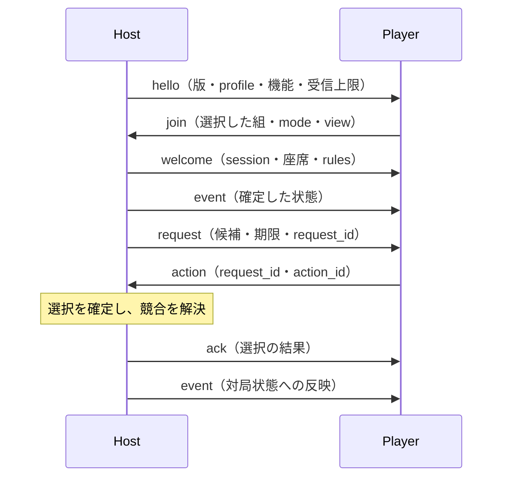

# YAMAI draft 1 仕様案内

YAMAI は、4人リーチ麻雀のホスト、AI プレイヤー、観戦・牌譜クライアントが共通の状態と結果を交換するためのプロトコルである。Protocol Version と `riichi-4p` profile revision はともに `1.0-draft.1`。

規範は [YAMAI 仕様書](yamai-protocol.md) に集約する。本書は仕様の読み方と主要な契約を案内する。

## 対象範囲

| 領域 | 定義する内容 |
|---|---|
| 接続 | JSON Lines / WebSocket、JSON の制約、資源上限 |
| 交渉 | Protocol Version、profile revision/hash、capability、mode/view、座席・対象 |
| 対局 | 4人リーチ麻雀のルール、牌、合法候補、行動とイベント、点数・局進行 |
| 配送 | session ごとの順序、不変の送信履歴、重複・欠落・衝突の判定 |
| 復旧 | play の resume、有限範囲の再送、snapshot による状態置換 |
| 適合性 | 必須試験、公式テストベクトル、実行検査と形式モデルの範囲 |

3人麻雀、AI の推論方法、アカウント、資格情報の発行方式、レーティングおよび課金は定義しない。公開サービスはゲーム・記録・座席・view・resume token・ログの認可を別の security/authorization profile で定義する。

## 実装目的別の参照先

| 目的 | 主に読む節 |
|---|---|
| 通信クライアント | 仕様書 [§4 JSON と transport](yamai-protocol.md#4-json-と-transport)、[§5 envelope](yamai-protocol.md#5-共通-envelope)、[§6 交渉](yamai-protocol.md#6-版機能交渉) |
| AI の行動選択 | [§7.3 牌と合法候補](yamai-protocol.md#73-牌)、[§8 行動要求](yamai-protocol.md#8-行動要求)、[§9 ACK と期限](yamai-protocol.md#9-ack-と-timeout) |
| 対局ホスト | [§3 状態モデル](yamai-protocol.md#3-プロトコルモデル)、[§7 ルールと採点](yamai-protocol.md#7-riichi-4p-profile)、[§10 イベント順序](yamai-protocol.md#10-イベント順序) |
| 観戦・牌譜 | [§11 mode と view](yamai-protocol.md#11-visibility-と-mode)、[§13 snapshot](yamai-protocol.md#13-再接続と-snapshot) |
| エラーと再接続 | [§12 エラー](yamai-protocol.md#12-エラー)、[§13 再接続](yamai-protocol.md#13-再接続と-snapshot)、[§15 資源上限](yamai-protocol.md#15-資源安全要件) |
| 拡張機能 | [§14 拡張](yamai-protocol.md#14-拡張)、[§19 識別子](yamai-protocol.md#19-識別子と-registry) |
| 適合性の確認 | [§17 適合性](yamai-protocol.md#17-適合性)、[成果物の仕様](artifacts.md)、[検証ガイド](../verification/README.md) |
| 今回の仕様点検 | [仕様レビュー](spec-review.mdx)：発見事項、修正、再検査と残る検証範囲 |
| 認証サービスの実装計画 | [認証・認可の実装計画](auth-implementation-plan.mdx)：§18.6に従うサービス層の設計と受入条件 |

## 通信の流れ



プレイヤーは `request` にだけ応答する。候補の内容は `legal_actions` にあり、応答には発行済み `action_id` を使う。ホストは切断中も期限と内部処理を継続し、確定した選択と結果を保持する。

## 状態と識別子

| 値 | 意味 |
|---|---|
| `game_id` | 対局を識別する |
| `session_id` | mode・view と配送状態を識別する |
| `seq` | session 内のホストメッセージの番号。新規メッセージで1ずつ増える |
| `request_id` | 一つの要求を識別する |
| `action_id` | その要求の合法候補を識別する |
| `profile_revision` / `profile_hash` | 交渉するルール・採点成果物の同一性を表す |

game の状態、session の配送位置、要求の選択・計時は独立して保持する。同じ `seq` の再送には元の JSON payload の byte 列を使い、再直列化しない。受信側は連続して完全に適用した位置だけを進める。

## モードと情報公開

| mode | view | 行動要求 | 対象 |
|---|---|---|---|
| `play` | `seat` | 自席の request に応答する | 新規対局への参加、または token が示す session の再開 |
| `spectate` | `public` | 受信しない | `game` |
| `replay` | `public` / `full` / 座席指定 | 受信しない | `game` または `recording` |

非公開牌1枚は `null`、非公開手牌は `count` で表す。公開範囲は通常の event、再送、snapshot と診断にも適用する。`public` は状態の投影範囲を表し、対象へのアクセス許可は別に判断する。

## 検査と HTML

[release manifest](../release-manifest.json) の成果物を同じ組として使用する。Schema はメッセージ構造を、状態検査は順序と前後条件を、採点検査は手牌・ルールから求めた役・符・支払いを検査する。Quint は有限境界内の制御フローを検査する。

Markdown・MDXの原本からHTMLを生成するには、リポジトリのルートで実行する。

```sh
python3 scripts/render_docs.py
```

`docs/index.html`、`docs/yamai-protocol.html`、`docs/artifacts.html`、`docs/auth-implementation-plan.html`、`docs/spec-review.html`、`verification/index.html`、`verification/quint/index.html` を生成する。MarkdownとMDXを原本とし、生成にはmdxr `0.2.0`を使用する。相互リンクもHTMLの配置に合わせる。検査の実行方法と適合性の範囲は[検証ガイド](../verification/README.md)に従う。
