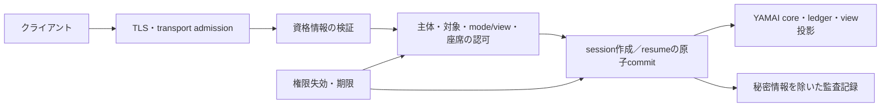

<Callout kind="note" title="計画の位置付け">

この文書は実装前の参考計画である。現在のリポジトリにはプロトコル仕様と検査実装があり、アカウント基盤・認証サーバー・対局サービスはない。[仕様書§18.6](yamai-protocol.md#186-サービスの認証認可との境界)に従い、認証・認可をホストサービスの境界に実装する。実装完了や公開サービスの安全性を表明する文書ではない。

</Callout>

<Toc depth="3" title="目次" />

## 到達する状態

認証済みの主体が、許可されたgame・recording・seat・mode/viewへ接続できる。resumeでは元の所有者・座席・権限を確認し、権限失効後の配送を停止する。既存のhello、join、welcome、seq、期限、tokenの原子的処理を維持する。

アカウント登録、外部IDプロバイダーの選択、資格情報発行のUIはサービス側の担当範囲とする。この計画では資格情報を検証するadapterと、その出力を使う認可契約を先に固定する。認証製品・実装言語・永続ストアはサービスの構成が決まった段階で選ぶ。

## 構成と責務

| 境界 | 入力と出力 | 必須の判断 |
|---|---|---|
| 認証adapter | transportの資格情報 → 検証済みprincipalと有効期限 | 発行元・対象サービス・期限・失効。ID文字列の自己申告を信用しない |
| 認可policy | principal、対象、mode/view、割当seat → permit/denyとpolicy version | 明示的な許可がない組はdeny |
| session管理 | permit、交渉結果、resume情報 → 一つのsession所有権 | 認可とtoken消費・旧接続無効化を原子的に確定 |
| 配送 | session所有者、権限世代、ledger → 許可されたview | 失効した接続へ保存済みprivate payloadを送らない |
| 監査 | 主体の内部ID、対象、判断理由分類、時刻、policy version | token、手牌、資格情報、完全なmessage本文を記録しない |

認証と認可を分離し、既定拒否と対象ごとの権限検査を採用する。[OWASP Authorization Cheat Sheet](https://cheatsheetseries.owasp.org/cheatsheets/Authorization_Cheat_Sheet.html)を参照する。

## 権限の契約

| 操作 | 許可条件 | 拒否時の状態 |
|---|---|---|
| 新規play | roomへの参加権と割当seatの使用権 | seat・sessionをcommitしない |
| spectate/public | 対象gameの閲覧権 | publicという名前だけで許可しない |
| replay/public | 対象game/recordingの再生権 | 存在の有無を外部診断へ区別して出さない |
| replay/seat | 再生権と対象seatの非公開情報閲覧権 | 別seatへ暗黙変更しない |
| replay/full | 明示的な完全情報閲覧権 | 通常の参加権を流用しない |
| resume | 有効なtoken、元principalとの一致、存続する対象・seat権限 | 旧tokenを消費せず、別sessionへfallbackしない |
| 記録・ログの取得 | 対象と情報区分の閲覧権 | URLやIDを知っているだけでは許可しない |

seat省略時は§6.2の最小空席割当を用い、その結果を認可する。許可されないseatを別seatへ黙って変更しない。認可待ちの間にseatが埋まった場合は、commit時の再検査で拒否する。

## 資格情報と接続

最初の実装対象はTLSで保護したWebSocketとする。AIクライアントの資格情報はtransportの認証機構で渡し、YAMAIの標準memberやWebSocket subprotocolへ埋め込まない。資格情報の発行・再発行は別の管理経路で行う。

ブラウザー接続を実装する場合は、サービスのcookie認証とOriginの許可一覧を併用する。cookie認証のあるWebSocketでは接続元Originを検査し、ログアウト・資格失効時には既存接続も停止する。URLへ長寿命tokenを入れない。[OWASP WebSocket Security Cheat Sheet](https://cheatsheetseries.owasp.org/cheatsheets/WebSocket_Security_Cheat_Sheet.html)を参照する。

JSON LinesのTCP版を提供する段階では、同じprincipalを得られるTLS側adapterを定義する。標準入出力版はローカルの信頼境界をサービスprofileへ明記する。いずれも最初のYAMAI application messageはHostのhelloとし、独自の認証messageを先行させない。

## resumeと失効の順序

1. transportの資格情報を検証し、principalを確定する。
2. joinの構造・版・profile・capability・limitを既存の順序で検査する。
3. resume tokenを検証し、保存したprincipal、game、seat、mode/view、権限世代を照合する。
4. 対象sessionのロック内でtoken期限・未使用状態・最新の認可を再確認する。期限処理と閉鎖済みgroupの解決を行い、再送範囲を固定する。
5. 有効なwelcomeの送信キュー記録と一体で、旧token失効、新token発行、旧接続の新規入力禁止をcommitする。
6. 元のwire bytesを再送する。再送中も対局時計と内部解決を継続する。

回復にsnapshotを用いる場合も、coreの§13.3の検査を通す。連続したprefixでの点数・手牌・発行済みrequest・元記録位置の変更、終了済み対局の再精算を認証成功の副作用として許可しない。選択・計時の更新と、認可の権限世代は別の状態として保持する。

欠落区間の回復でも、既知の原因eventの番号・payloadを保持する。個別requestとgroupの残期間は同じsnapshot固定時点から計算し、selectionをその時点より未来に置かない。これらのcore条件を認証adapter内で再定義せず、既存の受信・状態検査へ引き渡す。

原因eventの番号が変わらない欠落回復では、点数・手牌・受信済みrequest IDの保持も検査する。まだ届いていない元requestの復元は許可するが、認証成功を契機に別requestへ交換しない。game単位の持ち時間は再接続や局間snapshotで補充しない。

同時resumeの成功は1件だけにする。commit前の拒否でtokenを消費しない。welcome配送前に切断しても、commit後のrotateを取り消さない。紛失tokenの救済を追加する場合は管理経路で再認証する設計を別途定義し、旧tokenの再使用を許可しない。

権限の更新には世代番号を持たせ、session作成・resume・private配送の判断と失効を直列化する。失効確定後は未配送のprivateデータとaction受付を停止し、tokenを失効させる。ゲームの既存requestは通常の期限まで進める。mode/viewを途中変更してledgerを書き換えない。

## 拒否と診断

| タイミング | サービスprofileで定める動作 |
|---|---|
| WebSocket upgrade前 | 認証失敗はHTTP 401、対象へのアクセス拒否は403。本文は一般化した理由だけとする |
| 接続後、welcome前 | サービスpolicy違反としてWebSocket close 1008。YAMAIに未定義の認証error codeを作らない |
| coreのresume検証失敗 | 既存のfatal resume_unavailable。tokenの存在・所有者・期限の詳細は外部へ出さない |
| 既存接続の権限失効 | close 1008、token失効、以後の配送と新規入力を停止 |
| policyストア障害 | 許可を新規発行しない。失効確認を保証できないprivate配送も停止し、内部監査に障害を記録 |

接続後の認可拒否はtransportの終了として扱い、対局結果・チョンボへ変換しない。rate limitは主体と接続元の両方で適用し、外部へ出す認証診断には具体的なtargetやtokenを反射しない。

## 実装順序

<Phase title="1. サービスprofileと契約テスト" status="todo">

対象・権限表・拒否動作・失効時の処理をサービスprofileに記載する。新設候補の `scripts/auth_contract.py` と `scripts/test_auth_contract.py` でprincipal・policy・token所有権の参照モデルを作り、`test-vectors/auth/` に正負ケースを置く。既存のprotocol hashやwire Schemaへ認証用memberを追加しない。

</Phase>

<Phase title="2. transportと認証adapter" status="todo">

実際のホストサービスに検証済みprincipalの受け渡しを実装する。credential storeと有効期限・失効を統合し、ブラウザーを提供する場合はOrigin・cookie・ログアウトの結合試験を行う。サービスごとの設定が欠けた状態では公開接続を許可しない。

</Phase>

<Phase title="3. 認可・resume・配送の統合" status="todo">

seat予約、target取得、welcome commit、token rotate、旧接続停止に認可を接続する。並行resume、権限失効とcommitの競合、保存済みledgerの配送を結合試験する。失効によって対局時計や既定選択が止まらないことも確認する。

</Phase>

<Phase title="4. 運用と公開前確認" status="todo">

秘密情報を含まない監査、資格情報の再発行、policyストア障害、接続上限を確認する。全core検査と認証の正負ケースをCIへ組み込み、公開環境と同じ経路で受入条件を満たしてから接続を開放する。

</Phase>

## 受入条件

<Reqs>
  <Req id="AUTH-01" status="todo">未認証・期限切れ・失効済み資格情報でprivate sessionを作成できない。</Req>
  <Req id="AUTH-02" status="todo">game・recording・seat・viewの権限を個別に検査し、publicとfullの権限を混同しない。</Req>
  <Req id="AUTH-03" status="todo">別principalのresume、競合する二重resume、期限ちょうどのtokenを拒否する。</Req>
  <Req id="AUTH-04" status="todo">拒否時にseat・tokenを部分commitせず、成功時は旧接続を無効化する。</Req>
  <Req id="AUTH-05" status="todo">失効後のprivate配送を止め、元の期限・選択・点数・ledgerを保持する。</Req>
  <Req id="AUTH-06" status="todo">ログ・URL・error・HTMLへ資格情報や非公開牌を残さない。</Req>
  <Req id="AUTH-07" status="todo">policy障害と不正Originを拒否し、認証追加後も全core検査を通過する。</Req>
  <Req id="AUTH-08" status="todo">認証済みresumeでもsnapshotのprefix照合を省略せず、点数・手牌・request ID・終局結果の書き換えを拒否する。</Req>
  <Req id="AUTH-09" status="todo">欠落回復でも原因eventの巻戻し・別payload・非event参照を拒否し、個別・group時計とselectionの固定時点を一致させる。</Req>
  <Req id="AUTH-10" status="todo">同じ原因eventの欠落回復で点数・手牌・発行済みrequest IDを変更せず、未受信requestだけを復元する。game単位の持ち時間を補充しない。</Req>
</Reqs>

外部IDプロバイダー、永続ストア、権限の管理UI、記録の公開時期はサービス側で決める。この選定は本計画の契約を変更せずadapterとpolicy設定へ反映する。
