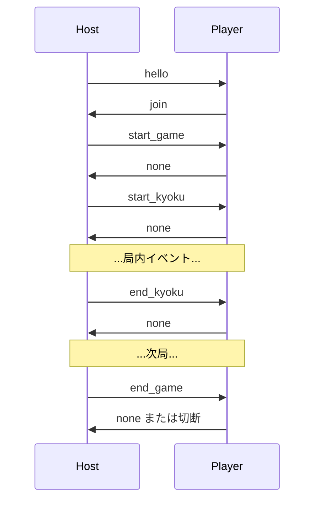
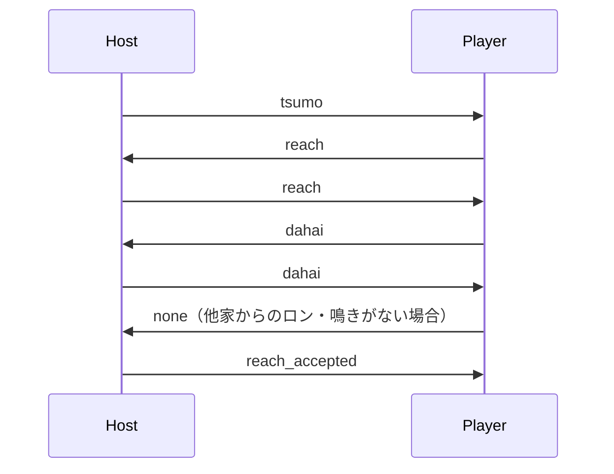

# YRC 0001: デファクト MJAI プロトコル記述仕様

| 項目 | 値 |
|---|---|
| 文書系列 | YAMAI Request for Comments (YRC) |
| 文書番号 | YRC 0001 |
| 表題 | The De Facto MJAI Protocol |
| 分類 | Informational |
| 状態 | Draft |
| 版 | 1.0-draft.2 |
| 発行日 | 2026-08-30 |
| 更新対象 | なし |
| 廃止対象 | なし |

## Abstract

MJAI は、リーチ麻雀 AI の対局通信および牌譜交換に用いられる JSON ベースのデファクト標準である。しかし、MJAI には単一の規範仕様が存在せず、原典文書、Gimite の実装、牌譜処理系、および標準入出力・WebSocket を用いる派生実装の間で、フレーミング、応答規則、フィールド集合および状態遷移が異なる。

本書は、Gimite 由来の4人リーチ麻雀用 MJAI イベントモデルを共通核として再構成し、原典で明記された事項、Gimite v3 実装で観測される拡張、および主要実装の慣行を区別して記録する。本書は既存実装の挙動を記述する Informational 文書であり、新たな MJAI 適合要件を制定するものではない。

## Status of This Memo

本書は YAMAI Project が管理する Request for Comments であり、IETF、IAB または IESG が発行する Internet Standard ではない。本書の配布に制限はない。

本書は Draft である。既存実装について新しい証拠が得られた場合、同じ文書番号の新しい版で記述を訂正することがある。MJAI 実装は、本書だけを根拠に特定方言との wire compatibility を主張しないことが望ましい。

## Table of Contents

1. この文書の位置付け
2. 用語
3. データ表現
4. 接続とライフサイクル
5. メッセージ一覧
6. Gimite v3 の応答ヒント
7. 応答規則と競合解決
8. 主な方言
9. 適合性を判断する際の最低確認事項
10. Security Considerations
11. Registry Considerations
12. References
Appendix A. 方言識別票

## 1. この文書の位置付け

この文書は、2026年8月30日時点で公開されている資料から、最も広く共有されている **Gimite 由来の MJAI イベントモデル**を整理した記述仕様である。既存の単一の公式規格を転載したものではない。

MJAI は、次の2つの意味で使用される。

1. リーチ麻雀の状態遷移を表す JSON イベント形式
2. そのイベントをホストと AI の間で交換する対局プロトコル

イベント形式は牌譜、レビューおよび AI 実行環境で広く共有されている。一方、TCP、標準入出力、WebSocket、1イベント単位および batch 単位など、通信方式は統一されていない。本書は原典の TCP line-by-line 方式を基準とし、実装依存の拡張を明示する。

### 1.1 主要資料

- [GIMITE-MJAI]: Gimite による原典説明
- [GIMITE-CODE]: `gimite/mjai` のサーバ実装
- [CRYOLITE-MJAI]: MJAI 標準化プロジェクト
- [MORTAL-EVENT]: Mortal の MJAI イベント型
- [MJAI-APP]: mjai.app の batch 方式

資料間で異なる場合、本書は次のラベルを使用する。

- **原典**: Gimite の説明ページに記載されている内容
- **Gimite v3 実装**: `gimite/mjai` の現行コードで観測できる内容
- **共通実装慣行**: Mortal、mjai.app、牌譜変換器など複数実装で共通する内容
- **方言**: 特定実装だけの追加フィールドまたは通信規則

外部実装を根拠にする記述の確認日、protocol revision、commit/tagおよび対象ファイルは [YRC 0004] §2.1 に固定する。Gimiteのcommitを確認できない場合など、固定できない資料はその理由を同節へ記録する。

### 1.2 記述規約

本書の「規定されている」は引用元が明示的に要求していることを表す。「観測される」は公開実装のコードパスから確認できることを表す。「一般的である」は複数の独立実装に同じ表現が存在することを表す。

本書中の `MUST`、`SHOULD` および `MAY` は、既存資料を引用する箇所を除き、[RFC 2119] の規範要件を表さない。YAMAI の規範要件は [YRC 0003] `1.0-draft.5` と、同文書が各profileの規範参照として指定するStandards Track文書（現在の `riichi-4p` では [YRC 0005] `1.0-draft.3`）が定義する。

## 2. 用語

| 用語 | 意味 |
|---|---|
| ホスト | ルール、牌山、状態遷移、合法性、精算を管理する側 |
| プレイヤー | 座席に割り当てられ、ホストの通知に対して行動を返す AI |
| actor | 行動した座席。通常は `0` から `3` の絶対座席番号 |
| target | 鳴き元・放銃者など、行動の対象となる座席 |
| in-game mode | 特定プレイヤーから見える情報だけを送る対局中の表現 |
| replay mode | 全プレイヤーの情報を含み得る牌譜表現 |
| line-by-line | 1行に1個の JSON object を送り、イベントごとに応答する方式 |
| batch | 複数イベントを JSON array などでまとめ、行動可能地点で1回応答する方式 |

座席番号は親からの相対位置ではなく、ゲーム中固定された絶対番号である。`tehais`、`scores`、`tenpais` および `deltas` などの配列は、座席 `0, 1, 2, 3` の順である。

## 3. データ表現

### 3.1 JSON とフレーミング

原典は、TCP 上でサーバとクライアントが JSON を1行ずつ交互に送る方式を定める。各 JSON text の末尾は改行である。1ゲーム終了時に TCP 接続を切断する [GIMITE-MJAI]。

原典は、文字コード、最大行長、空行、CRLF、重複キー、数値範囲および不正 JSON からの復旧を規定しない。

牌譜ファイルでも一般に1行1 JSON object の JSON Lines が使用される。ただし、対局通信の「各行へ応答する」という規則は牌譜に適用されない。

### 3.2 牌表記

| 種類 | 表記 |
|---|---|
| 萬子 | `1m` ～ `9m` |
| 筒子 | `1p` ～ `9p` |
| 索子 | `1s` ～ `9s` |
| 風牌 | `E`, `S`, `W`, `N` |
| 三元牌 | `P`（白）, `F`（發）, `C`（中） |
| 赤五 | `5mr`, `5pr`, `5sr` |
| 非公開牌 | `?` |

`?` は他家の配牌またはツモ牌を隠すために使用される。プレイヤーが送る行動の `pai` または `consumed` に `?` を使用することはできない。

### 3.3 共通フィールド

すべてのイベントは文字列の `type` を持つ。代表的な追加フィールドを次に示す。

| フィールド | 意味 |
|---|---|
| `actor` | 行動した座席 |
| `target` | 鳴き元または放銃者 |
| `pai` | 行動対象の牌 |
| `consumed` | 手牌から消費した牌の配列 |
| `scores` | イベント適用後の点数 |
| `deltas` | イベントによる点数差分 |
| `possible_actions` | Gimite v3 の応答ヒント。原典文書にはない |

### 3.4 方向別の解釈

MJAI は `type` 名を Host → Player の状態イベントと Player → Host の行動の両方で共有する。したがって、同じ `type` 名であっても、受信方向を確認せずに一方の JSON 形を他方へ適用しないことが望ましい。特に `dahai`、`chi`、`pon`、`daiminkan`、`kakan`、`hora` および `reach` は、イベントとして配信される形と行動として返す形が実装により異なる。

`error` も二つの意味で使われる。Host が接続・入力の失敗を知らせる protocol error message は、Gimite のコードでは `{"type":"error","message":...}` として Host → Player に送られる [GIMITE-CODE]。一方、Player → Host の `error` action は、処理できない要求を返すための行動オブジェクトであり、通常の状態イベントではない [GIMITE-CODE]。これらの方向、発生条件、フィールド集合および切断処理は共通 MJAI 規則ではなく、各 profile の記述対象とする。

以下では、方向を明記しない `type` の説明はイベントモデル上の意味を示すだけであり、接続可能な wire contract、必須 member または応答義務を意味しない。

## 4. 接続とライフサイクル

原典の典型的な開始シーケンスを次に示す。



原典説明の `hello` は `protocol_version: 1` であるが [GIMITE-MJAI]、Gimite v3 実装は `protocol_version: 3` を送信する [GIMITE-CODE]。各番号が示す機能、互換性および交渉方法は、公開仕様として定義されていない。

## 5. メッセージ一覧

### 5.1 制御・局管理

| `type` | 方向 | 主なフィールド | 意味 |
|---|---|---|---|
| `hello` | Host → Player | `protocol`, `protocol_version` | 接続開始 |
| `join` | Player → Host | `name`, `room` | 対局への参加 |
| `start_game` | Host → Player | `id`, `names` | 座席を割り当て、ゲームを開始 |
| `start_kyoku` | Host → Player | `bakaze`, `kyoku`, `honba`, `kyotaku`, `oya`, `dora_marker`, `tehais`, 任意の `scores` | 局開始 |
| `end_kyoku` | Host → Player | 実装により空 | 局終了 |
| `end_game` | Host → Player | 任意の `scores` | ゲーム終了 |
| `none` | Player → Host | なし | 行動しない |
| `error` | 双方向・実装依存 | `message` | エラー通知 |

`start_game.id` はゲーム中の自分の絶対座席である。原典は4人固定である。

### 5.2 摸打

| `type` | 方向 | 必須とみなされるフィールド | 応答可能な行動 |
|---|---|---|---|
| `tsumo` | Host → Player | `actor`, `pai` | 自分のツモなら `dahai`, `reach`, `ankan`, `kakan`, `hora`, `ryukyoku`。他家なら `none` |
| `dahai` | 双方向 | `actor`, `pai`, `tsumogiri` | 他家の打牌なら `chi`, `pon`, `daiminkan`, `hora`, `none` |

他家の `tsumo.pai` は `?` である。`dahai.pai` は全員へ公開される。

### 5.3 副露と槓

| `type` | 主なフィールド | 説明 |
|---|---|---|
| `chi` | `actor`, `target`, `pai`, `consumed[2]` | 上家の捨て牌を順子として鳴く |
| `pon` | `actor`, `target`, `pai`, `consumed[2]` | 捨て牌を刻子として鳴く |
| `daiminkan` | `actor`, `target`, `pai`, `consumed[3]` | 捨て牌による明槓 |
| `ankan` | `actor`, `consumed[4]` | 暗槓 |
| `kakan` | `actor`, `pai`, `consumed[3]` | 既存のポンへ牌を加える加槓 |
| `dora` | `dora_marker` | 新しいドラ表示牌 |

`chi` または `pon` の成立後、行動者は続けて `dahai` を返す。`daiminkan`、`ankan` または成立した `kakan` の後は嶺上ツモへ進む。

他家の `kakan` に対しては `hora`（槍槓）または `none` を返すことができる。Gimite v3 実装は `dahai` と `kakan` の両方に応答候補を付加する。

槓イベント、`dora`、嶺上 `tsumo` およびその後の `dahai` の厳密な順序は、原典の例と実装から推定できるものの、独立した規範仕様として固定されていない。

### 5.4 リーチ



| `type` | フィールド | 説明 |
|---|---|---|
| `reach` | `actor` | リーチ宣言。打牌は別メッセージ |
| `reach_accepted` | `actor`, 実装により `deltas`, `scores` | リーチ成立と供託の反映 |

上の交換列は、リーチ打牌に対する他家のロン・鳴きがなく、供託を受理できた場合だけの例である。別のプレイヤーが `hora`、`chi`、`pon` または `daiminkan` を返した場合は、その反応を優先し、`reach_accepted` の送信有無と後続の局結果は当該 profile の競合解決規則に従う。宣言と打牌が別の要求・応答であるため、実装は「リーチ宣言後にどの打牌を返す予定であったか」を保持する必要がある。

### 5.5 和了と流局

| `type` | 最小フィールド | よく使われる追加フィールド |
|---|---|---|
| `hora` | `actor`, `target`, `pai` | `ura_dora_markers`, `hora_tehais`, `yakus`, `fu`, `fan`, `hora_points`, `deltas`, `scores` |
| `ryukyoku` | `reason` | `tehais`, `tenpais`, `deltas`, `scores` |

`hora` で `actor == target` ならツモ和了、それ以外はロン和了である。クライアントが送る和了宣言は最小フィールドだけを持ち、ホストから配信される結果には点数情報が付加される。

ダブルロンは複数の `hora` として順番に配信される。Gimite 実装では、後の `hora.scores` は先の和了を反映した累積点である [GIMITE-CODE]。三家和を複数 `hora` にするか途中流局にするかはルールに依存する。

`hora` では裏ドラ表示牌欄の名称や、`ryukyoku.reason` の値の集合などに実装差がある。YAMAI gatewayは裏ドラ表示牌欄を `ura_dora_markers` へ正規化する。

## 6. Gimite v3 の応答ヒント

Gimite v3 実装は、行動可能なプレイヤーへ次のフィールドを付加する。

- 自分の `tsumo`: `possible_actions`
- 他家の `dahai`: `possible_actions`
- 他家の `kakan`: `possible_actions`
- 自分の `chi`, `pon`, `reach`: `cannot_dahai`

これらは原典説明にはなく、すべての MJAI 実装で利用できるとは限らない [GIMITE-MJAI] [GIMITE-CODE]。クライアント自身が合法手を計算する実装と、ホストの候補だけを使用する実装が存在する。

## 7. 応答規則と競合解決

line-by-line 方式では、ホストはイベントを4プレイヤーへ配信し、各プレイヤーから1応答を読み取る。行動しない場合も `none` を返す。

複数プレイヤーが同じ打牌に反応した場合、ホストがロン、ポン、チー等の優先順位と、同順位の複数和了を解決する。他家の応答が採用または棄却された理由をクライアントへ通知する標準メッセージは存在しない。

タイムアウト時間、期限超過後に到着した応答、重複応答、部分送信および再接続は、原典プロトコルで規定されていない。Gimite の TCP 実装は独自に60秒の応答タイムアウトを持つ [GIMITE-CODE]。

## 8. 主な方言

| 方言 | フレーミング | 行動要求 | 特徴 |
|---|---|---|---|
| Gimite 原典 | TCP、1行1 object | 全イベントへ1応答 | `hello/join`、ゲームごとに切断 |
| Gimite v3 | 同上 | `possible_actions` ヒント | 原典文書にない拡張 |
| replay JSONL | 1行1 object | なし | 全情報を含み得る牌譜 |
| Mortal | 標準入出力、1行1 event object | 行動生成時に1応答 | 起動引数で座席を渡す |
| mjai.app | 標準入出力、1行1 event array | batch ごとに1応答 | 行動可能地点までeventを蓄積 |
| Akagi v3 | 標準入出力、1行1 event array | batch ごとに1応答 | `num_players`, `kita`, `meta` 等を拡張 |
| RiichiLab | WebSocket、1 text message 1 object | `request_action` のみ | `request_id`, `action_ack`, time bank を追加 |

方言間では、フレームの単位、`start_game.id` の有無、結果フィールド、未知イベントおよび3人麻雀拡張が異なる [MORTAL-EVENT] [MJAI-APP] [AKAGI-BOT] [RIICHI-PROTOCOL]。JSON の形が類似していても、直接接続できるとは限らない。各実装のwire profileは [YRC 0004] に記述する。

## 9. 適合性を判断する際の最低確認事項

実装は「MJAI 対応」とだけ表明せず、相互接続前に少なくとも次を明示することが望ましい。本項は本書による適合要件ではなく、実装のprofile宣言に関する運用上の推奨である。

1. transport とフレーミング
2. line-by-line または batch
3. 対応する `protocol_version` または実装名・リビジョン
4. `possible_actions` への依存有無
5. 対応イベントと未知イベントの扱い
6. 4人・3人、東風・東南、赤牌などのルール
7. in-game と replay のどちらか
8. timeout、不正 JSON、違法行動、切断時の挙動

この共通契約が存在しないことが、[YRC 0002] で扱う設計上の問題につながる。

→ [MJAI の設計上の問題](mjai-problems.md)

## 10. Security Considerations

MJAI は信頼されたローカル対局環境を暗黙に想定して設計されており、敵対的入力に対する共通要件を持たない。ネットワーク越しに運用する実装は、少なくとも次の脅威を独自に処理することが望ましい。

1. 改行を送らない peer による受信バッファの無制限増加
2. 過大な JSON、深い nest、巨大配列による資源枯渇
3. 型不正、範囲外 `actor`、不正牌による範囲外アクセス
4. 遅延応答または重複応答の誤適用
5. replay の完全情報を play 接続へ送ることによる手牌漏洩
6. 診断出力を標準出力へ混在させることによる framing 破壊
7. TLS、peer authentication および message integrity が未規定であることによる改ざん

MJAI の wire compatibility を維持したまま上記を完全に解決する共通手段はない。公開ネットワークでの利用者は、transport security、入力上限、timeout および fail-closed validation を別途定義することが望ましい。本項は安全な運用の推奨であり、MJAI 共通の規範要件ではない。

## 11. Registry Considerations

MJAI には、プロトコル版、`type`、`ryukyoku.reason`、役ID、ルールIDまたは拡張フィールドを一意に管理する公式 registry が存在しない。そのため、同名拡張の衝突を機械的に防止できない。

本書は新しい MJAI 値を登録しない。YAMAI 用 registry は [YRC 0003] `1.0-draft.5` が別名前空間として定義する。

## 12. References

### 12.1 Normative References

本書は Informational 文書であり、外部文書へ規範的に依存しない。

### 12.2 Informative References

- [GIMITE-MJAI] Gimite, “Mjai 麻雀AI対戦サーバ”, 2017-06-07.  
  https://gimite.net/pukiwiki/index.php?Mjai+%E9%BA%BB%E9%9B%80AI%E5%AF%BE%E6%88%A6%E3%82%B5%E3%83%BC%E3%83%90=
- [GIMITE-CODE] Gimite, “mjai”, source repository.  
  https://github.com/gimite/mjai （`master`、commitは2026-08-30時点でWeb取得不能）
- [CRYOLITE-MJAI] Cryolite, “Standardization Project for mjai Format Specification”.  
  https://github.com/Cryolite/mjai
- [MORTAL-EVENT] Equim-chan, “Mortal MJAI Event”.  
  https://github.com/Equim-chan/Mortal/blob/0cff2b52982be5b1163aa9a62fb01f03ce91e0d2/libriichi/src/mjai/event.rs
- [MJAI-APP] smly, “mjai.app”.  
  https://github.com/smly/mjai.app/blob/cc24bace09673d1d38b4315031a1ce63fb1b5abf/README.md
- [AKAGI-BOT] Shinkuan, “Writing an mjai bot for Akagi”.  
  https://github.com/shinkuan/Akagi/blob/v3.7.0/mjai_bot/README.md
- [RIICHI-PROTOCOL] RiichiLab, “MJAI Protocol”.  
  https://riichi.dev/docs/protocol
- [RFC 2119] Bradner, S., “Key words for use in RFCs to Indicate Requirement Levels”, BCP 14, RFC 2119, March 1997.  
  https://www.rfc-editor.org/rfc/rfc2119
- [YRC 0002] YAMAI Project, “MJAI プロトコルの設計上の欠陥”.
- [YRC 0003] YAMAI Project, “YAMAI Protocol Version 1 (1.0-draft.5)”.
- [YRC 0005] YAMAI Project, “YAMAI `riichi-4p` 役・符・点数規則 (1.0-draft.3)”.
- [YRC 0004] YAMAI Project, “代表的 MJAI 実装プロファイル”.

## Appendix A. 方言識別票

MJAI 対応を表明する実装は、README または machine-readable manifest で次の識別票を公開することが望ましい。この票は MJAI の規範要件ではなく、接続前の誤認を減らすための運用上の推奨である。

```text
Implementation:
Revision:
Transport: tcp-jsonl | stdio-jsonl | stdio-batch | websocket | other
Framing: one-object-per-line | one-array-per-line | other
Base dialect: gimite-v1 | gimite-v3 | mortal | mjai.app | other
Mode: play | replay | both
Players: 4 | 3 | both
possible_actions: required | optional | unsupported
Unknown event policy: ignore | reject | configured
Timeout policy:
Error policy:
Rule profile:
Extensions:
```
