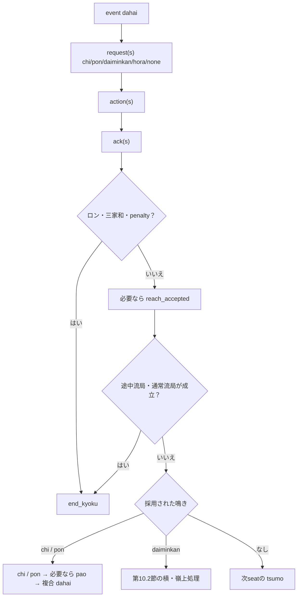
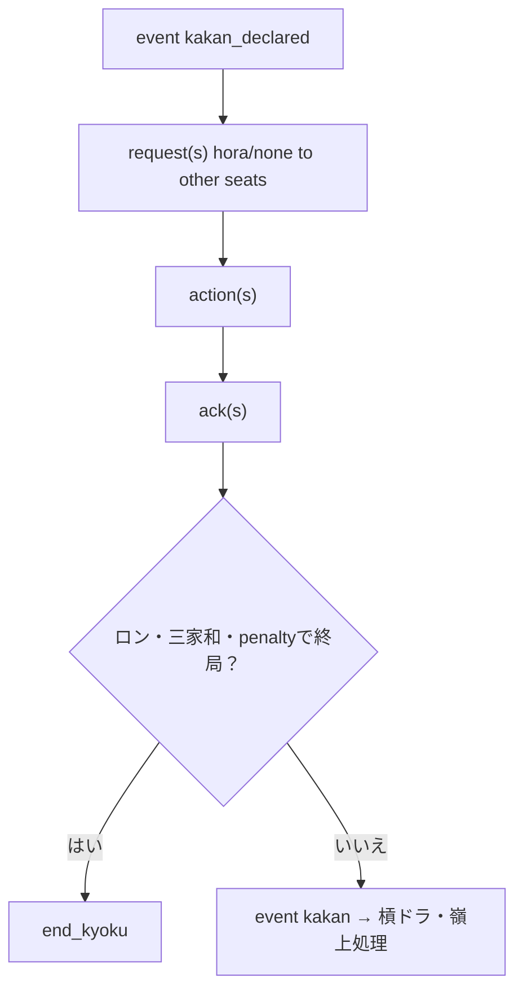
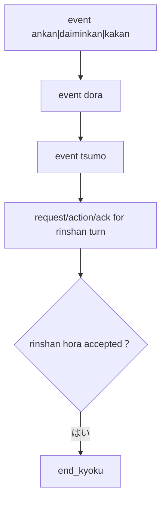
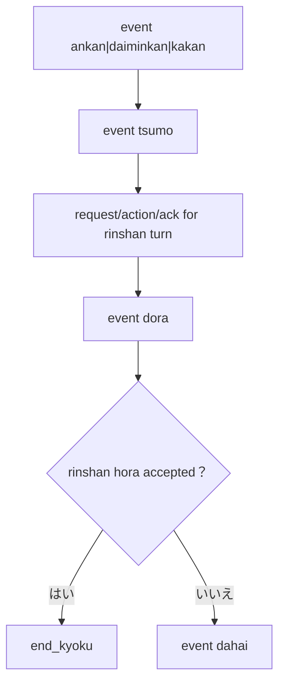
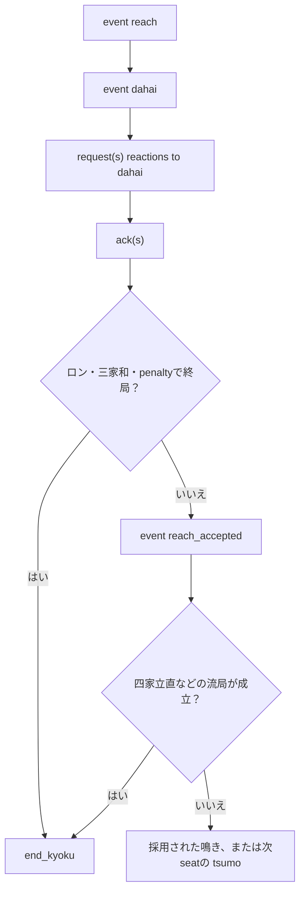
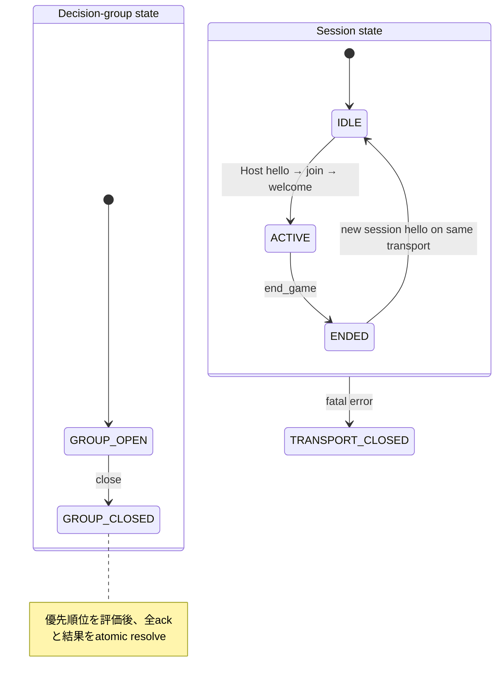
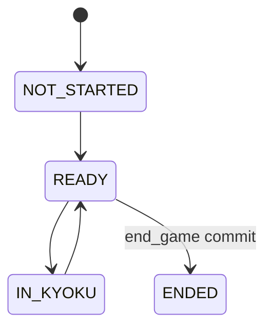

# YAMAI 仕様書 — draft 1

YAMAI は、4人リーチ麻雀の対局ホストと AI プレイヤーが、対局イベント、行動要求、行動選択および局結果を交換するためのプロトコルである。本書は通信、状態遷移、麻雀ルール、採点、再接続と適合性を定義する規範本文である。

| 項目 | 値 |
|---|---|
| 状態 | draft 1 |
| Protocol Version | `1.0-draft.1` |
| Profile | `riichi-4p` |
| Profile revision | `1.0-draft.1` |
| Release ID | `yamai-1.0-draft.1` |
| 作成日 | 2026-09-22 |
| データ形式 | UTF-8 JSON object |
| Transport | JSON Lines / WebSocket text message |

## 目次

1. [仕様の範囲と規約](#1-仕様の範囲と規約)
2. [用語と責務](#2-用語と責務)
3. [プロトコルモデル](#3-プロトコルモデル)
4. [JSON と transport](#4-json-と-transport)
5. [共通 envelope](#5-共通-envelope)
6. [版・機能交渉](#6-版機能交渉)
7. [`riichi-4p` profile](#7-riichi-4p-profile)
8. [行動要求](#8-行動要求)
9. [`ack` と timeout](#9-ack-と-timeout)
10. [イベント順序](#10-イベント順序)
11. [visibility と mode](#11-visibility-と-mode)
12. [エラー](#12-エラー)
13. [再接続と snapshot](#13-再接続と-snapshot)
14. [拡張](#14-拡張)
15. [資源・安全要件](#15-資源安全要件)
16. [成果物と版の一致](#16-成果物と版の一致)
17. [適合性](#17-適合性)
18. [セキュリティ](#18-セキュリティ)
19. [識別子と registry](#19-識別子と-registry)
20. [参照標準](#20-参照標準)

- [Appendix A. セッション状態機械](#appendix-a-セッション状態機械)
- [Appendix B. 最小交換例](#appendix-b-最小交換例)

## 1. 仕様の範囲と規約

本仕様は4人リーチ麻雀の `play`、`spectate`、`replay`、再接続および状態同期を対象とする。3人麻雀、AI の内部アルゴリズム、アカウント管理、認証方式、レーティングおよび課金は定義しない。公開サービスの認証・認可との境界は第18.6節に従う。

`request_id` は要求と応答を対応付け、`action_id` はホストが提示した合法候補を識別する。ホストからのメッセージは session ごとの `seq` で順序付ける。複数和了を含む局結果は一つの `end_kyoku` で原子的に確定する。

本書は実装と相互運用試験を目的とする Draft である。wire の Protocol Version は `1.0-draft.1` とし、draft 同士は完全一致する版だけを交渉できる（MUST）。版の文法は `MAJOR.MINOR-draft.REVISION`、安定版は `MAJOR.MINOR` とする。安定版を表明するには、本文と派生成果物の整合に加え、二つ以上の独立実装による相互運用試験を必要とする。

### 1.1 要件語

本書の **MUST**、**MUST NOT**、**REQUIRED**、**SHALL**、**SHALL NOT**、**SHOULD**、**SHOULD NOT**、**RECOMMENDED**、**NOT RECOMMENDED**、**MAY** および **OPTIONAL** は、大文字の場合に限り [BCP 14] の意味で解釈する。

### 1.2 データの表記

表の「必須」は member の存在を要求し、「任意」は省略を許可する。明示的に許可されない `null` は、member の欠落と同値ではない。配列添字は0始まり、member 名が `_ms` で終わる時間・期間の単位は millisecond とする。

JSON 例は独立したメッセージまたは payload の構造例である。連続した対局ログとして結合してはならない。非公開手牌、直前状態、交渉条件を含む合法性と処理順は、公式テストベクトルの前提とともに検査する。

## 2. 用語と責務

| 用語 | 意味・責務 |
|---|---|
| Host / ホスト | 牌山、ルール、合法候補、競合解決、時計、点数計算と確定状態を管理する |
| Player / プレイヤー | 自分に投影された状態を受信し、request に対して action_id を選択する |
| game | 同じルールと座席で行う対局。局と最終結果を含む |
| session | 一つの mode・view・game に対する通信状態。play は再接続して継続できる |
| transport | JSON Lines または WebSocket による通信路。session の寿命とは独立する |
| member | JSON object の name/value pair |
| message | 一つの top-level JSON object |
| event | ホストが確定した対局状態の変更 |
| request | 合法候補と期限を持つ行動要求 |
| action | request の候補から選択した行動 |
| decision group | 一つの打牌・槓宣言に反応する他家3人の要求集合 |
| ledger | session ごとの不変なホストメッセージ列と元の wire bytes |
| transaction | 選択、終端ACK、結果eventを一体として確定する処理単位 |
| view | 受信者へ開示する状態の範囲 |
| core | 拡張を除く標準message・状態遷移・採点規範の集合 |

ホストが保持する完全な状態を正準状態とする。プレイヤーは view に現れない牌や選択を推測して検証結果を補わず、自分に観測できる構造、順序、状態の整合を検査する。確定状態、要求の選択と計時、配送位置は区別して保持する。

## 3. プロトコルモデル

YAMAI は message を次の `kind` に分類する。

| `kind` | 方向 | 状態変更 | 応答 |
|---|---|---:|---|
| `hello` | Host → Player | しない | `join` |
| `join` | Player → Host | しない | `welcome` または `error` |
| `welcome` | Host → Player | セッション確立 | 不要 |
| `event` | Host → Player | する | 不要 |
| `request` | Host → Player | しない | `action` を1個 |
| `action` | Player → Host | ホスト受理後にのみする | `ack` |
| `ack` | Host → Player | action 結果を確定 | 不要 |
| `error` | 双方向 | 原則しない | fatal なら切断 |
| `snapshot` | Host → Player | 状態を置換 | 不要 |

プレイヤーは `request` を受信した場合にだけ `action` を送信しなければならない（MUST）。`event` への `none` 応答を送信してはならない（MUST NOT）。

### 3.1 正準状態

hostは、全seatが共有するgame状態とsessionごとの配送状態を分けて保持する（MUST）。同じ完全状態（固定した牌山、ID発行状態、時計入力を含む）と同じoperationに対するApplyの結果は決定的でなければならない。

```text
GameState = {
  game_id, phase: NOT_STARTED | READY | IN_KYOKU | ENDED,
  players, rules, scores, kyotaku, kyoku,
  decision: null | TurnRequest | ReactionGroup,
  terminal_requests, stale_attempts,
  seat_state[4], time_bank_ms[4], id_allocator
}
SessionState = {
  session_id, game_id, phase: NEGOTIATING | ACTIVE | ENDED | FATAL_CLOSED,
  negotiation, mode, view, seat, transport,
  head_seq, ledger, applied_seq, replay_frontier, resume_token
}
RequestState = {
  request_id, seat, issued_seq, caused_by_seq,
  legal_actions, default_action_id, prior_time_bank_ms,
  issued_at, individual_deadline,
  phase: OPEN | SELECTED | TERMINAL,
  selection: null | { action_id, source, elapsed_ms, time_bank_ms },
  terminal_ack, stale_attempts
}
```

GameStateの進行中decisionは、自摸番の単独request1個または反応group1個だけである。反応groupは他家3seatのrequestを持ち、同一seatへ二重発行しない。requestは選択と計時を固定してSELECTEDとなり、全memberの選択が固定されてから優先順位を一度だけ計算し、終端ACKを記録してTERMINALとなる。詳細は第8・9節に従う。

終端statusはaccepted、passed、superseded、defaulted、取消しのstaleのいずれかである。rejectedは終端ではない。自動選択・取消し後の後着actionに返すstaleは別のattempt履歴であり、元の終端決定を変更しない（MUST NOT）。

KyokuStateは第13.3節の公開・自己状態に加え、hostだけが保持する牌山と各seatの秘密状態を持つ。牌山は配牌、live wall、王牌、嶺上牌、表裏表示位置とcursorを一意に定め、局の途中で再抽選しない。pendingの槓は成立済みmeldと分け、供託はseatのscoresと別残高にする。全物理牌の保存、合法候補、フリテン、点数と次局は第7節に従う。

sessionの致命的終了とgameの終了は同一ではない。他seatのsessionやgameの進行を、あるsessionの切断だけで巻き戻してはならない。終了済みgameのledger、終端requestおよびresumeに必要な状態は第9・13節の期間保持し、同じgameへ新しいevent/requestを追加しない。

```text
Apply(S, operation) = (S', per_session_messages) | (S, diagnostic)
```

不正な入力を部分適用してはならない。エラー通知のledgerへの追加、fatalによる当該sessionの停止、期限処理および不正action policyによる処置は第8・9・12節が明示する別の遷移として処理する。確定した選択・計時・transaction・元のwire bytesを配送失敗で巻き戻してはならない。snapshotはこれらから受信viewに必要な状態を投影する（MUST）。

### 3.2 送信履歴と原子的な処理

hostは、`welcome` より後に送信する全てのenveloped host message（`event`、`request`、`ack`、`error`、`snapshot`）を、送信キューへ渡す前に `ledger` へ登録しなければならない（MUST）。`MessageRecord` は少なくとも次を保持する。

| field | 意味 |
|---|---|
| `seq` | このsessionで一度だけ割り当てる正の整数 |
| `wire_bytes` | JSON payloadのUTF-8 byte列。JSONLの行末LF、WebSocketのframe headerは含めない |
| `kind` | 登録時のmessage kind |
| `semantic_state` | 適用前後の内部state digestまたは同等の監査可能な参照 |
| `transaction_id` | 同一の原子operationに属するmessageを識別する不透明ID |

`wire_bytes` は、member順や空白を含めて最初に送信しようとしたpayloadそのものであり、再送時に再serializeしてはならない（MUST NOT）。`seq` は `head_seq + 1` を状態機械ロック内で予約し、reservationが失敗した場合は欠番にしてはならない（MUST NOT）。正常なlive streamでは `seq` は1から1ずつ増加する。`welcome`、版交渉前の`error`およびplayerからhostへのmessageはledgerに入れず、seqを持たない。

resume の ledger source は、対象 session に紐づく不変の host message ledger である。live の現在状態、別 transport の送信バッファ、Player が保存した表示状態を source としてはならない（MUST NOT）。replayは一つのtarget gameの記録済みeventを、新しいsessionのseqと元記録のoriginal_seqを分けて送る。同じseq列を消費するsnapshotやerrorも送り得る。ACKを観戦・replayへ流用してはならない。snapshot は ledger prefix の正準状態を圧縮した投影であり、snapshot の後に ledger の同じ seq を再生成してはならない。必要なledger区間がない場合も正準状態を保持しsnapshotが有効なら第13節の置換を使える。どちらも提供できなければresume_unavailableとする。

同一transaction内のmessageには同じtransaction_idを付与する（MUST）。主なtransaction境界を次に示す。requestの発行は第8.1.1節、診断は第12節に従う。

| operation | 送信順（seq順） | commit条件 |
|---|---|---|
| 単独action | `ack`、必要なら後続event | ackの終端決定とevent適用 |
| decision group | memberごとの全terminal `ack`、採用eventまたは`end_kyoku` | groupのlinearization point |
| chombo | offenderのrejected、そのoffenderを含む全OPEN/SELECTED requestの取消しstale、penalty end_kyoku | 第8.5節の取消し。既定候補を対局へ適用しない |
| resume | `welcome`（seqなし）、ledgerの再送 | 指定範囲を送信可能な状態 |
| snapshot | `snapshot` | snapshot stateと置換範囲をledgerへ登録 |

transaction内のackとeventの間に別transactionのhost messageを挿入してはならない（MUST NOT）。受信したactionの到着順、transportのworker順またはJSON objectのmember順を、transactionの適用順の根拠にしてはならない（MUST NOT）。

### 3.3 メッセージの前後条件

次表は全標準messageの入出力契約である。「成功時の状態」は `Apply` のcommit後にだけ成立し、表にない状態変更は不正である（MUST NOT）。不正messageは状態を変更せず、表のerrorを選択しなければならない（MUST）。

| message | 受理前提条件 | 成功時の状態・出力 | 不成立時のerror |
|---|---|---|---|
| `hello` | 新しい transport/session が接続され、まだ `hello` を送っていない | Host が negotiation context を作成して `hello` を **最初の application message として送信**し、Player の `join` を待つ。Player は `hello` を送信してはならない | `invalid_frame`/`invalid_json`/`invalid_message`、対応版がない場合は`unsupported_version`。transport層の`unsupported_frame`と汎用の`internal_error`も交渉中に使用し得る |
| `join` | `hello`受信後、未確定session。version/profile/hash/capability/limit/mode/view/targetが一致 | seatを予約または割当て、session/game contextを作り、`welcome`（seqなし）を一度だけ送る | `invalid_frame`/`invalid_json`/`invalid_message`、`unsupported_version`、`unsupported_profile`、`profile_mismatch`、`unsupported_view`、`unsupported_capability`、`unsupported_limit`、`resource_limit`（requested seat不可）、`resume_unavailable`。`unsupported_frame`・`internal_error`も交渉中に使用し得る |
| `welcome` | 有効な`join`を受理済み。まだapplication messageを送っていない | sessionをACTIVEにする。新規gameはstart_game(seq=1)、途中観戦は初期snapshot、resumeは保持済みgameと有限replay範囲を復元する | hostがこの前提を満たさない出力は`invalid_message`（受信側はfatal） |
| `event` | session ACTIVE、eventの前後条件（第10.4節）を満たす。seqと再送の判定は第5・13節に従う | event payloadを正準stateへ適用し、ledgerへ登録する | `sequence_gap`、`sequence_conflict`、状態・Schema違反は`invalid_message` |
| `request` | session ACTIVE、gameが継続中、原因eventが適用済み、active request数/seat/group制約を満たす | requestをactiveへ登録し時計を開始またはgroupへ予約し、ledgerへ登録する | `resource_limit`、`invalid_message`、原因seq不明なら`invalid_message` |
| `action` | Player → Host の application envelope（`yamai`/`kind`/`session_id`/`game_id`/`request_id`/`action_id`）。対象requestがactiveまたはterminal historyにあり、action_idがcandidateに対応 | attemptを記録。単独ならackと適用event、groupならlinearizationまでack/eventを保留 | 未知requestは`invalid_action`。候補不一致は`OPEN` requestに限り`invalid_action`、終端済みrequestは第9.2節の冪等再送・`request_conflict`・`stale`に従う。Schema/ID/session違反は第12節の`invalid_message` |
| `ack` | hostがaction/default/競合を一度だけ決定済み。requestがactiveまたは既存terminalの再送 | rejectedはOPENを維持し、終端ACKはTERMINALへ進める。後着staleは元の終端を維持する。採用したstate eventを同transactionの後続で適用 | request不明、status遷移不正、seq不正は`invalid_message` |
| `error` | error codeとseverityが送信方向・状態に適合 | recoverableはgame stateを変えず診断履歴だけを残す。ただし`sequence_gap`にはledgerの完全範囲replayまたは許可されたsnapshotを返す。fatalはsessionをFATAL_CLOSEDへ移す。`welcome` より後のenveloped host errorはledgerへ登録 | error自身のSchema/方向違反は相手へ適用せずtransportを終了 |
| `snapshot` | 連続したledger entry、resume/sequence gapで許可されたseq飛越し、または初回の途中観戦。stateが同じprofile/viewの完全射影 | 新規生成時にsnapshotをledgerへ登録し、受信側はstate、active requestおよび適用済みseqを置換 | 置換関係、visibility、pending requestまたはseq違反は`invalid_message`。復旧不能は`resume_unavailable` |

hostが `welcome` より後にenveloped errorを返す場合、そのerror message自体には新しいseqを割り当て、ledgerに登録しなければならない（MUST）。これはfatal errorを含む。版交渉前のerrorは第3.2節に従いseqを持たず、ledgerに登録しない。playerが送るerrorにはseqを割り当ててはならない。受信側は不正なhost messageを部分適用せず、どのerrorが選択されたかを決定的に記録できなければならない（MUST）。

## 4. JSON と transport

### 4.1 JSON 共通要件

message は [RFC 8259] の JSON object でなければならない（MUST）。

- 文字コードは UTF-8（MUST）
- BOM は禁止（MUST NOT）
- top-level は object（MUST）
- 重複キーは受信時に拒否（MUST）
- Unicodeの孤立surrogateは拒否し、正しいsurrogate pairは1個のUnicode文字として復号する（MUST）
- 整数は `-(2^53-1)` 以上 `2^53-1` 以下（MUST）
- `NaN`、`Infinity`、コメント、末尾カンマは禁止（MUST NOT）
- 1メッセージの既定上限は 1 MiB（UTF-8 JSON payloadのみ。JSONLのCR/LFおよびWebSocketのframe headerは含めない）（MUST）
- JSON の最大ネスト深さは64（MUST）
- 未知の標準フィールドは拒否（MUST）。`x_<owner>_<name>` 形式の拡張フィールドだけは、第14節の条件を満たす場合に限り無視してよい（MAY）
- 未知の `kind`、`type`、必須 capability は拒否（MUST）

版・profile・hash・capability・resume tokenおよび拡張member名の字句制約は、復号した文字列全体に適用する（MUST）。正しい接頭辞の後に改行や空白がある文字列を受理してはならない（MUST NOT）。JSON Schemaの正規表現にもこの条件を適用し、最終改行の直前へ一致する終端表現だけでは検査を済ませない。

各endpointは、自身が受信可能な上限を `hello.receive_limits` または `join.receive_limits` で通知しなければならない（MUST）。送信者はpeerの `receive_limits` を超えるmessageを送信してはならない（MUST NOT）。`max_message_bytes` は65,536以上1,048,576以下、`max_json_depth` は16以上64以下、`max_unresolved_requests` は1以上4以下でなければならない（MUST）。`riichi-4p` profileは第7.2節の受信下限（`max_message_bytes >= 1,048,576`、`max_json_depth >= 64`、`max_unresolved_requests >= 4`）を要求し、提示値を満たせないendpointは、ゲーム開始前に `unsupported_limit` で拒否しなければならない（MUST）。

深さはobjectとarrayだけを数え、top-level objectを1とする。キーとscalar値は深さを増やさず、空object/arrayも1段と数える。数値の整数制約は表記ではなく値に適用し、`1`、`1.0`、`1e0` は同じ整数を表す。交渉が完了する前は両者とも既定の1 MiB・深さ64で受信し、最初のhello/join自体を未通知の下限へ合わせる必要はない。

### 4.2 JSON Lines transport

フレーム文法を [RFC 5234] の ABNF で次のように定義する。[RFC 8259] の `JSON-text` は末尾の空白にCR/LFを含み得るため、行全体には直接使用せず、同RFCの `object` productionを基礎とする。ただし、このフレーム文法でobject内部およびobjectと行末の間に許される構文上の空白は `WSP`（SPまたはHTAB）だけとし、RFC 8259の `ws` に含まれるCR/LFをobject内部へ許可しない。`object` productionの先頭 `ws` は許可せず、行の先頭byteは `{` とする。JSON string内の改行はエスケープされた文字列として扱う。

```abnf
YAMAI-line = object *WSP [CR] LF
CR         = %x0D
LF         = %x0A
```

上記の `object` productionへ適用する空白制限は、この節の `WSP` 制約を優先する。payload内部のraw CRは `invalid_frame` とする。raw LFは常に行の区切りとなり、その位置まででJSONが完成していなければ `invalid_json` とする。

- 1メッセージを1行へ UTF-8 JSON として送信する（MUST）
- 行末は LF (`0x0A`)（MUST）
- 受信側は CRLF も受理する（MUST）。送信側の標準行末はLFとする
- JSON text 内の改行は JSON string の内外を問わず禁止し、string 内で必要な改行はエスケープする（MUST）
- 空行は無視せず `invalid_frame` とする（MUST）
- 送信側は各メッセージを flush する（MUST）
- 受信側は区切り後に先読みした byte を次のフレーム用に保持する（MUST）

TCP と標準入出力は同じフレーミングを使用できる（MAY）。TCP の接続寿命はゲームの寿命と独立であり、`end_game` だけを理由に切断する必要はない。

先頭byteは `{` とし、先頭のSP/HTABは許さない。payloadの長さには `{` から末尾のSP/HTABまでを含め、行末のLFと任意の直前CRだけを除く。未完行のままEOFになった場合は `invalid_frame` とし、完全な行だけを適用する。UTF-8の途中、CRとLFの間、JSON tokenの途中でtransport readが分割されても意味は変わらない。

### 4.3 WebSocket transport

- endpoint はWebSocket subprotocol `yamai.1.draft1` を交渉する（MUST）
- 1 text message は1個の YAMAI message だけを含む（MUST）
- 送信者は [RFC 6455] に従って text message を複数 frame へ分割できる（MAY）
- 受信者は分割された frame を完全な text message へ再構成してから JSON を解析する（MUST）
- binary message は `unsupported_frame` として拒否する（MUST）
- WebSocket の message boundary を YAMAI の message boundary とする（MUST）

WebSocket自身のhandshake・frame・UTF-8違反は [RFC 6455] の接続失敗処理を優先する（MUST）。例えば不正UTF-8は接続を失敗させ、Closeを送れる場合は1007、frame規約違反は1002を用いる。YAMAIのerrorを送るために失敗後のdata frameを送信したり、後続dataを処理したりしてはならない（MUST NOT）。ローカルの診断分類は第12節に従うが、transportが送信不能または既に終了処理中ならerror messageの配送を要求しない。正常なtext message内のJSON構文違反と、WebSocket層の違反を区別する。

### 4.4 transport 非依存性

transport は message の意味を変更してはならない（MUST NOT）。batch transport は1フレームへ複数 YAMAI message を格納してはならない（MUST NOT）。複数 message はそれぞれ独立したフレームとして連続送信する。

## 5. 共通 envelope

`welcome` 完了後、ホストから送る `event`、`request`、`ack`、`error` および `snapshot` は次の共通memberを持たなければならない（MUST）。`hello`、`join` および `welcome` は交渉messageであり、このenvelopeの対象外である。

```json
{
  "yamai": "1.0-draft.1",
  "kind": "event",
  "session_id": "s_01J6...",
  "game_id": "g_01J6...",
  "seq": 42,
  "event": {
    "type": "dahai",
    "actor": 2,
    "pai": "7s",
    "tsumogiri": true
  }
}
```

| フィールド | 要件 | 意味 |
|---|---|---|
| `yamai` | 必須 | 選択された完全なProtocol Version |
| `kind` | 必須 | メッセージ種別 |
| `session_id` | 必須 | 接続を越えて再開可能なセッションID |
| `game_id` | 必須 | 一意なゲームID |
| `seq` | 必須 | セッション内で1から単調に1増加する番号 |
| `original_seq` | replay eventでは必須、それ以外は禁止 | replay元記録のhost message seq。replay sessionの振り直し前の番号 |

ID は1～64文字の ASCII `[A-Za-z0-9._:-]` でなければならない（MUST）。復号した文字列全体を検査し、末尾の改行・空白やUnicode文字も許可してはならない（MUST NOT）。ID の内部構造を受信側が解釈してはならない（MUST NOT）。

ID以外の交渉用文字列・配列にも、次の閉じた上限を適用する（MUST）。文字列長はJSON復号後のUnicode scalar value数で数え、UTF-8 byte数・UTF-16 code unit数・表示上の文字数で代用しない。ASCII限定のmemberでは文字数とbyte数が一致する。message全体には別途第4.1節のbyte上限を適用する。

| member | 字句・長さ・要素数 |
|---|---|
| Protocol Version / profile revision | 第1節の版文法、ASCIIで32文字以下 |
| profile名 | 1～32文字、先頭は小文字英字、以降は小文字英字・数字・hyphen |
| 安定capability名 | 1～64文字、先頭は小文字英字、以降は小文字英字・数字・underscore。実験値は第14節 |
| `client.name`、`players[].name`、`join.room` | 存在する場合は1～128文字。表示名やroomを認証済みの主体IDとして扱わない |
| `client.version` | 1～64文字。クライアント自身の版を表す文字列であり、Protocol Versionの文法を要求しない |
| `hello.versions`、`profiles[].revisions`、`profiles[].protocol_versions[revision]` | 各1～16要素、同じ配列内の重複を禁止 |
| `hello.profiles` | 1～16要素、profile名を重複させない |
| `capabilities.required` / `optional` | 各0～64要素。両配列間も重複を禁止 |
| `welcome.capabilities` | 0～128要素、重複なしのASCII昇順 |
| `resume.token` | 22～256文字、ASCII英数字および `.`、`_`、`~`、`-` のみ。乱数強度・期限・所有権は第13節 |

byte-for-byteの比較対象はUTF-8 JSON payloadであり、JSONLの行末CR/LF、WebSocketのframe header・mask・fragment境界を含まない。payload内の空白、member順、escape表記は比較対象であり、再送でJSONを再直列化して変更してはならない（MUST NOT）。

プレイヤーは**連続して完全に適用した最大seq**を保持し、期待値をその値+1とする（MUST）。第12節の構文・envelope・Schema検査を通過したmessageのうち、期待値より大きいseqを持つものを破棄し、expected_seqとreceived_seqを持つrecoverable sequence_gapを送る。破棄した番号へ適用位置を進めてはならない（MUST NOT）。ホストの同じseqの再送は元のpayloadとbyte-for-byteで同一とし、同一の再送を再適用してはならない。保持している同じseqの内容が異なればfatal sequence_conflictとする。snapshotで置換した未保持の過去範囲は第13.3節に従う。

`sequence_gap` を受信したホストは、`expected_seq` から送信済みの最新 `seq` までの全messageを元の番号と内容で再送しなければならない（MUST）。一部だけを再送してはならない（MUST NOT）。再送できず `snapshot` capability が有効なら、第13.3節のsnapshotを送信できる（MAY）。いずれも不可能な場合、ホストはfatal `resume_unavailable`でsessionを終了しなければならない（MUST）。

`seq` は「受信できたmessage数」ではなく、hostがこのsessionへcommitしたapplication messageの永続的なledger番号である。hostは送信前に次の不変条件を満たすledger entryを作成し、entryとwire bytesの永続化に成功してからtransportへ渡さなければならない（MUST）。transportへのdelivery確認を待ってseqを割り当てたり、切断を理由に未送信entryを削除したりしてはならない（MUST NOT）。

受信側は `applied_seq` と、検証済みの `wire_bytes` を少なくとも最後の連続prefixについて保持する。`seq == applied_seq + 1` のmessageだけを構文・Schema・状態遷移検証後に適用し、適用成功後に `applied_seq` を進める。`seq <= applied_seq` は同じ `wire_bytes` ならduplicateとして無視できるが、byte-for-byteで異なる場合は `sequence_conflict` としなければならない。`seq > applied_seq + 1` はmessageを一切適用せず、第12節の検査層を通過した場合に限り `sequence_gap(expected_seq=applied_seq+1, received_seq=seq)`を返す。error送信によってapplied prefixを先へ進めてはならない。

hostは同一 `seq` の再送、resume replayおよびrange replayに、ledger entryのwire bytesをそのまま使用しなければならない。JSON objectをparseして再serializeしたもの、別のviewへ再投影したもの、または同じsemantic payloadを異なるmember順で組み立てたものは同一messageとみなさない（MUST NOT）。

### 5.1 標準 message の閉じた形

次の表は、本文で定義する標準 message の必須・条件付き member を閉じた形で示す。表にない標準 member は送信してはならず（MUST NOT）、拡張は `x_<owner>_<name>` のみ第14節に従って追加できる。`yamai`、`session_id`、`game_id`、`seq` の意味と byte 再送規則は上記の共通 envelope に従う。

| kind | 方向 | 共通 envelope | body の必須/条件付き member | 成功後の応答 |
|---|---|---|---|---|
| `hello` | Host→Player | なし | `kind`, `protocol`, `versions[1..]`, `profiles[1..16]`, `capabilities`, `receive_limits` | `join` |
| `join` | Player→Host | なし | `kind`, `version`, `mode`, `view`, `profile`, `profile_revision`, `profile_hash`, `client`, `capabilities`, `receive_limits`; `play` の新規時は任意 `seat`/`room`、`spectate`/`replay` は必須 `target`、resume時は必須 `resume` | `welcome` または `error` |
| `welcome` | Host→Player | `yamai`, `kind`, `session_id`, `game_id` | `resumed`, `seat`, `mode`, `view`, `profile`, `profile_revision`, `profile_hash`, `capabilities`, `players`, `scores`, `rules`; resume有効なら`resume`（tokenとexpires_in_ms）、resumed=trueならreplay_from_seqとreplay_through_seq | なし |
| `event` | Host→Player | 全て | `event={type,...}`。`type` と member は §7.4 の閉じた表に従う。状態前後条件は §10.4 | なし |
| `request` | Host→Player | 全て | 共通 envelope直下に `request_id`, `seat`, `caused_by_seq`, `timeout_ms`, `time_bank_ms`, `legal_actions`, `default_action_id`。group時は `decision_group_id`, `decision_group_members`, `decision_group_deadline_ms`, `decision_group_close` も直下に置き、ネストした `request` object は持たない | `action` 1個 |
| `action` | Player→Host | なし | `yamai`, `kind`, `session_id`, `game_id`, `request_id`, `action_id`; ネストした `action` object と `seq` は持たない | `ack`（必要なら後続 event） |
| `ack` | Host→Player | 全て | 共通 envelope直下に `request_id`, `action_id`, `status`, `elapsed_ms`, `time_bank_ms`。`ack` object は存在せず、`rejected` の診断は別の `error` messageで送る | なし |
| `error` | Host→Player または Player→Host | 交渉前はenvelopeなし、交渉後のHost発は共通envelope全て、Player発はyamai/session_id/game_id（seqなし） | 共通 envelope直下に `code`, `severity`, `message`, 条件付き `request_id`, `caused_by_seq`, `expected_seq`, `received_seq`, `action_id`, `original_status`。`error` object は存在せず、code と条件は §12 に従う | fatal以外は状態不変 |
| `snapshot` | Host→Player | 全て | 共通 envelope直下に `replaces_through_seq`, `state`。`state` は §13.3 と snapshot-state Schema の必須memberを持ち、`applied_seq` や snapshot専用の top-level `view` は送信しない | なし |

`event.type`、候補action（`legal_actions[].action`）の `type`、`ack.status`、`error.code` および `error.severity` は本文の閉じた列挙であり、同じ語を別の意味で再利用してはならない。request の `legal_actions` は不透明 `action_id` と、その action を適用するために必要な公開引数を含む候補の配列で、候補の順序は表示順に過ぎず優先順位を表さない。action は候補を丸ごと再送せず、request に発行された `action_id` だけを返す。

`snapshot` の `applied_seq` は受信側が保持するローカルな連続適用位置であり、wire memberではない。snapshotの適用範囲は `replaces_through_seq`、snapshot自身のledger番号は `seq` で表す。`snapshot.state` の `mode`、`seat`、`view` は通常のstate projectionのmemberであり、snapshot envelopeへ同じ意味のmemberを追加してはならない（MUST NOT）。

## 6. 版・機能交渉

### 6.1 `hello`

接続を確立した Host が最初の YAMAI application message として `hello` を送信する。Player は `hello` を送信してはならず（MUST NOT）、`hello` 受信前には交渉用のfatal `error` 以外を送信してはならない（MUST NOT）。`join` は有効な `hello` を受信した後にだけ送信する（MUST）。Host は同一sessionへ `hello` を二度送ってはならず、再交渉は新しいsessionで行う。同じtransportの再利用は第6.4節・Appendix Aに従う。

```json
{
  "kind": "hello",
  "protocol": "yamai",
  "versions": [
    "1.0-draft.1"
  ],
  "profiles": [
    {
      "name": "riichi-4p",
      "revisions": [
        "1.0-draft.1"
      ],
      "hashes": {
        "1.0-draft.1": "sha256:a2e314f5a134a43a3c2539ced8aafa84699e315e78566c3b304d58a393d1bafc"
      },
      "protocol_versions": {
        "1.0-draft.1": [
          "1.0-draft.1"
        ]
      }
    }
  ],
  "capabilities": {
    "required": [],
    "optional": [
      "resume",
      "snapshot"
    ]
  },
  "receive_limits": {
    "max_message_bytes": 1048576,
    "max_json_depth": 64,
    "max_unresolved_requests": 4
  }
}
```

### 6.2 `join`

```json
{
  "kind": "join",
  "version": "1.0-draft.1",
  "mode": "play",
  "view": "seat",
  "seat": 0,
  "profile": "riichi-4p",
  "profile_revision": "1.0-draft.1",
  "profile_hash": "sha256:a2e314f5a134a43a3c2539ced8aafa84699e315e78566c3b304d58a393d1bafc",
  "client": {
    "name": "ExampleAI",
    "version": "2.3.0"
  },
  "capabilities": {
    "required": [],
    "optional": [
      "resume",
      "snapshot"
    ]
  },
  "receive_limits": {
    "max_message_bytes": 1048576,
    "max_json_depth": 64,
    "max_unresolved_requests": 4
  },
  "room": "default"
}
```

クライアントは `hello.versions` に存在する版を1個選ばなければならない（MUST）。draft版は文字列が完全一致しなければならない（MUST）。安定版でmajorが異なる版へ暗黙にdowngradeしてはならない（MUST NOT）。

hello.profilesは同じprofile名を重複させず、対応revision、hashes、protocol_versionsを提示する。revisionsの集合と両objectのキー集合は一致し、protocol_versions[revision]は空でないhello.versionsの部分集合とする（MUST）。joinはこの行列に存在するversion/profile/revision/hashの組だけを選ぶ。単に各値が別々の一覧に存在することでは足りない。revision、hashまたは組み合わせが異なればprofile_mismatchとする。

profile_hashは、vector manifestのprofile_hash_inputsに列挙したJSONをprofile_schema、rules_schema、scoring_vectors_schema、protocol_registry、scoring_registry、official_vectors、scoring_vectorsの7 memberへ投影して計算する。protocol registryのprofiles[].hashを除外する。投影に含まれるhello.profiles[].hashesの値、およびjoin/welcomeのprofile_hashについて、正規の `sha256:` 付き64桁小文字hex文字列をゼロhashへ正規化する。wire memberに保存した正しいJSONのhello/join/welcomeでも、対応するidentity hashの文字列tokenをゼロhashへ置き換える。置換対象は復号したmember名とobject/array内の位置で特定し、同じ文字列を持つ他のmember名・注釈・配列要素は置換しない（MUST NOT）。その他の空白・member順・escape表記は維持する。Schemaのpropertiesや、否定試験の型不正な値はこの置換の対象にしない。

投影objectを[RFC 8785] JCSで直列化し、UTF-8 byte列へSHA-256を適用する（MUST）。member順・空白・Unicode escape・数値をJCS以外の方法で扱わない。現行のhash入力文書はsafe整数だけを数値値として用いる。小数等の構文試験はraw JSON文字列で保持し、公開artifactで数値範囲を拡張する場合はvalidatorも完全なJCS直列化へ対応させる。welcomeは選択済みのrevision/hashをそのまま返す。


`capabilities` は `required` と `optional` の2配列を持たなければならない（MUST）。重複および両配列への同一値の記載は禁止する（MUST NOT）。`required` はpeerが理解しない場合に交渉を拒否する機能、`optional` は両者が提示した場合だけ有効になる機能である。両者の `required` はpeerの `required` または `optional` に含まれなければならず（MUST）、満たせない場合は `unsupported_capability` で拒否する。未知のexperimental capabilityは `optional` なら無視できるが、`required` なら拒否しなければならない。安定 capability は小文字 snake case、実験用 capability は `x-<owner>-<name>` とする。`resume` capabilityは `play` modeでだけ有効であり、`spectate` または `replay` modeでは交渉済みoptional一覧に双方が含めても有効化してはならない（MUST NOT）。

新規sessionを要求する `join` は `resume` memberを省略する。`play` の新規joinでは `seat` memberを省略してもよく（MAY）、その場合hostは空いているseatのうち最小のseatを割り当てる。`seat` memberを指定した場合、hostはそのseatを割り当てなければならず（MUST）、既に予約済み・参加済みまたはprofile上割り当て不能なら `resource_limit` で拒否しなければならない（MUST）。hostはjoinの到着順以外の隠れた規則でseatを変更してはならず（MUST NOT）、assignment結果を `welcome.seat` に記録する。従って `welcome.seat == join.seat` は `join.seat` が存在する場合だけ要求され、省略時は `welcome.seat` がhostの最小空席割当と一致しなければならない（MUST）。seat割当は `welcome`送信前にsession stateへcommitされ、失敗時に別seatへ暗黙にfallbackしてはならない（MUST NOT）。

再開は `play` modeだけで許可し、`resume` を伴う場合は `target` と新規seat指定を省略し、tokenが対象gameと既存seatを識別する（MUST）。resume joinで `seat` を指定してはならず（MUST NOT）、tokenから復元したseat以外への変更を要求してはならない。`spectate` または `replay` の `join` は `resume` を指定してはならず（MUST NOT）、このmodeでは `resume` capabilityを有効化してはならない。`mode` は `play`、`spectate` または `replay` のいずれかであり、`view` は `play` では文字列 `seat`、`spectate` では文字列 `public`、`replay` では文字列 `public`、`full` または `{ "seat": N }` とする（MUST）。`play` では `target` を指定してはならない（MUST NOT）。`spectate` の `target` は `{ "type": "game", "id": <game_id> }`、`replay` の `target` は `{ "type": "game", "id": <game_id> }` または `{ "type": "recording", "id": <recording_id> }` の一方を必須とする（MUST）。`target.type` を省略してはならない（MUST NOT）。

```json
{
  "kind": "join",
  "version": "1.0-draft.1",
  "mode": "play",
  "view": "seat",
  "profile": "riichi-4p",
  "profile_revision": "1.0-draft.1",
  "profile_hash": "sha256:a2e314f5a134a43a3c2539ced8aafa84699e315e78566c3b304d58a393d1bafc",
  "client": {
    "name": "ExampleAI",
    "version": "2.3.0"
  },
  "capabilities": {
    "required": [],
    "optional": [
      "resume",
      "snapshot"
    ]
  },
  "receive_limits": {
    "max_message_bytes": 1048576,
    "max_json_depth": 64,
    "max_unresolved_requests": 4
  },
  "resume": {
    "token": "rt_AQIDBAUGBwgJCgsMDQ4PEA",
    "last_seq": 120
  }
}
```

`resume.last_seq` はクライアントが完全に適用した最後のhost messageである。未適用または部分適用したmessageの番号を指定してはならない（MUST NOT）。

有効capability集合は、両者がrequiredまたはoptionalに列挙した集合の共通部分である。両者のrequiredがこの集合に入らない場合は `unsupported_capability` とする（MUST）。modeがplay以外ならoptionalのresumeをこの集合から除き、どちらかがresumeをrequiredにしていれば交渉を拒否する。welcomeの必須 `capabilities` はこの結果をASCII昇順・重複なしの配列で返す。広告していない機能をwelcomeで追加したり、requiredを黙って落としたりしてはならない（MUST NOT）。

### 6.3 `welcome`

```json
{
  "yamai": "1.0-draft.1",
  "kind": "welcome",
  "session_id": "s_01J6...",
  "game_id": "g_01J6...",
  "resumed": false,
  "resume": {
    "token": "rt_AQIDBAUGBwgJCgsMDQ4PEA",
    "expires_in_ms": 600000
  },
  "seat": 0,
  "mode": "play",
  "view": "seat",
  "profile": "riichi-4p",
  "profile_revision": "1.0-draft.1",
  "profile_hash": "sha256:a2e314f5a134a43a3c2539ced8aafa84699e315e78566c3b304d58a393d1bafc",
  "players": [
    {
      "seat": 0,
      "name": "ExampleAI"
    },
    {
      "seat": 1,
      "name": "BotB"
    },
    {
      "seat": 2,
      "name": "BotC"
    },
    {
      "seat": 3,
      "name": "BotD"
    }
  ],
  "scores": [
    25000,
    25000,
    25000,
    25000
  ],
  "rules": {
    "game_length": "tonnan",
    "starting_points": 25000,
    "extension": {
      "mode": "sudden_death",
      "target_points": 30000,
      "max_extra_rounds": 4
    },
    "ranking_policy": "initial_seat_order",
    "red_fives": {
      "m": 1,
      "p": 1,
      "s": 1
    },
    "kuitan": true,
    "ron_policy": "double_only",
    "reaction_priority": "hora_call_chi",
    "multiple_ron_settlement": {
      "honba": "each_winner",
      "kyotaku": "first_winner"
    },
    "bankruptcy": "end_game",
    "bankruptcy_threshold": 0,
    "dealer_continuation": {
      "win": true,
      "tenpai_draw": true
    },
    "abortive_draw_continuation": true,
    "agariyame": true,
    "noten_payment": {
      "total_points": 3000,
      "unit": 100,
      "remainder": "lowest_seat"
    },
    "riichi_stick_value": 1000,
    "honba_ron_value": 300,
    "honba_tsumo_value_per_payer": 100,
    "kiriage_mangan": false,
    "kazoe_yakuman": "yakuman",
    "double_yakuman": [
      "kokushi_13_wait",
      "suuankou_tanki",
      "junsei_chuuren",
      "daisuushii"
    ],
    "pao": {
      "yakus": [
        "daisangen",
        "daisuushii"
      ],
      "ron": "split",
      "tsumo": "liable_all"
    },
    "chombo": {
      "penalty_points": 8000,
      "distribution": "equal_other_players",
      "remainder": "lowest_seat"
    },
    "ankan_chankan": "kokushi_only",
    "kan_dora_timing": {
      "ankan": "before_rinshan",
      "daiminkan": "after_rinshan_discard",
      "kakan": "after_rinshan_discard"
    },
    "invalid_action_policy": "reject",
    "time_control": {
      "grace_ms": 3000,
      "bank_ms": 15000,
      "bank_scope": "kyoku"
    },
    "abortive_draws": [
      "kyushukyuhai",
      "suufon_renda",
      "suucha_riichi",
      "suukan_sanra",
      "sanchaho"
    ],
    "local_yaku": []
  },
  "capabilities": [
    "resume",
    "snapshot"
  ]
}
```

welcomeはseqを持たない（MUST NOT）。mode/viewとprofileの選択をjoinへ一致させ、playのseatはホストが割り当てる。resumed=falseならreplay_from_seqとreplay_through_seqを省略し、trueなら両値とresumeを必須とする。spectate/replayのgame_idはtagged targetが示すgameに一致し、recording targetならその記録に対応するgame_idとする。新規sessionの最初のenveloped host messageはseq=1とする。再開では同じsession_id/game_idを返し、from=last_seq+1からthroughまでを再送するか、第13.3節のsnapshotを送る（MUST）。

`play` modeで `resume` capabilityが有効な場合、ホストは `welcome.resume.token` を毎回新しい値へrotateしなければならない（MUST）。`resume` capabilityが有効でない場合、`welcome` に `resume` memberを含めてはならず（MUST NOT）、`spectate` または `replay` modeでも含めてはならない（MUST NOT）。expires_in_msはwelcomeの送信キュー記録完了（成功確定）からの有効期間である。再開に失敗した場合、ホストは交渉用fatal `resume_unavailable` を返し、新規sessionへ暗黙にfallbackしてはならない（MUST NOT）。`resume` capabilityが無効なjoinに `resume` memberがある場合も、ホストは `resume_unavailable` で拒否しなければならない（MUST）。

`rules` のすべての member は §7.2 の表と §7.6 の規則で意味を定義する。§7.2 が必須とする member を省略してはならず（MUST NOT）、クライアントは理解できない必須ルール値を `unsupported_rules` で拒否しなければならない（MUST）。Schema はこの表の派生表現に過ぎない。

welcomeのplayersはseat 0～3の順に並べる。新規playとreplayのwelcome.scoresは開始点、途中観戦とresumeでは同期対象時点の点数を返す（MUST）。resumeでwelcome.scoresを既存の対局状態へ上書きしてはならない。last_seq=0から古いstart_gameを再生する場合は、rules.starting_pointsによる初期点を適用し、その後のeventで現在へ進める。再開でrules、players、seat、mode/view、有効capability集合を変更してはならない（MUST NOT）。

新規sessionの初期化には、seq=1のstart_game、または第11節の観戦初期snapshotを使う。hostはこの初期化messageを最初にledgerへcommitし、初期化前の入力に対するrecoverable errorを含め、他の非fatal messageを先に採番・配信してはならない（MUST NOT）。初期化できずsessionを終了するときだけ、seq=1のfatal errorを送れる。受信者も初期化前の連続した非fatal error・request・ACKをfatal invalid_messageとして拒否する（MUST）。これにより診断がseq=1を消費してstart_gameを開始不能にしない。履歴再送と欠落回復は第13節に従う。

新規playおよびreplayのクライアントは、welcome受理時に全seatのscoresがrules.starting_pointsと一致することを検査する（MUST）。replayのtargetが進行中または終了済みでも、現在点数・最終点数を開始点数として受理してはならない。違反は後続のstart_gameを待たずfatal invalid_messageとする。

### 6.4 交渉の検査順と境界

ホストはhello→join→welcome/errorの順を守り、交渉中にapplication messageを送らない。join.roomは新規playだけで使用し、resumeやspectate/replayのtargetと併記しない（MUST）。構造上有効なmode/viewの組をホストが提供しない場合はunsupported_viewとして拒否する（MUST）。unsupported_profileはprofile名が未対応の場合に限る。mode/viewの型や組合せ自体が不正な場合はinvalid_messageとし、この二つと区別する。

拒否理由は次の順に決める（MUST）。

1. frame・JSONの検査を行う。
2. [join-proposal Schema](../schemas/protocol/1.0-draft.1/negotiation/join-proposal.schema.json)で型、必須member、mode/view/target、重複などを検査する。この段階ではversion/profile/revisionの選択値をconst一致で拒否しない。構造違反はinvalid_messageとする。
3. 広告済みかつ対応するversionがなければunsupported_version、profileがなければunsupported_profile、revision/hashの組が異なればprofile_mismatchとし、その後に提供しないmode/viewをunsupported_viewとする。
4. required capabilityとmode制約を確認し、満たせなければunsupported_capabilityとする。途中観戦に必須のsnapshotも、この段階で検査する。その後でprofileの受信下限を検査し、満たせなければunsupported_limitとする。両方を満たさない場合はunsupported_capabilityを優先する。
5. target取得とresumeの資格・範囲を検査し、取得不能・失効・保持不能はresume_unavailableとする。
6. 有効なwelcomeを構築する。クライアントはwelcomeの構造・選択の一致を確認し、不一致はfatal invalid_message、構造が有効でも未対応のルール値はfatal unsupported_rulesで拒否する。

受理されたjoinは通常のjoin Schemaにも適合する。message Schemaのconst制約だけを先に適用し、版不一致を一律invalid_messageにしてはならない（MUST NOT）。welcomeはホストの確定結果であり、クライアントの受信・承認を通知する追加ACKは存在しない。

IDの一意性は同一hostの運用・記録系列を範囲とし、新しいsession_idや新規game_idを過去の対象へ再利用しない。別hostの同じIDを同じ対象とみなさない。通常のend_game後は同じtransportで次のhelloを送れるが、前sessionの終了前に次sessionを重ねない（MUST）。

## 7. `riichi-4p` profile

本節および §7.6 が `riichi-4p` の役、役満条件、ドラ bonus、符、基本点、支払、責任払い、流局および精算を完全に定義する。採点のSchema、registry、vectorおよび検査実装はこの節に従う派生成果物であり、実装が別文書を参照しなければ意味を確定できない状態にしてはならない（MUST NOT）。

### 7.1 座席

座席は整数 `0` から `3` である。座席はゲーム中固定し、seat-indexed array は座席順とする。親は event ごとの `oya` で表す。

### 7.2 必須ルール

`riichi-4p` の `rules` は次の member をすべて持たなければならない（MUST）。既定値による省略を禁止する（MUST NOT）。

`riichi-4p` profileのendpointは `max_message_bytes >= 1,048,576`、`max_json_depth >= 64` および `max_unresolved_requests >= 4` を受信可能でなければならない（MUST）。`join.receive_limits` がこの下限を満たさない場合、ホストは `unsupported_limit` で交渉を拒否しなければならない（MUST）。完全な `legal_actions` またはsnapshotをpeer上限に合わせて切り詰めてはならない（MUST NOT）。

| キー | 型・値 | 意味 |
|---|---|---|
| `game_length` | `tonpu`, `tonnan` | 規定のゲーム長 |
| `starting_points` | 非負整数 | 開始点 |
| `extension` | `{mode,target_points,max_extra_rounds}` | 規定局後の延長。`mode` は `none` または `sudden_death`、`max_extra_rounds` は0～100 |
| `ranking_policy` | `initial_seat_order` | 同点時は小さい絶対seatを上位とする |
| `red_fives` | `m,p,s` ごとの0～4 | 各色の赤五枚数 |
| `kuitan` | boolean | 喰いタン |
| `ron_policy` | `multiple`, `head_bump`, `double_only` | 全ロン、頭ハネ、または二家和まで許可し三家和を途中流局とする |
| `reaction_priority` | `hora_call_chi` | 和了、daiminkan/pon、chi、noneの固定優先順 |
| `multiple_ron_settlement` | `{honba,kyotaku}` | 複数ロン時の本場・供託。下記規則に従う |
| `bankruptcy` | `continue`, `end_game` | トビ終了 |
| `bankruptcy_threshold` | 整数 | `scores < threshold` をトビとする境界 |
| `dealer_continuation` | `{win,tenpai_draw}` | 親和了・流局聴牌時の連荘 |
| `abortive_draw_continuation` | boolean | 途中流局時の連荘 |
| `agariyame` | boolean | オーラス親のアガリ止め |
| `noten_payment` | `{total_points,unit,remainder}` | 通常流局時に授受する点の総額と100点単位の配分 |
| `riichi_stick_value` | 非負整数 | リーチ供託額 |
| `honba_ron_value` | 非負整数 | ロン時の1本場加算 |
| `honba_tsumo_value_per_payer` | 非負整数 | ツモ時に各支払者が加算する1本場額 |
| `kiriage_mangan` | boolean | 切り上げ満貫 |
| `kazoe_yakuman` | `yakuman`, `sanbaiman` | 数え役満の上限 |
| `double_yakuman` | condition IDの配列 | ダブル役満として扱う形。空配列なら全役満を単倍とする |
| `pao` | `{yakus,ron,tsumo}` | 対象役と責任払い。`ron` は `split`/`liable_all`、`tsumo` は `liable_all`/`normal` |
| `ankan_chankan` | `never`, `kokushi_only` | 暗槓への槍槓 |
| `kan_dora_timing` | `{ankan,daiminkan,kakan}` | 各槓の公開時点。値は `before_rinshan` または `after_rinshan_discard` |
| `invalid_action_policy` | `reject`, `default`, `chombo` | 不正 action への対局上の処置 |
| `chombo` | `{penalty_points,distribution,remainder}` | `chombo`時の総点数、他家への配分、端数席 |
| `time_control` | `{grace_ms,bank_ms,bank_scope}` | 猶予時間、持ち時間、`bank_scope` は `kyoku` または `game` |
| `abortive_draws` | reason ID の配列 | 採用する途中流局 |
| `local_yaku` | yaku ID の配列 | 合意済みローカル役。通常は空 |

`local_yaku` に未知の値があるクライアントは接続を拒否しなければならない（MUST）。合法手だけを選択するプレイヤーであっても、和了判断と期待値計算が変化するため、未知の値を無視してはならない（MUST NOT）。

`time_control.grace_ms` と `time_control.bank_ms` は0以上600,000以下の整数でなければならない（MUST）。`grace_ms` は全requestに共通する非課金の猶予であり、time bankを消費しない。単独requestのdeadlineは、第9.1節のrequest開始時刻に `grace_ms + timeout_ms + time_bank_ms` を加えた時刻である。decision groupの各requestについては、第8.1節で定義する `group_start` を各個別時計の開始時点とし、同じ式を `group_start` に加えた時刻を個別deadlineとする。`bank_scope == "kyoku"` では `start_kyoku` ごと、`bank_scope == "game"` では `start_game` ごとに bank を reset する。

`starting_points`、`extension.target_points`、`bankruptcy_threshold`、`riichi_stick_value`、`honba_ron_value`、`honba_tsumo_value_per_payer` および `chombo.penalty_points` は100の倍数でなければならない（MUST）。`noten_payment.total_points` は600の倍数、`noten_payment.unit` は100、`noten_payment.remainder` は `lowest_seat` でなければならない（MUST）。

ホストはゲーム開始前に、次の保守的な上限式を満たすrulesだけを受理する（MUST）。`M = 2^53 - 1`、`E = 100000`（第15節のevent上限）、`W = 768000`、`S = starting_points`、`R = riichi_stick_value`、`H = max(honba_ron_value, honba_tsumo_value_per_payer)`、`N = noten_payment.total_points`、`P = chombo.penalty_points` とする。

```text
D = max(R, N, P, 3 * W + E * (3 * H + R))
S + E * D <= M
```

Wは登録済み12役満と4種の倍化を全て合計した16倍役満の親ロン額であり、同時成立しない役も含めた上界である。本場・供託本数はそれぞれE以下、和了者またはツモ支払者は3人以下なので、各eventの各seatの差額の絶対値はD以下となる。最大E eventを通じた点数の絶対値を上式で制限することにより、合法な局精算のscores・deltas・payments・供託点を第4.1節の整数範囲内に保つ。ゲーム開始時の点数だけを範囲検査して済ませてはならない（MUST NOT）。

この条件を満たさないwelcome/start_gameのrulesはfatal `invalid_message` とする。Schemaの個別member上限だけでは上式の組合せ条件を保証しないため、意味検査も必須である。上限式と点数保存則の計算は、任意精度整数または範囲超過を検出する整数演算を使用し、浮動小数点の丸めや整数overflowで受理判定を変えてはならない（MUST NOT）。状態・採点に影響する拡張は、第14節に従って追加の移動点と和了点の上界を定め、core以上のDを用いて同じ整数範囲の保証を検査する（MUST）。

`extension.mode == "none"` の場合、`max_extra_rounds` は0でなければならない（MUST）。`sudden_death` の場合、本節のnext決定手順に従い、規定最終局から親が流れたときに最高点がtarget未満なら、max_extra_roundsを上限として局を延長する。延長局数は `start_kyoku.extension_round` で表し、通常局は0、最初の延長局は1とし、`max_extra_rounds` を超えてはならない（MUST）。同点順位は常に `ranking_policy` で決定し、`end_game.rankings` はその結果と一致しなければならない（MUST）。

`ron_policy == "head_bump"` では、候補のうち `(actor - target + 4) mod 4` が最小の和了者だけを採用する。`multiple` では全和了者を採用する。`double_only` では二家和まで採用し、三家和は `sanchaho` として流局にする。`double_only` では `abortive_draws` に `sanchaho` を含め、それ以外では含めてはならない（MUST）。

複数ロンの `first_winner` は `(actor - target + 4) mod 4` が最小の和了者とする。`multiple_ron_settlement.honba` は `each_winner` または `first_winner` である。前者は各winへ本場を加算し、後者はfirst winnerだけへ加算する。`kyotaku` は `first_winner` または `equal_split` である。`kyotaku` は供託本数で表し、点数は `kyotaku × riichi_stick_value` とする。`equal_split` では供託点を100点単位で等分し、除算の余りをfirst winnerへ加算する。未配分の供託本数はなく、`next.kyotaku` は配分後の本数でなければならない（MUST）。各winの `deltas` はこの配分と一致しなければならない（MUST）。

`pao.yakus` は責任払いの対象役を列挙する。公開済みの副露・暗槓の履歴により責任seatが決まった時点で、ホストはpao eventを記録する（MUST）。責任払いは第7.6.7.3節に従い、対象役満の基本点成分だけを移す。複合した対象外の役満まで責任seatへ移してはならない（MUST NOT）。ronのsplit/liable_all、tsumoのnormal/liable_all、本場の100点単位配分も同節の式に従う。供託はseat間の支払いへ追加せず、供託残高から和了者へ付与する。複数winはそれぞれ独立に展開してからdeltasを合算する（MUST）。

`noten_payment.total_points` は通常流局で授受する総点数である。聴牌者数を `t` とし、`total_points` は600の倍数でなければならない（MUST）。`0 < t < 4` の場合、各seatの純差額は、`t==1` なら聴牌者 `+total_points`・各不聴者 `-total_points/3`、`t==2` なら各聴牌者 `+total_points/2`・各不聴者 `-total_points/2`、`t==3` なら各聴牌者 `+total_points/3`・不聴者 `-total_points` とする。`t==0` または `t==4` の場合は全seatの差額を0とする。配分はseat単位の純差額で表し、個別seat間の支払明細を要求してはならない（MUST）。

`chombo.penalty_points` はchomboで移動する総点数であり、distribution=equal_other_playersならoffenderから他の3seatへ100点単位で等分し、余りをoffender以外の最小seatへ加算する。正の支払いだけをresult.penalty.paymentsへ記録し、総額0なら空配列とする。各seatのdeltasは、そのseatの受取総額から支払総額を引いた値とし、全seatの合計は0とする（MUST）。詳細は第7.6.8.2節に従う。

新規gameは東1局、oya=0、honba=0、kyotaku=0、extension_round=0、全seatのscore=`starting_points` で開始する。局終了後、ホストは次の順にnextを決め、最初に該当した終了条件を採用する（MUST）。

1. deltasを適用してscoresと配分後のkyotakuを確定する。
2. `bankruptcy == "end_game"` でいずれかのscoreがthreshold未満なら終了する。thresholdと等しいだけでは終了しない。
3. 現局が延長局（extension_round>0）で、最高scoreがtarget以上、または使用済み延長局数がmax_extra_rounds以上なら終了する。親の和了・聴牌でもこの上限を越えて続行しない。
4. penaltyは同じ局・同じ親・同じ本場でやり直す（renchan）。供託は返却せず繰り越す。延長中なら、次の配牌も延長局数へ1加算する。
5. 親を含む和了で `dealer_continuation.win` がtrue、通常流局で親が聴牌し `dealer_continuation.tenpai_draw` がtrue、途中流局で `abortive_draw_continuation` がtrueの場合だけ `dealer_continues=true` とする。
6. 規定最終局より前なら、dealer_continuesに従いrenchanまたはrotateとする。
7. 規定最終局で親が続行する場合、親の**和了**、agariyame=true、親がrank 1、親scoreがtarget以上の全条件を満たすときだけ終了し、それ以外はrenchanとする。聴牌・途中流局をアガリ止めに含めない。
8. 規定最終局で親が続行しない場合、最高scoreがtarget以上なら終了する。target未満でextension.mode=sudden_death、max_extra_rounds>0なら最初の延長局へrotateし、それ以外は終了する。
9. 延長中で上記の終了条件を満たさなければ、dealer_continuesに従ってrenchanまたはrotateし、いずれでもextension_roundを1増やす。

`tonpu` の規定最終局は東4局、`tonnan` は南4局である。規定最終局の連荘はextension_round=0のままとし、そこから親が流れて初めてextension_round=1となる。通常流局・途中流局では本場を1増やす。和了時はrenchanなら1増やし、rotateなら0とする。penaltyの本場は上記の例外に従う。

renchanはbakaze、kyoku、oyaを維持する。rotateはoyaを `(oya+1) mod 4`、kyokuを1増加し、4局の次はkyoku=1としてbakazeをE→S→W→N→Eの順に進める。延長で場風が一周してもextension_roundを0へ戻さない（MUST NOT）。終了時のnextは `{type:"end_game",kyotaku:N}` とし、継続時はtype、bakaze、kyoku、oya、honba、kyotaku、extension_roundの全てを次局の値で明示する（MUST）。

`abortive_draws` のreasonは次の条件で成立する。conditionを満たしても一覧に含まれないreasonを宣言してはならない（MUST NOT）。

`fanpai` はlive wallが0枚となり、最後の自摸および打牌に和了がなく、途中流局も成立しない通常流局である。`fanpai` は `abortive_draws` に含めない。
- `kyushukyuhai`: 自分の第一巡の自摸番（当該seatの最初の `dahai` より前）で、他家を含め鳴きがなく、自分の手牌に異なる么九牌が9種以上ある場合に、そのplayerが `ryukyoku` actionを選択する。
- `suufon_renda`: 鳴きのない第一巡で4人の最初の打牌が同一の風牌であり、4枚目にロンがない。
- `suucha_riichi`: 4人全員の `reach_accepted` が成立し、4人目のリーチ打牌にロンがない。
- `suukan_sanra`: 卓上の成立済み槓が4回に達し、4回全てが同一playerによるものではなく、4回目の槓への槍槓およびその嶺上打牌への和了がない。
- `sanchaho`: `ron_policy == "double_only"` で同一打牌、暗槓宣言または加槓宣言に3人が実際に `hora` を選択した場合。候補にhoraが存在するだけでは成立しない。

三家和にも通常のロン候補の合法性を適用する（MUST）。暗槓の三家和は `ankan_chankan == "kokushi_only"` の幺九牌への国士無双に限り、`never` や中張牌の暗槓では成立しない。同じリーチ打牌について `reach_accepted` を記録した後に三家和へ変更してはならない（MUST NOT）。

反応の和了・三家和は第8.4節で最初に確定する。打牌への和了がない場合は、必要なリーチ成立を反映してから、`suucha_riichi`、`suufon_renda`、`suukan_sanra`、`fanpai` の順で最初に成立するreasonを採用する（MUST）。採用された鳴きがある場合は四風連打と通常流局を成立させない。四家立直では全員が成立済みリーチのため鳴きはなく、四槓散了を待つ最終打牌では7.3.1節により鳴きを提示しない。九種九牌は自摸番の明示選択であり、この自動判定へ混ぜない。

この一覧で表現できない必須ルールは、交渉済み capability と namespaced rule key を使用しなければならない（MUST）。namespaced rule key は `rules` object の member 名であり、第14節の field 形式 `x_<owner>_<name>` に従う。状態または点数へ影響するルールを、説明文だけで追加してはならない（MUST NOT）。

### 7.3 牌

公開牌は次の文字列表記を使用する。m は萬子、p は筒子、s は索子、E・S・W・N は東・南・西・北、P・F・C は白・發・中を表す。末尾の r は赤五を表す。

```text
1m..9m  1p..9p  1s..9s
E S W N P F C
5mr 5pr 5sr
```

非公開牌を文字列 `?` で表してはならない（MUST NOT）。単一の非公開牌は JSON `null`、非公開手牌は `{"count": 13}` で表さなければならない（MUST）。

`riichi-4p` の牌山は、34牌種を各4枚ずつ持つ136枚の物理牌で構成する。`5mr`、`5pr`、`5sr` は各色の通常の `5m`、`5p`、`5s` の物理牌を置換する赤五であり、`rules.red_fives` の個数を超えてはならない（MUST NOT）。従って、各色の赤五と通常五の合計は常に4枚である。花牌、抜き北、ジョーカーおよび136枚以外の牌をこのprofileの牌山へ含めてはならない（MUST NOT）。

`start_kyoku` でhostは、配牌52枚（各seat 13枚）を除いた70枚をlive wall、14枚をdead wallとして一度だけ初期化する。dead wall内の4枚をrinshan draw用に予約し、残りをdora/ura-dora表示牌のスロットとして固定する。`dora_marker` は最初の表ドラ表示牌であり、追加の `dora` eventは次の表示スロットを公開する。実際の牌山順序はhostが生成し、正準stateの非公開deckへ保存しなければならない（MUST）。`wall_remaining` はlive wallに残る未取得枚数（初期値70）だけを表し、rinshan drawで減らしてはならない。shuffle seed、dead wallの隠れた順序および未公開牌をwireへ送信してはならない（MUST NOT）。

```json
{
  "hands": [
    {
      "tiles": [
        "1m",
        "2m",
        "3m",
        "5pr",
        "E",
        "E",
        "E",
        "4s",
        "5s",
        "6s",
        "7p",
        "8p",
        "9p"
      ]
    },
    {
      "count": 13
    },
    {
      "count": 13
    },
    {
      "count": 13
    }
  ]
}
```

action 内の牌は公開牌文字列でなければならない（MUST）。赤五と通常五は異なる牌として比較し、面子の牌種を比較する場合に限り同じ五として扱う。

### 7.3.1 牌山と手番

本profileの牌集合は34種各4枚、計136枚であり、赤五は通常五の置換とする。ホストは各局でこの集合をシャッフルし、4seatへ13枚ずつ配り、14枚を王牌、残り70枚をlive wallとする（MUST）。配牌の順序や山の内部配置はホスト内部の表現であるが、各物理牌の所属は一意でなければならない。`start_kyoku` の全handは13枚で、最初の手番は `oya` の通常自摸とする。親へ最初から14枚を配って最初の `tsumo` を省略してはならない（MUST NOT）。

`wall_remaining` はlive wallの枚数だけを表し、初期値は70、通常自摸で1減る。槓成立時にはlive wall末尾の1枚を王牌の補充へ移し、その時点で1減る。嶺上自摸は王牌の補充牌4枚から順に1枚を取り、live wallをさらに減らさない（MUST）。表ドラと対応する裏ドラの表示位置は初期1組と槓用4組を局開始時に固定し、表示牌を手牌へ配ってはならない。表示・自摸のたびに牌を再抽選してはならない（MUST NOT）。

通常の打牌後は第8.4節の反応と途中流局を処理し、鳴きも終局もなければ `(actor + 1) mod 4` が自摸する。chi/ponでは採用seatの複合打牌に手番が移り、daiminkanでは採用seatの嶺上自摸へ移る。宣言だけの槓は牌山、物理手牌、面子を変更せず、成立eventでだけ変更する（MUST）。

全卓の成立槓数は最大4とし、live wallが0枚のとき、5回目の槓、または嶺上牌が残っていないときの槓を禁止する（MUST NOT）。4回目の槓が `suukan_sanra` の終了条件を満たす場合、その嶺上手番では和了と打牌だけを許可する。最終打牌にはロン／noneだけを提示し、live wallが0枚になった後にchi、pon、daiminkanを提示してはならない（MUST NOT）。

### 7.3.2 合法候補の生成

ホストは次の条件と第7.6節の和了判定から完全な候補集合を生成する（MUST）。同じ選択を複数のIDで重複提示してはならない（MUST NOT）。`consumed` は牌のmultisetとして扱い、並び順だけが異なる候補は同じ選択である。IDの発行順に麻雀上の意味はない。

| action | 条件 |
|---|---|
| `dahai` | 現在の自摸番で手牌中の物理牌を1枚捨てる。自摸したその1枚なら `tsumogiri:true`、以前からの牌ならfalse。値が同じ牌でも両方の実体がある場合は両候補を提示する |
| `reach` | 門前、未成立・未宣言、複合打牌後が§7.6.2.7の聴牌、現在scoreが供託額以上、live wallが4枚以上。フリテンリーチを許可する |
| `chi` | 直前打牌のactorが `(seat + 3) mod 4`、`pai` と `consumed` が同色の順子。下記の喰い替え制約を満たす複合打牌を少なくとも1個持つ |
| `pon` | 直前打牌と同牌種の2枚を手牌から消費し、喰い替え制約を満たす複合打牌を持つ |
| `daiminkan` | 直前打牌と同牌種の3枚を手牌から消費し、7.3.1節の槓条件を満たす |
| `ankan` | 自摸番で同牌種4枚を手牌から消費し、7.3.1節の槓条件とリーチ後の追加条件を満たす |
| `kakan` | 自摸番で既存ponへ手牌の同牌種1枚を加え、7.3.1節の槓条件を満たす。`consumed` は元のponの物理牌3枚 |
| `hora` | 自摸牌、直前打牌または許可された槓宣言牌を和了牌として、第7.6節の役のある和了が成立する。ロンには7.3.3節の制約も適用する |
| `ryukyoku` | `abortive_draws` に `kyushukyuhai` があり、その成立条件を満たす自摸番だけ。その他の流局はホストが自動判定する |
| `none` | 他家の打牌・槓宣言への反応を見送る。自分の自摸番には提示しない |

chi/ponの複合打牌では `tsumogiri:false` とする。喰い替えは、鳴いた牌種そのものの即時打牌を禁止し、chiではさらに `consumed` の2枚と順子を作れる別の牌種の即時打牌を禁止する（MUST）。例えば `3m` を `4m,5m` でchiした直後は `3m,6m` を捨てられない。赤五と通常五を同牌種として禁止する。この禁止は当該複合打牌だけへ適用し、次の自摸へ持ち越さない。

自摸牌と同じ表記の牌を `tsumogiri:false` で捨てるには、自摸前から同じ物理牌表記の牌を少なくとも1枚持っていなければならない（MUST）。自摸後の可視手牌にその牌が1枚しかなければ手出しは不正であり、受信者は `invalid_message` とする。赤五と通常五はこの検査では別の物理牌表記である。手牌または自摸牌が非公開の場合は、見えない牌の有無を推測せず、ホストが完全情報で検証する。

リーチ成立後は `hora`、自摸牌の `dahai`、次の条件を全て満たす `ankan` だけを提示する（MUST）。暗槓牌は直前に自摸した1枚と既に持つ同牌種3枚からなり、暗槓の前後で形の待ち牌種集合が等しく、槓前の各待ち牌に対する全ての通常形の分解が当該3枚を同じ暗刻として含まなければならない。待ちだけが同じでも順子として使う分解がある場合は禁止する。リーチ後に待ち形を変更したり、chi/pon/daiminkan/kakanを行ったりしてはならない（MUST NOT）。

### 7.3.3 フリテンと見逃し

現在の和了前手牌から§7.6.2.7で求める形の待ち牌種集合を `W` とする。自分の当該局の全捨て牌履歴に `W` のいずれかがある場合は捨て牌フリテンであり、`W` の全牌へのロンを禁止する（MUST）。他家が鳴いた自分の捨て牌も履歴から除かない。手牌が変われば現在のWで再評価し、役の有無や山の残枚数では変更しない。

他家の打牌または許可された槓宣言牌が現在の形を完成する場合、その反応で `hora` を選ばなければ見逃しとなる。役がないためhora候補がない場合とtimeoutによるnoneも含む（MUST）。リーチ成立後の見逃しは `riichi_furiten:true` として局終了まで保持し、それ以外は `temporary_furiten:true` として自分の次の自摸でだけ解除する。鳴きや打牌だけでは解除しない。既に合法horaを選択して優先順位に負けた場合は見逃しに含めない。いずれかのフリテン中は全ロンを禁止するが、役のある自摸和了は許可する。

### 7.4 event

`event` は状態を1回だけ変更する。プレイヤーは `seq` 順に event を適用しなければならない（MUST）。

新規gameでは、`welcome` 完了後の最初のenveloped host `event`を `start_game` としなければならない（MUST）。そのmessageの `seq` は1であり、`start_game` より前に同じgameの `request`、`event` または `ack` を送信してはならない（MUST NOT）。

本節の event 表および例は、共通 envelope の `event` member の値を示す。wire message は第5節の envelope で包まなければならない（MUST）。

| event `type` | 必須フィールド | 説明 |
|---|---|---|
| `start_game` | `players`, `rules`, `scores` | ゲーム開始。`welcome` と同値なゲーム情報を記録用に含む |
| `start_kyoku` | `bakaze`, `kyoku`, `honba`, `kyotaku`, `oya`, `extension_round`, `dora_marker`, `scores`, `hands` | 局開始 |
| `tsumo` | `actor`, `pai` | ツモ。非行動者の view では `pai:null` |
| `dahai` | `actor`, `pai`, `tsumogiri` | 打牌 |
| `chi` | `actor`, `target`, `pai`, `consumed[2]` | チー成立 |
| `pon` | `actor`, `target`, `pai`, `consumed[2]` | ポン成立 |
| `daiminkan` | `actor`, `target`, `pai`, `consumed[3]` | 大明槓成立 |
| `ankan_declared` | `actor`, `consumed[4]` | 暗槓宣言。槍槓判断前で面子は未確定。4枚の牌は全viewへ公開する |
| `ankan` | `actor`, `consumed[4]` | 暗槓成立。宣言と同じ4枚を全viewへ公開する |
| `kakan_declared` | `actor`, `pai`, `consumed[3]` | 加槓宣言。槍槓判断前で、既存ポンは未変更 |
| `kakan` | `actor`, `pai`, `consumed[3]` | 槍槓がなかった加槓の成立 |
| `dora` | `dora_marker` | ドラ表示牌追加 |
| `reach` | `actor` | リーチ宣言 |
| `reach_accepted` | `actor`, `deltas`, `scores`, `kyotaku` | リーチ成立・供託反映 |
| `pao` | `actor`, `yaku_id`, `liable_seat` | 役ごとの責任払いseat決定履歴 |
| `end_kyoku` | `result`, `deltas`, `scores`, `next` | 局結果を原子的に確定 |
| `end_game` | `scores`, `rankings`, `kyotaku` | ゲーム終了。未配分供託本数も確定 |

`scores` と `deltas` は4要素でなければならない（MUST）。点数変更 event では、各座席について `new_scores[i] == old_scores[i] + deltas[i]` が成立しなければならない（MUST）。

点数変更の全体保存則は、供託を含めて `sum(new_scores) + new_kyotaku * riichi_stick_value == sum(old_scores) + old_kyotaku * riichi_stick_value` としなければならない（MUST）。`old_kyotaku` と `new_kyotaku` は当該eventまたは直前に確定した局状態から取得する。`reach_accepted` ではactorの `deltas` による控除と `kyotaku` の1本増加を同時に検証し、`end_kyoku` では配分した供託をwinの `deltas` に一度だけ含める。paoを含む各winは、profileの支払式または明示されたpaymentへ展開できなければならず、点数の発行・消滅・二重計上を許可してはならない（MUST NOT）。

`start_kyoku.kyotaku`、`reach_accepted.kyotaku`、`end_kyoku.next.kyotaku` および `end_game.kyotaku` は供託本数であり、1本の点数は `rules.riichi_stick_value` である。`reach_accepted` はactorから `riichi_stick_value` を1本分控除し、kyotakuを1増やす。和了時に配分した供託点はwinの `deltas` に含め、配分後の残本数を `next.kyotaku` へ繰り越す。和了者がいない場合も供託を失わせず、次局または `end_game.kyotaku` へ繰り越さなければならない（MUST）。

`ankan_declared` と `kakan_declared` は pending 状態を開始する。`ankan` または `kakan` は面子を確定し、`end_kyoku` は pending 状態を破棄する。宣言 event だけを根拠として副露を確定してはならない（MUST NOT）。

`pao` eventは責任払いの履歴であり、actorは対象役を成立させるseat、yaku_idはrules.pao.yakusの値、liable_seatはactorと異なる責任seatである。和了時のwins[].paoは、**そのwinのactorと成立役**に該当するpao履歴だけを取り出し、対応を一致させる（MUST）。他の和了者の責任を混ぜず、責任seatを自由記述から推測させてはならない（MUST NOT）。

`end_game.rankings` はseat-indexedな4要素の整数arrayであり、値 `1,2,3,4` を重複なく1回ずつ含まなければならない（MUST）。高い `scores` を持つseatを上位とし、同点は `rules.ranking_policy` で解決する。`end_game.scores` は最終の実点であり、未配分の供託は `end_game.kyotaku` に本数で報告し、scoresまたはrankingsへ暗黙に加算してはならない（MUST NOT）。`end_game` 後に同じ `game_id` のeventまたはrequestを送信してはならない（MUST NOT）。

`start_game.players` と `start_game.rules` は、同じsessionの `welcome` に含まれる値とJSONのobject member順を除いて同値でなければならない（MUST）。新規session（`welcome.resumed == false`）では `start_game.scores` も `welcome.scores` と一致しなければならない（MUST）。再開時に `last_seq=0` から再送する `start_game.scores` は、元のledgerに記録した開始点、すなわち全seatで `rules.starting_points` と一致させる。再開時の `welcome.scores` は同期対象時点の点数であり、この開始点との一致を要求してはならない（MUST NOT）。それぞれの比較条件に違反した場合だけ、クライアントはfatal `invalid_message` としてsessionを終了する（MUST）。

### 7.5 `end_kyoku`

ホストは、和了が1件か複数かにかかわらず、局内の全和了を1個の `end_kyoku` にまとめなければならない（MUST）。

```json
{
  "type": "end_kyoku",
  "result": {
    "type": "hora",
    "wins": [
      {
        "actor": 0,
        "target": 2,
        "pai": "7s",
        "fu": 40,
        "han": 4,
        "yakus": [
          {
            "id": "riichi",
            "value": 1,
            "unit": "han"
          }
        ],
        "bonuses": [
          {
            "id": "dora",
            "han": 2
          },
          {
            "id": "uradora",
            "han": 1
          }
        ],
        "ura_dora_markers": [
          "4p"
        ],
        "pao": [],
        "hand_points": 12000,
        "deltas": [
          13000,
          0,
          -12000,
          0
        ]
      },
      {
        "actor": 1,
        "target": 2,
        "pai": "7s",
        "fu": 30,
        "han": 2,
        "yakus": [
          {
            "id": "tanyao",
            "value": 1,
            "unit": "han"
          }
        ],
        "bonuses": [
          {
            "id": "akadora",
            "han": 1
          }
        ],
        "ura_dora_markers": [],
        "pao": [],
        "hand_points": 2000,
        "deltas": [
          0,
          2000,
          -2000,
          0
        ]
      }
    ]
  },
  "deltas": [
    13000,
    2000,
    -14000,
    0
  ],
  "scores": [
    38000,
    27000,
    10000,
    25000
  ],
  "next": {
    "type": "renchan",
    "honba": 1,
    "oya": 0,
    "kyotaku": 0,
    "extension_round": 0,
    "bakaze": "E",
    "kyoku": 1
  }
}
```

流局の表現例を次に示す。

```json
{
  "type": "end_kyoku",
  "result": {
    "type": "ryukyoku",
    "reason": "fanpai",
    "tenpai": [
      true,
      false,
      false,
      true
    ]
  },
  "deltas": [
    1500,
    -1500,
    -1500,
    1500
  ],
  "scores": [
    26500,
    23500,
    23500,
    26500
  ],
  "next": {
    "type": "renchan",
    "honba": 1,
    "oya": 0,
    "kyotaku": 0,
    "extension_round": 0,
    "bakaze": "E",
    "kyoku": 1
  }
}
```

`next.type` は `renchan`、`rotate` または `end_game` のいずれかでなければならない（MUST）。局継続判断を `wins` の順序から推測してはならない（MUST NOT）。

`next.type == "end_game"` は次局を開始しないという局終了後の判断だけを表し、`end_game` eventを置き換えない。`next.type == "end_game"` の `end_kyoku` を送信したhostは、その直後に同じsessionとgameの最終 `end_game` eventを1個送信しなければならない（MUST）。

`end_kyoku` は次の member を持たなければならない（MUST）。

| member | 型 | 制約 |
|---|---|---|
| `type` | string | `end_kyoku` |
| `result` | object | 下記 result variant の1個 |
| `deltas` | integer[4] | 局全体の seat-indexed 点差 |
| `scores` | integer[4] | `previous_scores[i] + deltas[i]` |
| `next` | object | 継続時は `type`、`bakaze`、`kyoku`、`honba`、`oya`、`kyotaku`、`extension_round` を持つ。終了時は `type:end_game` と配分後の `kyotaku` だけを持つ |

`result.type == "hora"` の場合、`result.wins` は1個以上3個以下の win object を持たなければならない（MUST）。各 win object は次の member を持つ。

| member | 型 | 制約 |
|---|---|---|
| `actor` | seat | 和了者 |
| `target` | seat | ツモでは `actor` と同じ、ロンでは放銃者 |
| `pai` | tile | 和了牌 |
| `fu` | 非負整数 | 適用ルールで計算した符 |
| `han` | 非負整数 | 役満を除く合計飜。役満だけなら0 |
| `yakus` | array | 登録済み yaku ID、`value`、`unit` (`han` または `yakuman`) |
| `bonuses` | array | 登録済みbonus IDと正の整数 `han`。該当なしなら空array |
| `hand_points` | 非負整数 | 本場・供託を除く和了点の総支払額 |
| `deltas` | integer[4] | 当該 win に割り当てた本場・供託を含む点差 |
| `ura_dora_markers` | tile[] | リーチ和了時の裏ドラ表示牌。リーチでない場合は空array |
| `pao` | object[] | `yaku_id` と責任払い `liable_seat` の対応。該当なしは空array |

`result.wins` は `actor` の昇順で整列しなければならない（MUST）。top-level `deltas` は全 win の `deltas` を要素ごとに加算した値と一致しなければならない（MUST）。供託と本場は `rules.multiple_ron_settlement` に従って割り当て、二重計上してはならない（MUST NOT）。

各 `wins[].pao` elementは `{ "yaku_id": <登録済みyaku ID>, "liable_seat": <seat> }` でなければならず（MUST）、同一 `yaku_id` を重複させてはならない。`wins[].ura_dora_markers` は当該winの和了時点で公開する裏ドラ表示牌を正確に列挙し、`reach_accepted` が成立していないwinでは空arrayでなければならない（MUST）。

`yakus` と `bonuses` の一意性はそれぞれ `id`、`pao` は `yaku_id` で判定する（MUST）。飜数、倍数または拡張注釈が異なっても同じIDを二重に記録してはならない（MUST NOT）。JSON Schemaの `uniqueItems` はobject全体の比較であるため、IDの重複と第7.6節の排他関係を別途意味検査する。拡張役は `rules.local_yaku` に列挙され、所有するcapabilityの定義を理解して有効化している場合だけ使用する（MUST）。

役満でないwinでは、`han` は `yakus` の `unit == "han"` の `value` と全 `bonuses[].han` の合計に一致しなければならない（MUST）。役満winでは `han` を0、`bonuses` を空arrayとし、`unit == "yakuman"` の `value` 合計を役満倍数とする。ドラ、裏ドラおよび赤ドラは役ではなくbonusとして記録する。

`result.type == "ryukyoku"` の場合、`result.reason` は `fanpai`、`kyushukyuhai`、`suufon_renda`、`suucha_riichi`、`suukan_sanra`、`sanchaho` のいずれかとする（MUST）。`fanpai` の `result.tenpai` は4要素の boolean arrayでなければならず、途中流局の残る5 reasonでは常に `null` とする（MUST）。`illegal_action` は `penalty` のreasonであり、流局へ流用してはならない。通常流局で `0 < t < 4` の場合、`deltas` は `rules.noten_payment.total_points` のseat単位の純差額規則に従い、各seatの受取または支払の純差額と一致しなければならない（MUST）。個別seat間の支払明細を要求してはならない。

`result.type == "penalty"` の場合、`result.offender`、登録済み `result.reason`、`result.penalty.payments` および top-level `deltas` を持たなければならない（MUST）。各paymentは `{from,to,points}` で、`from` は offender、`to` は他seatとする。各seatのtop-level `deltas`は、そのseatへの受取総額からそのseatの支払総額を引いた値と一致しなければならない（MUST）。このvariantは `invalid_action_policy == "chombo"` またはprofileが登録した penalty ruleでのみ使用できる（MUST）。

### 7.6 `riichi-4p` の採点規範（完全定義）

本節は `riichi-4p@1.0-draft.1` の役、符、基本点、支払いと局精算を定義する。

#### 7.6.1. 採点の対象

本書は4人リーチ麻雀だけを対象とする。3人麻雀、花牌、joker、ローカル役および焼き鳥等の最終精算は対象外である。

#### 7.6.2. 和了形と共通用語

##### 7.6.2.1 和了形

和了には少なくとも1個の役または役満が必要である（MUST）。ドラbonusだけでは和了できない。役満でない和了の `han` は、成立した通常役とドラbonusの合計でなければならない（MUST）。

通常形は4面子1雀頭である。面子は順子、刻子または槓子、雀頭は同一牌2枚である。例外形は七対子および国士無双である。

評価対象は本書のevent/stateから復元した正規化局面である。`concealed_tiles` は和了牌と確定済みの副露・暗槓を除いた手牌であり、`melds` は成立順に保持したchi、pon、daiminkan、ankan、kakanだけを含む（MUST）。未公開の暗刻や順子を探索前に固定してmeldsへ移してはならない（MUST NOT）。kakanは元のponの成立位置と供給元sourceを保持し、公開面子はsourceを必須とし、ankanにはsourceを付けない。

`winning_tile` は別に保持して評価時に1回だけ加え、ron/tsumoのどちらでも `len(concealed_tiles) + 3 * len(melds) == 13` とする。親の第一自摸も同じ規則である。`win_method`、actor、target、oya、bakaze、kyoku、wall_remaining、公開済みdora/uraの列、リーチ・一発・第一巡・最終牌・フリテン・槓・供託・点数の現在値を明示する（MUST）。これは評価用の入力であり、wireへ同じmemberを追加する要求ではない。

通常形は論理面子4個と雀頭1個、七対子は異なる牌種7組、国士無双は么九牌13種とそのうち1種の重複でなければならない（MUST）。槓子は論理面子1個として数えるが、物理牌は4枚として保持する。完成した和了形は、特殊形を除き論理上14枚であり、任意の牌種が物理的に4枚を超えてはならない（MUST）。

ホストは正規化局面から、通常形、七対子および国士無双の全ての合法な評価候補を列挙しなければならない（MUST）。各候補について面子の所属、和了牌の所属、待ち、門前/副露状態、役、符、ドラbonus、`han` および支払額を独立に計算し、第7.6.2.4節の比較規則で1候補を選択する。特定の分解順、牌の配列順または実装内部の探索順を結果決定に使用してはならない（MUST NOT）。

##### 7.6.2.2 門前

チー、ポンまたは大明槓を含む手は副露手である。暗槓だけを含む手は門前を維持する。加槓は元のポンが副露であるため門前ではない。実行可能fixtureの `meld.kind` が `chi`、`pon`、`daiminkan` または `kakan` の場合は `open` をtrue、`ankan` の場合はfalseとしなければならない（MUST）。

##### 7.6.2.3 牌分類

数牌の1・9と字牌を么九牌、2から8の数牌を中張牌とする。赤五は牌種判定では通常の五と同じであり、bonus計算だけで区別する。

`rules.red_fives.m`、`rules.red_fives.p` および `rules.red_fives.s` は、それぞれの色で通常の五を置換する赤五の物理枚数である。各色について赤五と通常の五の合計は4枚でなければならず（MUST）、赤五を通常の五へ追加して牌種の総数を増やしてはならない（MUST NOT）。

「牌種」は赤五を通常の五へ正規化した比較単位であり、「物理牌」は赤五と通常五を区別した1枚の実体である。順子・刻子・雀頭・七対子・国士無双の形判定は牌種で行い、`akadora` だけは物理牌で行う（MUST）。したがって、赤五と通常五を合わせて1組の対子または1個の刻子として扱えるが、赤五の枚数は別途数える。

##### 7.6.2.4 待ち

- 両面: `23`～`78` の連続2牌が、連続の両端の2種類の牌種のいずれでも順子を完成できる待ち
- 嵌張: `13`、`24`、…、`79` の中央1牌を待つ形
- 辺張: `12` の3または `89` の7だけを待つ形
- 双碰: 2個の対子のいずれかを刻子にする待ち
- 単騎: 雀頭を完成する待ち

待ちは選択した評価候補における和了直前の13枚（論理面子・副露を含む）から判定する。和了牌をどの面子または雀頭へ割り当てたかで待ちが変わる場合、候補ごとに別の待ちとして評価する。両面・嵌張・辺張は順子を完成する候補、双碰は刻子を完成する候補、単騎は雀頭を完成する候補に限る（MUST）。七対子および国士無双には通常形の待ち符を加算しない。

同じ和了牌に複数の解釈がある場合、hand_points、真の役満value合計、han、fuの順に大きい候補を採用し、それでも同じなら成立役IDをASCII昇順に並べた配列の辞書順が小さい候補を採用する（MUST）。真の役満がない候補の役満valueは0である。この比較により、支払額が同じ真の役満と数え役満では真の役満を優先する。本場・供託や責任seatへの移し替えで分解の選択を変えない。

候補比較の「合法」とは、第7.6.2.1節の牌数・面子数・特殊形の条件を満たし、各物理牌を1回だけ使用し、和了牌を1回だけ追加した候補をいう。成立しない候補の役・符・点数を比較対象へ含めてはならない（MUST NOT）。

##### 7.6.2.5 風の対応

絶対seatの順序は `0`、`1`、`2`、`3` の順に固定し、`oya` を東家、`oya` の次のseatを南家、その次を西家、次を北家とする。`offset = (seat - oya + 4) mod 4`、`wind(0)=東`、`wind(1)=南`、`wind(2)=西`、`wind(3)=北` とし、seatの自風は `wind(offset)`、場風は `bakaze` である（MUST）。`kyoku` はeventの局識別に使用し、自風の算出を別の暗黙規則で変更してはならない（MUST NOT）。

自風と場風が同じ牌種の場合、`seat_wind` と `round_wind` をそれぞれ成立させ、雀頭符もそれぞれ加算する。風牌の文字列表記は本書の `E`、`S`、`W`、`N` に対応する。

##### 7.6.2.6 局面時刻の定義

次の時刻述語は、本書のevent/stateを正規化して判定する（MUST）。

- **第一巡**: 当該seatの最初の `dahai` eventより前のそのseatの手番。`double_riichi` の「鳴きのない」は、`start_kyoku` から当該 `reach` actionの `reach` eventまでに、いずれのseatにも `chi`、`pon`、`daiminkan`、`ankan` または `kakan` の成立eventがないことをいう。
- **リーチ成立**: 当該seatの `reach_accepted` eventが同一局に存在することをいう。`reach` eventだけ、またはリーチ打牌がロンされた局面は成立としない。
- **一発期間**: `reach_accepted` から当該seatの次の `dahai` event直前まで。期間中にいずれかのseatの `chi`、`pon`、`daiminkan`、`ankan` または `kakan` が成立した場合、一発期間は失効する。期間中の和了は次の打牌前であれば一発の対象となる。
- **live wall最後の牌**: `rinshan` でないlive wall由来の `tsumo` で、直前stateのlive wall残数が1であるもの。槓の補充牌はlive wall最後の牌ではない。
- **嶺上牌**: 槓成立eventの直後に、槓の補充として行われる `tsumo` の牌。槍槓が成立した場合、槓成立・嶺上牌は存在しない。
- **最終打牌**: live wall最後の牌を自摸した直後に、槓または別の自摸を挟まず行われる最初の `dahai`。この打牌へのロンだけが `houtei` の対象となる。
- **第一自摸役**: 親の最初の `tsumo` を `tenhou`、子の最初の `tsumo` を `chiihou` とする。当該playerの最初の `dahai`より前で、当該局に鳴き・槓成立・和了がないことを要する。

`haitei` はlive wall最後の牌の自摸和了だけで成立し、`rinshan_kaihou` と併記してはならない。`houtei` は最終打牌へのロンだけで成立し、槍槓や嶺上和了の結果へ付与してはならない。複数の通常役が同じ時刻述語を満たす場合は、表の排他規則以外は併記する。

嶺上手番の直前には必ず槓成立があるため、嶺上手番中は全seatの一発資格がfalseであり、`ippatsu` と `rinshan_kaihou` は複合しない（MUST NOT）。第一巡資格も自分だけでなく全seatの槓成立によって失効する。宣言だけで未成立の槓は、これらの資格を失効させない。

##### 7.6.2.7 聴牌

通常流局の `tenpai` は、当該seatの和了前局面へ合法な牌種を1枚追加したとき、第7.6.2.1節のいずれかの合法な和了形を少なくとも1個得られることをいう（MUST）。和了に必要な役の有無、フリテン、牌山に残る実枚数は `tenpai` の真偽を変更しない。したがって、役なし形でも形が完成するなら聴牌である。赤五は牌種として通常五と同じ候補を生成し、物理牌が5枚になる候補は除外する。

七対子および国士無双をtenpai候補へ含め、槓子は論理面子1個として通常形の候補へ含める。`tenpai == null` は本書が定める途中流局またはチョンボなど、判定を行わない結果に限る（MUST）。

#### 7.6.3. 通常役

表の「門前」は門前時の飜数、「副露」は副露時の飜数である。`-` は副露時に成立しない。条件付きで成立しない役は、成立しないときwireへ役IDを出力してはならない（MUST）。

| Yaku ID | 門前 | 副露 | 成立条件 |
|---|---:|---:|---|
| `riichi` | 1 | - | 門前聴牌でリーチを宣言し `reach_accepted` が成立している |
| `double_riichi` | 2 | - | 鳴きのない自分の第一巡でリーチが成立している。`riichi`と重複しない |
| `ippatsu` | 1 | - | リーチ成立後、自分の次の打牌までに和了し、その間にチー・ポン・槓がない |
| `menzen_tsumo` | 1 | - | 門前でツモ和了する |
| `tanyao` | 1 | 1 | 手牌・和了牌・副露が全て中張牌。副露時は `rules.kuitan` がtrueの場合だけ成立し、falseなら役IDを出力しない |
| `pinfu` | 1 | - | 全面子が順子、雀頭に符がなく、待ちが両面である |
| `iipeikou` | 1 | - | 同色同数の順子を2組持つ |
| `yakuhai_haku` | 1 | 1 | 白の刻子または槓子 |
| `yakuhai_hatsu` | 1 | 1 | 發の刻子または槓子 |
| `yakuhai_chun` | 1 | 1 | 中の刻子または槓子 |
| `seat_wind` | 1 | 1 | 自風の刻子または槓子 |
| `round_wind` | 1 | 1 | 場風の刻子または槓子。自風と同じ牌なら両方を加算 |
| `rinshan_kaihou` | 1 | 1 | 槓成立後の嶺上牌でツモ和了する |
| `chankan` | 1 | 1 | 加槓、または `rules.ankan_chankan` が許す暗槓宣言牌をロンする |
| `haitei` | 1 | 1 | live wall最後の牌でツモ和了する。嶺上開花と重複しない |
| `houtei` | 1 | 1 | live wall最後の自摸後の打牌でロン和了する |
| `sanshoku_doujun` | 2 | 1 | 3色で同じ数字の順子を持つ |
| `ikkitsuukan` | 2 | 1 | 同色で123・456・789の順子を持つ |
| `chanta` | 2 | 1 | 全面子と雀頭が么九牌を含み、順子を1組以上、字牌を1枚以上含む |
| `chiitoitsu` | 2 | - | 異なる7組の対子を持つ。4枚の同一牌を2対子として数えない |
| `toitoi` | 2 | 2 | 4面子が全て刻子または槓子 |
| `sanankou` | 2 | 2 | 暗刻または暗槓を3組持つ。ロンで完成した刻子は明刻として扱う |
| `honroutou` | 2 | 2 | 全牌が么九牌である |
| `sanshoku_doukou` | 2 | 2 | 3色で同じ数字の刻子または槓子を持つ |
| `sankantsu` | 2 | 2 | 槓子を3組持つ |
| `shousangen` | 2 | 2 | 三元牌の刻子・槓子を2組、残りの三元牌を雀頭にする。三元牌の役牌も加算 |
| `honitsu` | 3 | 2 | 1色の数牌と字牌だけで構成する |
| `junchan` | 3 | 2 | 全面子と雀頭が老頭牌を含み、順子を1組以上持ち、字牌を含まない |
| `ryanpeikou` | 3 | - | 一盃口形を2組持つ。`iipeikou`と重複しない |
| `chinitsu` | 6 | 5 | 1色の数牌だけで構成する |

同一役を構成する独立した組が複数あっても、役IDの加算回数は表の役ごとに1回とする。ただし `seat_wind` と `round_wind` は別役である。`honitsu` と `chinitsu` は排他的であり、同じ和了に両方を加算してはならない（MUST）。`ryanpeikou` と `iipeikou`、`double_riichi` と `riichi` も同様に排他的である。`chanta` と `junchan` も、前者が要求する字牌を含むため同時成立しない。`suuankou` のような役満が成立する候補では通常役を加算せず、複数役満だけを加算する。

`iipeikou` は同一色・同一数字の順子が2組以上ある候補に1回だけ加算する。`ryanpeikou` は同一色・同一数字の順子の組が2組ある一盃口形を2組持つ候補に1回だけ加算し、成立時は `iipeikou` を加算しない。4枚の同一牌を七対子の2組へ分割してはならず、赤五と通常五は第7.6.2.3節の牌種単位で同一対子として判定する。

wireへ出力する通常役IDは重複してはならず、各IDの `value` は本表の門前・副露欄に固定された値でなければならない（MUST）。`tanyao` の副露時だけは `rules.kuitan` により役ID自体を出力しない場合がある。

各役の成立条件を同じ評価候補で同時に満たす必要がある。別々の分解で成立する役を合算してはならない（MUST NOT）。七対子に順子・刻子・槓子を要する役を併記せず、通常形では各役が要求する最小順子数と最小刻子・槓子数の和が4を超えてはならない。平和と対々和、一盃口と三暗刻などはこの条件に違反する。混老頭には順子がなく、断么九には么九牌がなく、純全帯・清一色には字牌がない。混一色は数牌と字牌の両方を含む。これらの牌種条件と、三色役の3色条件、一気通貫の123・456・789、二盃口の2組の同一順子対も同時に満たす（MUST）。受信者は役IDだけで確定するこれらの不両立を、非公開手牌の有無にかかわらず拒否する。各役に必要な面子が重なる場合は共有してよく、例えば三暗刻と三槓子を単に3+3面子として拒否しない。

#### 7.6.4. 役満

| Yaku ID | 成立条件 |
|---|---|
| `kokushi_musou` | 13種の么九牌を全て1枚以上持ち、そのうち1種を対子にする |
| `suuankou` | 暗刻・暗槓を4組持つ。双碰待ちのロンでは成立しない |
| `daisangen` | 三元牌3種を全て刻子または槓子にする |
| `shousuushii` | 風牌3種を刻子・槓子、残り1種を雀頭にする |
| `daisuushii` | 風牌4種を全て刻子または槓子にする |
| `tsuuiisou` | 全牌が字牌である |
| `chinroutou` | 全牌が老頭牌である |
| `ryuuiisou` | 全牌が2s・3s・4s・6s・8s・發のいずれかである |
| `chuuren_poutou` | 門前で同一色の1112345678999に同色任意1牌を加えた形 |
| `suukantsu` | 槓子を4組持つ |
| `tenhou` | 親が第一自摸で和了し、それ以前に鳴きがない |
| `chiihou` | 子が第一自摸で和了し、それ以前に鳴きがない |

`rules.double_yakuman` のconditionは次を意味する。

- `kokushi_13_wait`: 国士無双を13面待ちで和了する
- `suuankou_tanki`: 四暗刻を単騎待ちで和了する
- `junsei_chuuren`: 純正九蓮宝燈の9面待ちで和了する
- `daisuushii`: 大四喜をダブル役満とする

`kokushi_13_wait` および `junsei_chuuren` は、第7.6.2.7節と同じ方法で和了前局面の合法な和了牌種集合を生成し、その集合の大きさがそれぞれ13種または9種である場合にだけ成立する。`suuankou_tanki` は、和了前局面の選択候補が単騎待ちであり、和了後に四暗刻となる場合にだけ成立する。和了後の牌姿だけを見て待ちを推測してはならない（MUST NOT）。`daisuushii` は大四喜の役満候補が成立している場合にだけ適用する。

役満候補の判定でも、赤五は通常五と同じ牌種へ正規化し、槓子は論理面子1個として扱う。役満候補が1個以上成立した場合、その候補に含まれる通常役およびbonusは全て無視する。複数役満が同じ合法候補に成立する場合だけ、それぞれの役満valueを合計する。

複数役満は `yakus[].value` を合計する。役満と通常役・ドラbonusは複合しない。役満和了の `fu` は常に0とする（MUST）。

役満も同じ和了形で全条件を同時に満たさなければならない（MUST）。国士無双と九蓮宝燈に複合できる本版の役満は、それぞれ天和または地和だけである。大三元と小四喜・大四喜は必要な面子数が4を超えるため複合しない。字一色・清老頭・緑一色のうち二つ以上を同時に満たす14枚の合法形は存在せず、大三元・四喜と清老頭・緑一色も両立しない。天和・地和は四槓子と複合しない。受信者は、これらの役IDだけで確定する不両立を非公開手牌の有無にかかわらず拒否する（MUST）。大三元と字一色・四暗刻、四槓子と大四喜・字一色など、同じ面子を共有できる複合役満は許可する。

#### 7.6.5. ドラbonus

| Bonus ID | 計算 |
|---|---|
| `dora` | 全表ドラ表示牌 `dora_markers` の次牌と同じ牌種の枚数 |
| `uradora` | 有効なリーチ和了時に公開する裏ドラ表示牌 `ura_dora_markers` の次牌と同じ牌種の枚数 |
| `akadora` | 手牌・和了牌・副露に含まれる赤五の枚数 |

ドラの次牌は、数牌では9の次を1、風牌では東→南→西→北→東、三元牌では白→發→中→白とする。赤五と通常五はドラ牌種の枚数計算では同じ五として数え、赤五なら `dora` と `akadora` の両方を加算できる。

`dora_markers` は表ドラ表示牌の、`ura_dora_markers` は裏ドラ表示牌の、公開順に並んだ物理的な表示牌列である。`dora_markers` は当該 `win` の和了確定直前に公開済みの列を、`ura_dora_markers` は当該 `win` の和了者に有効な `reach_accepted` がある場合に和了確定時点で公開する列を用いる（MUST）。槍槓で和了した場合は未成立の槓に対応する表示牌を含めず、嶺上和了では本書の `kan_dora_timing` に従ってその時点までに公開済みの表示牌だけを含める。その他の和了では `ura_dora_markers` は空配列でなければならない（MUST）。複数和了では同じ局の裏ドラ表示牌列を各該当 `win` に記録する。裏ドラ表示牌は、和了が確定するまで `play` viewへ送信してはならない（MUST NOT）。

ホストは和了結果の確定前に、各表示牌の次牌を手牌・和了牌・副露と照合してdora、uradora、akadoraを再計算する（MUST）。同じ表示牌が複数位置にあれば位置ごとに数えるが、同じ手牌の実体を手牌と副露の両方へ重複計上しない。点数確定時の表表示牌数は `1 + 成立槓数`、有効リーチ和了の裏表示牌数は同数、それ以外は0とする（MUST）。嶺上和了で公開を延期していた表表示牌も、YAMAI 仕様書の順序で公開してから計算する。

真の役満ではbonusとhanを0にするが、有効リーチのura_dora_markersは省略しない。複数ロンは同じ1枚の捨て牌を各手で仮想評価するため、卓全体の物理牌数では和了牌を1回だけ数える（MUST）。同じ局の表・裏表示牌を和了者ごとに別の物理牌として重複させない。手牌から計算したbonusと結果が異なれば不正として扱う。

槍槓の評価では、宣言者が持つ同牌種4枚全てを物理在庫へ含め、和了牌はそのうち1枚として扱う（MUST）。和了形へ仮想的に加えるその1枚を除き、同じ牌種を和了者の手牌・副露や表裏表示牌に重ねてはならない。未成立の槓であってもこの在庫制約は失われず、宣言時のlive wall残数が正かつ成立槓数が4未満という第7.3.1節の前提も満たさなければならない。これらは採点fixtureの入力にも適用する。

#### 7.6.6. 符

##### 7.6.6.1 基本

通常形は20符から開始し、次を加算する。

- 門前ロン: 10符
- ツモ: 2符。ただし平和ツモは加算しない
- 三元牌の雀頭: 2符
- 自風の雀頭: 2符
- 場風の雀頭: 2符。自風と同じなら合計4符
- 嵌張・辺張・単騎待ち: 2符

##### 7.6.6.2 面子符

| 面子 | 中張牌 | 么九牌 |
|---|---:|---:|
| 明刻 | 2 | 4 |
| 暗刻 | 4 | 8 |
| 明槓 | 8 | 16 |
| 暗槓 | 16 | 32 |

ロン牌で完成した刻子は明刻として計算する。順子に面子符はない。

##### 7.6.6.3 丸めと例外

通常形の符は、(1) 20符を置き、(2) 門前ロン、ツモ、役牌雀頭、待ちおよび面子符を加算し、(3) 副露ロンで加算後の合計が20符の場合だけ30符へ置き換え、(4) 10符単位へ切り上げる順に計算する（MUST）。副露ロンの20符特例は10符単位への切り上げより前に適用する。平和ツモはツモ2符を加算せず20符とする。七対子は常に25符とし、他の符を加算せず、10符単位へ切り上げない。役満和了は第7.6.4節の規定により0符とする。

「雀頭に符がない」とは、三元牌、自風および場風のいずれにも該当しない牌種の雀頭をいう。符計算に使う待ちは、第7.6.2.4節で選択した候補の和了牌割当から導出する。通常形以外へ通常形の面子符・待ち符を加算してはならない（MUST NOT）。

#### 7.6.7. 基本点と支払い

##### 7.6.7.1 基本点

役満でない手の `han` は通常役とbonusの合計であり、1以上でなければならない。uncapped basic points は `fu × 2^(han + 2)` である。`basic_points` は、次の分岐を上から順に評価し、最初に該当した値を採用しなければならない（MUST）。この順序により、満貫以上の上限と切り上げ満貫の判定を一意にする。

1. `han >= 13` かつ `rules.kazoe_yakuman == yakuman` なら8,000（数え役満）。
2. `han >= 13` かつ `rules.kazoe_yakuman == sanbaiman` なら6,000（三倍満）。
3. `han >= 11` なら6,000（三倍満）。
4. `han >= 8` なら4,000（倍満）。
5. `han >= 6` なら3,000（跳満）。
6. `han >= 5`、または `han == 4` かつ `fu >= 40`、または `han == 3` かつ `fu >= 70` なら2,000（満貫）。
7. `rules.kiriage_mangan == true` かつ、`(han == 4` かつ `fu >= 30)` または `(han == 3` かつ `fu >= 60)` なら2,000（切り上げ満貫）。すなわち論理式は `rules.kiriage_mangan == true AND ((han == 4 AND fu >= 30) OR (han == 3 AND fu >= 60))` である。
8. 上記のいずれにも該当しない場合は uncapped basic points とする。

役満の `basic_points` は `8,000 × yakuman value合計` とし、上記の通常手の分岐を適用しない。役満と通常役・ドラbonusを同時に数えてはならない。

##### 7.6.7.2 支払い

`ceil100(x)` を、x以上の最小の100の倍数とする。各支払者の基本支払額を個別に `ceil100` してから合計しなければならない（MUST）。

- 子のロン: `basic × 4` を放銃者が支払う
- 親のロン: `basic × 6` を放銃者が支払う
- 子のツモ: 親が `basic × 2`、他の子2人がそれぞれ `basic` を支払う
- 親のツモ: 他3人がそれぞれ `basic × 2` を支払う

`hand_points` は本場・供託を除いた、個別丸め後の全支払額の合計である。本場、供託、複数ロンおよび責任払いは 本書 第7.2節のruleに従う。本場加算は基本支払いを丸めた後に適用する。

受信者は、公開された各winの符・飜・役満倍数から基本点と `hand_points` を再計算し、本場・供託・公開済み責任履歴を用いて各winの `deltas` を検査する（MUST）。点数の全体保存だけでは、支払額や支払seatの正しさを保証しない。非公開手牌のため役・符の成立自体を再判定できないviewでも、この公開値間の算術検査を省略してはならない（MUST NOT）。

この再計算へ不正な役宣言を入力してはならない（MUST NOT）。全viewの受信者は、IDの一意性・排他関係に加え、公開された副露から決まる門前限定と食い下がり、`kuitan`、倍役満の有効条件、リーチ成立・ダブルリーチ・一発、ロン／ツモ・嶺上・槍槓・海底／河底・第一自摸役との整合を検査する（MUST）。通常役を加算する和了では、公開履歴から成立が確定する状況役を欠落させてもならない。七対子の25符、平和のツモ20符／ロン30符、未成立リーチへの裏ドラbonus禁止も同様である。逆方向の制約も検査し、25符は七対子、20符は平和ツモの場合だけ許可する（MUST）。ロンの20符や、七対子役を持たない25符は、点数の算術が一致していても `invalid_message` とする。真の役満では通常役・bonusを出力しない。待ち形など非公開情報を要する倍化条件の完全判定はホストが行うが、無効なconditionに対応するvalue 2は受信者も拒否する。

成立済みの槓は暗槓を含め全viewで公開されているため、和了者の槓子数も役宣言と照合する（MUST）。四槓子は正確に4槓の場合だけ出力し、4槓なら欠落させない。真の役満でない和了の三槓子も、正確に3槓の場合だけ出力し、3槓なら欠落させない。未成立の槓宣言や他家の槓を数えてはならない。通常役・役満とも、必要な面子数と公開面子が両立しない役を拒否する。例えば平和には公開刻子・槓子を含められず、大三元・小四喜には3組、大四喜には4組の刻子または槓子が必要なため、その枠を埋めるチーを含められない。混老頭・字一色・清老頭にチーは成立しない。三暗刻は公開された明刻・明槓・チーが合計2組以上ある手に成立しない。

大四喜の倍化条件は役IDとルールだけで確定するため、`rules.double_yakuman` に `daisuushii` があればvalue 2、なければ1とする。四暗刻のロンは単騎に限られるため、`suuankou_tanki` が有効ならvalue 2、無効なら1とする（MUST）。四暗刻のツモは非公開の待ちによって単倍・倍役満の両方があり得るため、このロン専用の推論を適用しない。受信者は倍化の不足も過大計上と同様に拒否する。

受信者は和了牌、公開された副露・暗槓、およびそのviewで可視の手牌を役の牌種条件と照合する（MUST）。断么九への么九牌、字一色への数牌、清老頭への中張牌・字牌、緑一色への許可外の牌、国士無双への中張牌を認めない。混一色・清一色・九蓮宝燈は既知の数牌が1色に収まること、混全帯・純全帯は各公開面子に必要な么九牌・老頭牌があることも検査する。赤五はこの役判定では通常五と同じである。別seatの手牌や捨て牌、表示牌を和了者の構成牌として照合してはならない（MUST NOT）。

必要な字牌面子の牌種も照合する。大三元には三元牌3種、大四喜には風牌4種、小三元には三元牌の刻子・槓子2組と残り1種の雀頭、小四喜には風牌の刻子・槓子3組と残り1種の雀頭が必要である。既知の面子でこれらの条件を満たせず、残りの面子枠でも補えない宣言は拒否する（MUST）。公開面子が4組ある小三元・小四喜では、和了牌は公開刻子・槓子にない残り1種の三元牌・風牌でなければならない。場風と自風が異なる場合の両役牌には別々の面子が必要である。公開面子から成立が確定する役牌・大三元・大四喜を欠落させてもならない。真の役満がある場合は通常役を加算しない規則を維持する。

真の役満・七対子以外では、基本20符、公開面子の符、確定する門前ロン10符またはツモ2符（平和を除く）だけから求めた符の下限を10符単位へ切り上げ、申告されたfuがこれを下回らないことを検査する（MUST）。非公開の雀頭・待ち・面子の符は推測して加算しない。この下限検査はホストによる完全な符計算を置き換えない。

##### 7.6.7.3 責任払い

`rules.pao.yakus` に含まれる役だけが責任払いの対象となる。既に公知である成立済み副露・暗槓だけを数え、非公開手牌中の暗刻を根拠に責任seatを公開してはならない（MUST NOT）。責任seatは次で決定し、その局の間保持する。

- `daisangen`: 既に異なる三元牌の刻子・槓子を2組持つプレイヤーが、3組目の三元牌を `pon` または `daiminkan` したとき、その鳴きの `target`（捨て牌を供給したseat）を `daisangen` の責任seatとする。
- `daisuushii`: 既に異なる風牌の刻子・槓子を3組持つプレイヤーが、4組目の風牌を `pon` または `daiminkan` したとき、その鳴きの `target` を `daisuushii` の責任seatとする。

新しいankan、kakanまたは手牌中の暗刻は責任払いの成立契機にならない。kakanは元のponで既に成立した責任を保持する。対象役が設定されていない場合は責任払いを適用しない。複数の対象役を拡張で許す場合、役ごとの責任seatを独立に保持する（MUST）。
現行registryの対象役（`daisangen` および `daisuushii`）は、4面子の同一和了候補で同時成立しない。将来のregistry拡張で同一候補に複数の責任払い対象役を許す場合、その拡張仕様は役ごとの点数寄与、複数責任seatへの配分および丸めを追加定義しなければならない（MUST）。

#### 対象役満の点数だけを移す

対象役のvalueをvとすると、基本点 `8000 × v` に対応する通常支払いだけを責任払いへ移す。複合した他の役満の基本支払いは通常どおり残す（MUST）。数え役満に責任払いを適用してはならない。

ronのliable_allはその成分の全額を責任seatへ移す。splitでは成分の総支払額の半分を100点単位へ切り上げて責任seatへ、残りを放銃seatへ割り当てる。同じseatなら全額をそのseatが払う。tsumoのliable_allは当該成分の全額を責任seatへ移し、normalなら移さない。移し替え後もhand_pointsは変わらない（MUST）。

例えば子の大四喜2倍と字一色1倍の96,000点ロンで、放銃seatと責任seatが異なりsplitなら、大四喜の64,000点だけを半分に分ける。責任seatは32,000点、放銃seatは残りの大四喜32,000点と字一色32,000点の合計64,000点を払う。

#### 本場の100点単位配分

責任払いで基本支払いを移した場合、本場の総額Hも、移し替え後の各支払者の基本支払額b_iに比例して配る。Hはronなら `honba × honba_ron_value`、tsumoなら `honba × 3 × honba_tsumo_value_per_payer` とする。Bをb_iの総和、UをH/100とし、基本支払いが正のseatだけへ `floor(U × b_i / B)` 単位を配る。残りの100点単位は `(U × b_i) mod B` が大きい順、同値なら責任seatを優先し、それでも同値なら小さい絶対seatの順に1単位ずつ配る（MUST）。

純粋な責任払いのsplitで1本場300点なら、責任seatへ200点、放銃seatへ100点を加算する。tsumo=normalなど基本支払いを移さない場合は通常の本場規則を維持し、各支払者へ同額を加える。供託はこの配分に含めない。

#### 7.6.8. 局精算との関係

ホストは各winについて、本書で計算した `fu`、`han`、`yakus`、`bonuses`、`hand_points` を 本書 の `end_kyoku.result.wins[]` へ格納しなければならない（MUST）。

`deltas` は基本支払いへ本場・責任払い・供託配分を適用した結果であり、scoresは直前点数と加算して検証する。供託はリーチ成立時に既に控除されているため、和了時に放銃者へ再請求してはならない（MUST NOT）。

fixtureのpaymentsはseat間の支払いだけを表し、本場と責任払いを含み、供託を含めない。供託から当該winへの受取額をkyotaku_pointsとして別記し、`win.deltas = paymentsからの差額 + 和了seatへのkyotaku_points` とする（MUST）。horaの供託残本数は0である。各winの差額の和はその供託受取額となり、局全体で `sum(deltas) + (new_kyotaku - old_kyotaku) × riichi_stick_value == 0` を満たす。

出力のyakusとbonusesはidのASCII昇順、paoはyaku_idのASCII昇順、fixtureのpaymentsはfrom・toの順に整列する（MUST）。0点のpaymentを省略し、支払いが0なら空配列とする。winsはYAMAI 仕様書に従いactorの昇順である。

##### 7.6.8.1 通常流局のノーテン精算

`result.type == "ryukyoku"` かつ `result.reason == "fanpai"` の場合、`result.tenpai` のtrueの個数を `k`、`rules.noten_payment.total_points` を `P` とする。`P` は600の倍数でなければならない（MUST）。各seatの純差額は次の表に従い、合計は0でなければならない（MUST）。

| `k` | 聴牌者 | ノーテン者 |
|---:|---:|---:|
| 0または4 | 0 | 0 |
| 1 | 各 `+P` | 各 `-P/3` |
| 2 | 各 `+P/2` | 各 `-P/2` |
| 3 | 各 `+P/3` | `-P` |

通常流局の `end_kyoku.deltas` は表の純差額と一致しなければならず、0人または4人聴牌では点数を移動しない。個別seat間の支払明細を要求してはならない（MUST）。

途中流局では聴牌判定・ノーテン精算・本場の支払いを行わず、`result.tenpai` は `null`、`end_kyoku.deltas` は `[0,0,0,0]` とし、`scores` は直前の点数を保持する（MUST）。成立済みリーチの供託は返却せず、現在の全供託を `next.kyotaku` へ繰り越す。次局の連荘・本場は第7.2節に従う。チョンボにもノーテン精算を適用せず、第7.6.8.2節だけで精算する。

##### 7.6.8.2 チョンボ精算

`result.type == "penalty"` かつ `result.reason == "illegal_action"` で `rules.chombo.distribution == "equal_other_players"` の場合、違反seatを除く3 seatへ `rules.chombo.penalty_points` を配分する。`q = floor(P / (3 × 100)) × 100`、`r = P - 3 × q`（`P = penalty_points`）とし、各seatへ `q` を支払い、`remainder == "lowest_seat"` なら違反seat以外で最小のabsolute seatへ `r` を加算する（MUST）。従って `P=8,000`、違反seatが0の場合は seat 1へ2,800、seat 2と3へ2,600を支払う。`payments[].points` の合計と違反seat以外の `deltas` の合計は `P`、違反seatの `deltas` は `-P` とし、全seatの `sum(deltas)` は0でなければならない（MUST）。

#### 7.6.9. 非対応ルール

`riichi-4p` profileは、流し満貫、人和、オープンリーチ、切り上げ以外のローカル満貫、花牌および焼き鳥を定義しない。これらを使用する場合、本書 のcapability、namespaced rule key、Yaku/Result registry登録を全て満たさなければならない（MUST）。

#### 7.6.10. 採点の検証

点数・役判定の不一致は対局結果を改ざんする。ホストは和了actionを受理する前に、手牌、副露、和了牌およびruleから役、符、表示牌bonus、責任seatおよび点数を再計算しなければならない（MUST）。通常流局では `tenpai` の配分も再計算しなければならない。playerが申告する役・符・点数を権威として使用してはならない（MUST NOT）。

#### 7.6.11. 採点識別子とテスト入力

Yaku ID、Bonus ID、Double Yakuman Conditionの登録は本書第19節に従う。新しい役は門前・副露飜数、成立条件、既存役との重複、符・役満との関係および最低2個のtest vectorを指定する（MUST）。本版の実行可能fixtureは `test-vectors/riichi-4p/1.0-draft.1/scoring.json`、その形式は `schemas/riichi-4p/1.0-draft.1/scoring-vectors.schema.json` で固定する。

fixtureファイルのrulesをbase ruleとし、rule_overridesを最上位member単位で置換する。置換後の完全なrulesをrules Schemaでも検証する（MUST）。expectedから入力・役・係数を取得してはならず、fixtureのidも計算条件として使用してはならない（MUST NOT）。

先頭のvectorsは計算・網羅範囲の索引である。符・飜からの算術例は明示したrule_overridesを適用して再計算し、複数ロン・責任払い・ノーテン・bonusなどの索引はfixture_idsで実行可能fixtureへ結び付ける。政策値、人数、配分単位、bonus一覧と保存則もリンク先に一致させ、名前だけの項目を適合試験として数えてはならない（MUST NOT）。

| input.type | 必須の評価入力 |
|---|---|
| hora | hand、winning_tile、win_method、actor、target、dora_markers、ura_dora_markers。複数ロンではother_winnersへ他の和了入力と各seatのstateを記録し、expectedを入力内へ埋め込まない |
| ryukyoku | reason=fanpai、4seatの和了前の完全なhands。tenpaiはこれらから第7.6.2.7節で計算する |
| penalty | offender。invalid_action_policy=chomboが必要。和了牌や和了手を仮に付けてはならない |

stateは場・局・親、本場・供託、scores、live wall残数、kan_counts、pending_kan、リーチ成立、double_riichi、ippatsu、first_turn、last_tile、rinshan、furitenを明示する。省略による暗黙の0/falseを許さない（MUST NOT）。first_turnは評価seatの第一巡資格、last_tileは和了の原因が最後のlive wall自摸またはその直後の打牌であること、furitenは第7.3.3節の3種のフリテンの論理和である。真の役満に通常役を付けるためのフラグではない。

state.pre_stateは採点に関連するイベント投影の前の完全な状態、state.eventsはその後の関連event列とする。投影はtsumo、dahai、reach、reach_accepted、chi、pon、daiminkan、ankan_declared、ankan、kakan_declared、kakanを順に保持する。actorと、必要なpai等の採点用memberを保持し、envelope、request、ACK、点数へ影響しないmemberを省略する。暗槓のpaiはconsumedの牌種を赤五正規化した値であり、wire上のankan eventへpaiを追加するものではない。

この投影から、live wall、槓数、pending kan、リーチ成立、宣言時の第一巡資格、一発、最終牌、供託控除とscoresを更新し、stateの値と一致させる（MUST）。非空の和了用投影は、和了牌の原因となった自摸・打牌・槓宣言で終わり、actor/target/paiも和了入力と一致しなければならない。first_turnの自摸は親からの順にlive wall残69、68、67、66の第一自摸を表す。海底/河底の投影は残1から0への通常自摸を含む。

furitenは行動選択・全捨て牌履歴・現在の待ち集合も必要とするため、当該event投影では更新せず、最終stateの明示的な入力とする。pre_stateには含めない。牌の所有・合法手・フリテン状態遷移そのものはYAMAI 仕様書の状態vectorで検査する。状態を変える投影が不要な牌姿・配分fixtureはeventsを空配列とし、必要な事実をpre_stateとstateへ同じ値で固定できる。これは完全なwireログの省略値を推測する許可ではない。

投影が空でも、明示した局面値同士の矛盾は許可しない（MUST NOT）。和了入力の `first_turn:true` は全seatの `kan_counts` が0であること、`rinshan:true` は `ippatsu:false` であることを必要とする。前状態と最終状態へ同じ矛盾値を書いて一致させても `invalid_context` とする。通常の第一自摸、リーチ後の合法な暗槓による一発なしの嶺上和了、および未成立の槓宣言への槍槓を混同しない。

通常流局の採点入力でも、4seatそれぞれの `kan_counts` はそのseatの完全な `hands[].melds` に含む暗槓・大明槓・加槓の個数と一致し、卓全体で4以下でなければならない（MUST）。聴牌人数とノーテン精算が偶然一致しても、この不一致は `invalid_context` とする。

expectedは全役、bonus、符、飜、基本点、hand_points、pao、裏表示牌、seat間payments、供託受取kyotaku_points、deltas、確定scores、供託残本数を記録する。複数ロンは全和了入力の物理牌と共有和了牌・表示牌が同じ136枚の集合へ収まることも検証する（MUST）。通常流局は4人の手牌からtenpaiとノーテン罰符を計算する。penaltyはruleから配分を計算する。入力時・出力時の `sum(scores) + kyotaku × riichi_stick_value` はゲーム開始時の `4 × starting_points` と一致する。

複数ロンの各stateは、場・局・親・本場・供託・点数・live wall・槓数に加えてpending_kanとlast_tileも一致させる（MUST）。同じ原因をある和了者だけ通常打牌、別の和了者だけ槍槓または河底として評価してはならない。リーチ・一発・第一巡・フリテンは和了者ごとの事実であり、この共通値の比較とは区別する。

negative_fixturesは入力、state、rule_overrides、expected_errorを持つ。invalid_messageはSchema違反または第7.2節のrulesの点数範囲条件違反、invalid_handは牌数・牌形・物理牌在庫の不正、invalid_contextは状況や精算の不一致、no_yakuは形があっても有効な役がないことを表す。これらはfixtureの検査分類であり、新しいwire error codeではない。

fixture集合はregistryの全通常役・全役満、通常形・七対子・国士無双、20/25/30/140符、切り上げ満貫、12/13飜、赤牌・表裏ドラ、複合役満、親ツモ、複数ロン、本場・供託、責任払い、chombo、聴牌者数0～4を含む。各期待値は表示ラベルではなく入力から再計算する規範値である（MUST）。

#### 7.6.A. 計算例

##### 7.6.A.1 子の30符3飜ロン

`basic = 30 × 2^5 = 960`、子ロンは `960 × 4 = 3,840` を100点単位へ切り上げ、3,900点とする。

##### 7.6.A.2 親の40符3飜ロン

`basic = 40 × 2^5 = 1,280`、親ロンは `1,280 × 6 = 7,680` を切り上げ、7,700点とする。

##### 7.6.A.3 子の30符2飜ツモ

`basic = 30 × 2^4 = 480`。親は1,000点、子2人は各500点を支払い、`hand_points = 2,000` とする。

##### 7.6.A.4 切り上げ満貫の分岐

4飜30符では uncapped basic points は `30 × 2^6 = 1,920` である。`kiriage_mangan == false` なら子ロンは `ceil100(1,920 × 4) = 7,700` 点、`kiriage_mangan == true` ならbasic pointsを2,000として子ロンは8,000点とする。

##### 7.6.A.5 ノーテン罰符

`rules.noten_payment.total_points = 3,000`、聴牌者が2人の場合、各聴牌seatの純差額は `+1,500`、各不聴seatは `-1,500` である。聴牌者が1人の場合はそのseatが `+3,000`、他3seatが各 `-1,000` となる。

##### 7.6.A.6 複数分解の選択

門前13枚 `1122334455667m` に `7m` をロンし、ドラや状況役がない場合、`11m` を雀頭、`234m`×2および`567m`×2とする通常形は、`chinitsu` 6飜、`ryanpeikou` 3飜、両面待ちの `pinfu` 1飜で10飜30符となる。同じ物理牌の七対子解釈は `chinitsu` 6飜と `chiitoitsu` 2飜の8飜25符である。子ロンはどちらも倍満16,000点なので、第7.6.2.4節の同点時の飜数比較により通常形を採用する。

##### 7.6.A.7 役なし形の聴牌

`123m 456m 789p 234s E` は `E` 待ちであり、`E` を加えると通常形が完成する。リーチなどの状況役がないロンでは役を持たないが、第7.6.2.7節の形の聴牌を満たすため、通常流局の `tenpai` はtrueである。和了の可否（第7.6.2.1節）とノーテン精算用の聴牌判定（第7.6.2.7節）を混同してはならない。

## 8. 行動要求

### 8.1 `request`

次の例は、リーチ成立済みの自摸番で自摸和了と自摸切りだけが合法な場合である。

```json
{
  "yamai": "1.0-draft.1",
  "kind": "request",
  "session_id": "s_01J6...",
  "game_id": "g_01J6...",
  "seq": 43,
  "request_id": "r_01J6...",
  "seat": 0,
  "caused_by_seq": 42,
  "timeout_ms": 3000,
  "time_bank_ms": 15000,
  "legal_actions": [
    {
      "action_id": "a1",
      "action": {
        "type": "dahai",
        "actor": 0,
        "pai": "7s",
        "tsumogiri": true
      }
    },
    {
      "action_id": "a2",
      "action": {
        "type": "hora",
        "actor": 0
      }
    }
  ],
  "default_action_id": "a1"
}
```

`request` は次の要件を満たさなければならない。

- `request_id` は `game_id` 内で一意である（MUST）。
- `seat` は受信 session の `welcome.seat` と一致する（MUST）。
- `caused_by_seq` は現在の判断の原因となった、同じsessionの適用済みeventの正確な `seq` を参照する（MUST）。同じactor・牌・payloadを持つ過去eventの番号で代用してはならない（MUST NOT）。
- `legal_actions` は、その view で選択できる完全な集合であり、1個以上512個以下の要素を持つ（MUST）。
- 各 `legal_actions[].action.actor` は `seat` と一致する（MUST）。`none` だけは `actor` を省略できる（MAY）。
- `action_id` は request 内で一意な64文字以下のIDである（MUST）。
- `default_action_id` は `legal_actions` に存在する（MUST）。
- `timeout_ms` と `time_bank_ms` は0以上600,000以下の整数である（MUST）。
- 競合解決が必要な request は `decision_group_id`、`decision_group_members`、`decision_group_deadline_ms` および `decision_group_close` を持つ（MUST）。単独 decision の request はこれらを全て省略する（MUST）。

同じ打牌、暗槓宣言または加槓宣言に複数プレイヤーが反応する request は、同じ `decision_group_id` を持たなければならない（MUST）。`decision_group_members` は当該groupに属する全requestの `{request_id,seat}` の配列であり、group内の全requestで同一でなければならない（MUST）。`decision_group_deadline_ms` は millisecond 単位の期間であり、group内の全memberのrequestを第9.1節の履歴とキューへ記録し終えた直後の時刻を `group_start` としたとき、`group_start` から共通期限までの長さを表す。group内の各requestの個別時計は `group_start` より前に開始してはならず、個別deadlineは `group_start + rules.time_control.grace_ms + timeout_ms_i + time_bank_ms_i` とする。共通期限 `group_start + decision_group_deadline_ms` は全memberの個別deadline以上でなければならない（MUST）。`decision_group_deadline_ms` の上限は1,200,000msであるため、groupを発行するhostは全memberの個別deadlineがこの上限内へ収まる値を選ばなければならず（MUST）、収まらない組み合わせをgroupとして送信してはならない（MUST NOT）。例えば `rules.time_control.grace_ms == 3000`、各memberの `timeout_ms_i == 1000`、`time_bank_ms_i == 1000` のgroupでは、`decision_group_deadline_ms` は少なくとも5000でなければならない（MUST）。`decision_group_close` は本版では `all_selected_or_deadline` 固定とする。ホストは当該 request を並列に発行できる（MAY）が、groupの全選択を固定して優先順位を評価し、全終端ACKを記録するまでは結果eventを送信してはならない（MUST NOT）。

request の lifecycle は `OPEN`（入力受付中）、`SELECTED`（選択と計時結果を固定済み、競合判定待ち）、`TERMINAL`（競合判定済み、終端ACKを記録済み）の順である。合法actionの受信または既定行動の自動選択で `SELECTED` へ進む。group は全memberが `SELECTED` となった時点、または共通期限に閉じる。group の閉鎖条件として終端ACKを待ってはならない（MUST NOT）。共通期限では未選択memberだけへ既定行動を設定する。

`terminal` は、requestが `accepted`、`passed`、`superseded`、`defaulted` または取消しを表す `stale` のいずれかの終端ACKで解決済みであることをいう。`rejected` ACKはterminalではない。group の全memberを固定して優先順位を評価した後に終端ACKを生成する（MUST）。別seatのACKを待たず自分のactionを送信することが、playerの義務である。

`riichi-4p` の反応requestでは既定行動を `none` とし、自摸番では自摸牌を捨てる `dahai`（`tsumogiri:true`）とする（MUST）。ホストがtimeoutによってリーチ、和了または鳴きを自動選択してはならない（MUST NOT）。複合鳴きの直後に追加の打牌requestは存在しない。

実対局では、各dahai・ankan_declared・kakan_declaredの後、他の3seat全員へ同じgroupの反応requestを発行する（MUST）。和了も鳴きもできないseatにはnoneだけを提示する。group memberの有無から他家の合法手や手牌を漏らしてはならない（MUST NOT）。caused_by_seqは各受信sessionの原因eventの番号であり、異なるsession間で同じ数値になる必要はない。同一game内で進行する判断は、自摸番の単独request1個または直前eventの反応group1個だけである。

`decision_group_members` は常に3要素であり、そのseat集合は原因eventのactor以外の全seatに一致する（MUST）。noneだけの反応もgroupから外さない。

同一seatに同時に存在できる未解決requestは1個だけであり（MUST）、1個の `decision_group_members` に同じseatを2回以上含めてはならない（MUST NOT）。これによりtime bankはseatごとの共有残量から一度だけ消費される。

#### 8.1.1 要求の発行・確定と時計

requestの並行性はtransportの並行workerではなく、hostの単一state machineが決める。hostは次の順序でrequestを発行しなければならない（MUST）。

1. 原因eventの適用後、全request ID、candidate、defaultおよびgroup descriptorを生成し、active requestへ予約する。
2. 同一groupのrequestを `seat` の昇順（同一seatは不可）で並べ、各送信先sessionのledgerへ、そのsessionの次のseqを予約する。他のtransactionのmessageをgroup memberの間へ挿入してはならない（MUST NOT）。
3. 各requestのpayloadを一度だけwire bytesへ確定し、ledgerへ登録してから送信キューへ渡す。最後のmember payloadを送信キューへ渡し終えた後のhost単調時計の最初の時点を `group_start` とする。
4. 全memberへ同じ `decision_group_members`、`decision_group_deadline_ms` および `decision_group_close` を設定する。descriptorの配列順は意味を持たないが、正準化・監査時はseat昇順とする。

group memberごとの送信開始時刻や送信完了時刻はelapsedの起点ではない。全member payloadを送信キューへ渡し終えた直後の最初のmonotonic instantだけを `group_start` とし、全memberの `issued_at`、個別 `elapsed_ms`、`D_i` をこの起点から計算する。単独requestだけはそのpayloadを送信キューへ渡し終えた直後を `group_start=issued_at` とする。

`decision_group_id` がないrequestは、同じ規則を適用する幅1のimplicit decisionである。幅1のdecisionはwire上でgroup memberを省略するが、内部では `operation_id = request_id` を持ち、`group_start = issued_at` とする。`max_unresolved_requests` は全active request（group内のrequestを含む）の上限であり、groupの幅を超えるrequestまたは同一seatの二重requestを、上限に達していないことを理由に許可してはならない（MUST NOT）。

各request `i` の個別deadlineを次で定義する。

```text
D_i = group_start + rules.time_control.grace_ms + timeout_ms_i + time_bank_ms_i
D_G = group_start + decision_group_deadline_ms
```

groupの `D_G` は全 `D_i` 以上でなければならない（MUST）。時計の開始前に受信したactionは、group発行transactionが完了するまでbufferしてよく（MAY）、そのactionのstate変更・bank消費・ack発行を開始前に行ってはならない。`group_start` でbuffered actionをstate-machine lockへ投入し、そこでのeffective arrival ticketを割り当てる。D_i以上の時刻に入力処理へ登録したactionは、そのrequestの候補にならない。`D_i` に到達したrequestは既定候補へ移行し、groupが他memberを待っていても後からactionで置換してはならない（MUST NOT）。

hostはaction入力とtimerを一つの順序で処理する。候補を新規選択できるのは、切り捨て前の受信・構文検証・入力登録時刻が個別deadlineより厳密に前の場合だけである。deadlineと同時刻なら常にtimeoutを優先し、arrival_ticketやworkerの順序で逆転させない（MUST）。

groupの `linearization point` は、全memberがSELECTED（応答またはdefault固定）になった時点、または `D_G` のexpiry処理時点に、state-machine lock内で一度だけ記録する。linearization pointまでは候補を外部へ終端ACK（`accepted`/`passed`/`superseded`/`defaulted`/`stale`）として確定してはならず、同groupを再評価してはならない（MUST NOT）。ただし第8.5節のchombo取消しによる `stale` はこの制約の対象外とする。同一gameの次decisionは現decisionの結果event列を記録した後で開始する。異なるsessionのcaused_by_seqを共通の番号として比較してはならない。

requestの候補を固定する最初の期限内action ingressまたは個別deadlineによるdefault固定時に、`elapsed_ms` を一度だけ確定し、`consumed_ms = min(max(0, elapsed_ms - grace_ms - timeout_ms), prior_time_bank_ms)` をそのseatのbankから控除する。rejectedの不正actionは候補を固定せず、その時点の経過を通知するだけでselectionの時計を確定しない。候補固定後にgroup closeを待つ時間は同じrequestのbankを追加消費しない。ACKの `time_bank_ms` はこの控除後の値であり、group内の他requestとの待ち時間を二重に差し引いてはならない（MUST NOT）。

linearization後のackはmemberの `seat` 昇順、同seat不可、の順で生成する。各sessionのledgerで自分宛てACKのseqを予約し、全memberのackをcommitしてから採用eventまたは `end_kyoku` を同じtransactionで送信する。採用eventの内容はlinearization pointで凍結したcandidate集合からだけ計算し、後着action・後着timeout・再接続を結果へ混在させてはならない（MUST NOT）。

### 8.2 `action`

```json
{
  "yamai": "1.0-draft.1",
  "kind": "action",
  "session_id": "s_01J6...",
  "game_id": "g_01J6...",
  "request_id": "r_01J6...",
  "action_id": "a2"
}
```

プレイヤーは `legal_actions` の `action_id` を1個だけ返さなければならない（MUST）。action object を再構築して送信してはならない（MUST NOT）。この規則は、`consumed` の順序、赤牌、既定値およびルール差による不一致を排除する。

pass が合法な場合、ホストは `none` action を候補に含めなければならない（MUST）。自摸番で打牌が必須の場合、`none` を含めてはならない（MUST NOT）。

### 8.3 複合行動

リーチとその打牌、ならびにチー・ポンと直後の打牌は、単一の合法候補として表さなければならない（MUST）。

```json
{
  "action_id": "a7",
  "action": {
    "type": "reach",
    "actor": 0,
    "dahai": {
      "type": "dahai",
      "actor": 0,
      "pai": "7s",
      "tsumogiri": false
    }
  }
}
```

```json
{
  "action_id": "a8",
  "action": {
    "type": "pon",
    "actor": 0,
    "target": 3,
    "pai": "E",
    "consumed": [
      "E",
      "E"
    ],
    "dahai": {
      "type": "dahai",
      "actor": 0,
      "pai": "9p",
      "tsumogiri": false
    }
  }
}
```

複合action内の `dahai` は完全なdahai objectであり、`type` は常に `dahai`、`actor` は外側actionと同じでなければならない（MUST）。受理後は `reach → dahai`、`chi → dahai`、または `pon → dahai` の順に別eventとして配信する。ponによって責任seatが確定するときだけ、そのponとdahaiの間に `pao` を挿入する（MUST）。別のrequestや無関係なstate変更を挿入してはならない（MUST NOT）。

### 8.4 競合解決

ホストは、同じ `decision_group_id` の全選択を第8.1節に従って固定し、優先順位を一度だけ評価してから、全memberの終端ACKを記録・配信し、最後に採用した選択のevent列を記録・配信しなければならない（MUST）。個別deadlineへ達したmemberの既定行動は、その時点で固定する。他memberの期限まで延長してはならない（MUST NOT）。期限前に固定した合法actionは、判定やACKがdeadlineより遅れても有効である。

優先順位は次の順序に固定する（MUST）。

1. `hora`: 実際に `hora` を選択したseatを対象に `rules.ron_policy` を適用する。`multiple` は全て、`head_bump` は `(actor-target+4) mod 4` が最小の1人、`double_only` は1人または2人なら全員を採用し、3人なら全horaを採用せず `sanchaho` のryukyokuとする。和了可能でも `none` を選択したseatを数えてはならない（MUST NOT）。
2. `daiminkan` または `pon`: 複数候補は `(actor-target+4) mod 4` が最小の1人を採用する。
3. `chi`: 複数候補は同じ距離式の最小の1人を採用する。
4. 採用候補がない場合は全ての `none` を受理し、原因eventに対応する処理を続ける。打牌なら途中流局・通常流局を判定してから次の自摸へ進み、槓宣言なら槓を成立させる。

採用された明示的な `hora`／鳴きのstatusは `accepted`、採用されなかった非 `none` 選択は `superseded`、明示的な `none` は他家の結果にかかわらず `passed`、自動選択した `none` は `defaulted` とする（MUST）。三家和の3人の `hora` は全て `superseded` となる。`hora` が採用された場合または三家和では1個の `end_kyoku` を送る。副露候補を採用した場合、chi/ponは副露と複合打牌の2event、daiminkanは槓成立に続く第10.2節のevent列を送る。必要な `pao` 等の派生eventの位置は第10節に従う。

全memberの終端ACKと結果event列は同一groupのtransactionに属し、各sessionでは自分宛てのACKが結果eventより先になる（MUST）。別seatのACKを他seatへ配信してはならない（MUST NOT）。group解決中に別のstate変更、無関係なerror、snapshotまたは次groupのrequestを挿入してはならない（MUST NOT）。全体の採用結果を固定してから各sessionのseqを割り当てる。transport切断時も同じ順序で履歴へ記録する。

受信者は `accepted` または `defaulted` ACKの `action_id` を元の候補へ対応付け、後続のcore eventがその候補を正確に展開していることを検証する（MUST）。他の合法候補への置換もfatal `invalid_message` とする。打牌・副露のactor、target、pai、consumed、tsumogiri、および複合候補内の打牌は全て一致させ、consumedは赤牌を区別した多重集合で比較する。状態に影響しない拡張memberの差は無視できる。暗槓・加槓は対応する宣言event、和了は当該actorを含む和了結果、九種九牌は対応reasonの流局結果へ展開する。`none` は自分の行動eventを発生させない。第10節で必要なdora、reach_accepted、paoだけを規定の位置に挿入し、これらの値も局stateから検証する。復旧用snapshotが欠落した結果transaction全体を置換する場合を除き、結果の途中に別messageを挿入してはならない（MUST NOT）。

合法であったが他家の優先行動に負けた action の status は `rejected` ではなく `superseded` とする（MUST）。当該 action をチョンボ等の違法行動として扱ってはならない（MUST NOT）。

受信者は見送り・不採用の結果も照合する（MUST）。passed、noneのdefaulted、またはsupersededの後に、同じ反応で自分のchi/pon/daiminkanや自分を含む和了結果を受理してはならない。sanchahoには原因牌の行為者以外の3seat全員の明示horaとsupersededが必要であり、反応する自分のnone選択と両立しない。reach_acceptedなどの派生eventを挟んでも元の反応との対応を保持し、次の自摸は新しい判断として扱う。これらのACKから結果eventまでにもtransactionの非交錯規則を適用し、連続したsnapshotを挿入しない。欠落したtransaction全体を置換する復旧用snapshotは第13.3節に従う。

core候補のsupersededには、当該候補より高い優先順位の採用結果、またはhoraを選択した全3seatの三家和が必要である（MUST）。全員見送りとして次の自摸へ進んだり、選択済みhoraを鳴きへ置換したりしない。horaをsupersededとして別seatだけを和了させる場合はhead_bumpの座席距離を満たさなければならない。

ここでいう解決のMUSTは、host processが稼働し、host schedulerが該当するresolve actionを実行し、単調時計が進行することを前提とした状態機械上の義務である。同じgroupが `GROUP_CLOSED` のまま、disconnectとresumeなど別の処理を繰り返してresolveを無期限に先送りすることは、このMUSTに違反する。host crash、scheduler starvation、clock haltまたは恒久的なtransport不通の下で、eventualなresolveまたはpeerへのdeliveryまでを本プロトコルが保証すると解釈してはならない（MUST NOT）。transportの一時的な切断だけではrequestの時計またはresolveを停止・取消ししてはならず（MUST NOT）、hostは稼働中に解決結果を保持して再接続後のreplayまたはsnapshotへ含めなければならない（MUST）。

### 8.5 不正 action

第9.2節の再送・期限検査後も `request_id` が `OPEN` で期限前であり、`action_id` が `legal_actions` に存在しない場合、ホストは `rules.invalid_action_policy` に従って次を実行しなければならない（MUST）。`SELECTED` または `TERMINAL` のrequestへこのpolicyを再適用してはならない（MUST NOT）。

| policy | 処理 |
|---|---|
| `reject` | `rejected` ack と recoverable `invalid_action` を送信し、元の期限まで request を未解決のまま維持する |
| `default` | `default_action_id` と計時値を直ちに固定して `SELECTED` とする。単独decisionはそのまま解決し、反応groupは全memberの選択固定まで待ってから `defaulted` ACKを結果event列より前に記録する |
| `chombo` | `rejected` ack の後、全ての未解決requestをterminal statusへ遷移させ、`result.type == "penalty"` の `end_kyoku` を送信する |

JSON 構文違反、message Schema 違反または `session_id` 不一致は、この policy の対象外である。これらは第12節の error として処理する。

構文とenvelopeが正しいが、現在の未解決requestにも終端履歴にも存在しない `request_id` を持つ `action` は、recoverable `invalid_action` errorとして扱わなければならない（MUST）。この場合、request、stateおよび終端履歴を新たに作成または変更してはならない（MUST NOT）。

`chombo` が発生した場合、offenderの不正actionには `rejected` ACKを送信し、その後、offender自身を含む全ての `OPEN`／`SELECTED` requestを `stale` ACKで取消してから、`result.type == "penalty"` の `end_kyoku` を送信する（MUST）。取消しACKの `action_id` は、固定済み選択があればそのID、なければ `default_action_id` とする。候補を状態へ適用してはならない（MUST NOT）。この取消しにはgroupの閉鎖待ちを適用しない。新しいactionを受理してpenaltyへ混在させてはならない（MUST NOT）。`end_kyoku` のpaymentsとdeltasは `rules.chombo` に従い、`next` は第7.2節に従う。

受信者も、未終端requestを取消す `stale` は `chombo` policyだけで受理し、その結果を `penalty` の `end_kyoku` と照合する（MUST）。取消した候補を打牌・副露・和了として適用してはならない。passed・defaulted・supersededで解決済みの反応を、取消しの代わりとしてpenaltyへ置換してはならない（MUST NOT）。既存終端に対する後着通知の `stale` はこの取消しと区別し、元の結果を再適用しない。

## 9. `ack` と timeout

```json
{
  "yamai": "1.0-draft.1",
  "kind": "ack",
  "session_id": "s_01J6...",
  "game_id": "g_01J6...",
  "seq": 44,
  "request_id": "r_01J6...",
  "action_id": "a2",
  "status": "accepted",
  "elapsed_ms": 812,
  "time_bank_ms": 15000
}
```

`status` は次のいずれかでなければならない（MUST）。

| status | 意味 | 状態への適用 |
|---|---|---|
| `accepted` | 選択が採用された | 後続 event で適用 |
| `passed` | `none` が受理された | 変更なし |
| `superseded` | 合法だが優先行動に負けた | 変更なし |
| `defaulted` | 期限到達または `invalid_action_policy == default` による既定選択 | `none` なら変更なし、打牌なら後続eventで適用 |
| `stale` | requestの取消し、または自動選択・取消し後の後着actionへの応答 | 変更なし |
| `rejected` | `OPEN` requestに存在しない `action_id` | 非終端。`reject` policyでは recoverable `invalid_action` errorを伴い元requestを維持。`chombo` policyでは第8.5節の取消しへ進む。`default` policyではこのACKを送らず既定選択を固定する |

すべてのACKは `request_id`、`status`、`action_id`、`elapsed_ms` および `time_bank_ms` を持つ（MUST）。通常は固定した候補のIDを返す。`rejected` と後着actionへの `stale` は受信したID、取消しの `stale` は第8.5節のIDを返す。後着への `stale` は新しいrequestの終端化ではなく既存終端状態についての通知であり、元の選択・statusを上書きしてはならない（MUST NOT）。

snapshotで `selection.source` を復元済みなら、そのrequestの終端ACKも明示選択と自動選択の区別を保持する（MUST）。`user` は `accepted`/`passed`/`superseded`、`default` は `defaulted` とし、取消しの場合だけどちらも `stale` を許可する。単独decisionには競合相手がないため `superseded` を使用しない。未終端requestを取消す `stale.action_id` は元の候補内のIDであり、候補外の後着IDを返す `stale` は元の終端ACKと結果event列の後に限る。明示選択で終端済みかつ取消されていないrequestへの再送には、新しい `stale` を生成せず第9.2節を適用する。

### 9.1 計時と期限境界

hostの単調時計で、完全なrequestのwire内容をseq付き送信履歴と送信キューへ記録し終えた時点を `start` とする（MUST）。切断中は再配送用履歴への記録完了が同じ起点である。JSONLのflushやWebSocket APIの完了を待って期限を延長してはならない（MUST NOT）。送信者のflush義務は第4節に従う。groupでは全memberの記録完了後の共通 `group_start` を使用する。group_start前に受信したactionは一旦保持し、開始時点に受信したものとして判定する。

`G = rules.time_control.grace_ms`、`T = request.timeout_ms`、`B = request.time_bank_ms`、`D = G + T + B` とする。完全なmessageを受信・構文検証し、そのactionをhostの直列化された入力処理に登録した単調時刻と `start` の差を `t` とする。合法actionを新規選択できる条件は **`0 <= t < D`** である（MUST）。比較は切り捨て前の時計精度で行う。`t == D` では常にtimeoutが優先し、`D == 0` では即座に既定選択となる。timer実行の遅延はdeadlineを延ばさない（MUST NOT）。入力とtimerは単一の順序で処理し、deadline前に固定済みの選択をtimerで置換してはならない（MUST NOT）。

合法actionを固定した時点で `E = floor(t / 1ms)` を保存する。timeoutでは処理が遅れても `E = D` とする。不正actionの即時defaultや取消しでは、その発生時点の経過を `0..D` へ制限して切り捨てる。ACKには次の値を格納する（MUST）。

```text
elapsed_ms   = E
consumed_ms  = min(max(0, E - G - T), B)
time_bank_ms = B - consumed_ms
```

`elapsed_ms` は0～1,800,000、`time_bank_ms` は0～600,000である。seatの共有time bankは選択を固定する時点で一度だけ更新する（MUST）。OPEN中のsnapshotでは元のB、SELECTED中はselection.time_bank_ms、終端化後は最後の終端ACKの残量を共有残量として保持する。次のrequestはその共有残量をtime_bank_msへ記録する。`SELECTED` 以後のgroup待ち・ACK送信・切断・再送の時間を追加課金してはならない（MUST NOT）。取消し時も既に選択済みなら固定した値を維持する。`rejected` ACKではその時点の経過と仮の残量を通知するが、requestの起点・元のB・deadlineは維持し、最終精算で同じ時間を二重に引いてはならない（MUST NOT）。`bank_scope` ごとのresetは第7.2節に従う。

期限前の自動選択は `invalid_action_policy == "default"` による場合だけ許可する。`reject`/`chombo` policyの `defaulted` ACK、および `invalid_action_policy != "default"` のsessionにおけるsnapshotの `selection.source == "default"` は、timeoutによる `elapsed_ms == D` を満たさなければならない（MUST）。`default` policyでは期限前の既定選択を `elapsed_ms < D` で固定できる。取消しの `stale` はこのtimeout条件の対象ではない。

同じOPEN requestについて、既に通知したrejected ACKのelapsed_msを、後続のACKまたは新しく固定するselectionで下回ってはならない（MUST NOT）。その後のOPEN snapshotも `D - remaining_ms` が既知の経過時間以上であることを検査する。rejectedでは共有bankをまだ控除しないが、観測済みの時計は保持する（MUST）。これにより、再試行やsnapshotを理由に時間を戻したり、最終精算時に既に経過した時間を無視したりしない。

### 9.2 再送・後着actionの判定順

Schemaとsession/game IDを検証してから、次の順に処理する（MUST）。`SELECTED` は終端ACKがまだなくても最初の選択を保持する。

1. 当該sessionのseatへ発行していない `request_id` は第8.5節のrecoverable `invalid_action` errorとし、ACKを生成しない。他seatのIDがgroup member一覧から既知でも、そのseatの選択を変更してはならない（MUST NOT）。
2. 取消されておらず明示actionで選択済みなら、同じ `action_id` は無応答の冪等な再送として扱う。異なるIDはrecoverable `request_conflict` とする。元の選択を維持し、不正action policyを再適用しない。errorには受信した `request_id` と `action_id` を含め、元の終端statusが存在するときだけ `original_status` を含める。
3. 自動選択または取消し済みなら、後着actionを状態へ適用せず `stale` ACKを新しいseqで返す。未配信の終端ACKがある場合は、そのACKと結果event列の後へ通知を並べる。`elapsed_ms` と `time_bank_ms` は元の終端ACKと同じとする。同じ後着 `(request_id, action_id)` への `stale` は最初の1回だけ生成し、同一再送では追加messageを生成しない。
4. それ以外の `OPEN` requestは、まず期限を検査する。期限到達なら既定選択を固定し、後着の処理を行う。期限前なら、候補内IDを `SELECTED` に固定し、候補外IDを第8.5節で処理する。`reject` policyによる不正選択は固定されず、その後の正しいactionを元の期限まで受け付ける。

resumeまたはsequence-gapのreplayでは、生成済みACKを元のseqとwire内容で再送する。元の終端ACK、後着の通知、明示選択か自動選択か、計時結果およびID対応を少なくとも同gameの `end_game` と保留中の後着通知のcommitまで保持する（MUST）。有効なresume tokenが残る場合は第13節の回復にも必要な履歴を保持する。

受信者は観測済みの後着 `(request_id, action_id)` も保持し、同じ組のstale通知を別の新しいseqで受理してはならない（MUST NOT）。同一seq・同一byteの再送は通常どおり無視し、同じrequestでも異なる後着action_idは別attemptとする。requestを終端化する取消しstaleは後着通知とは別である。resumeやsnapshotで、既に観測したattemptを消去して再通知を許可しない。snapshotで元requestを失った場合も、置換後に観測した後着通知の重複は検査する（MUST）。

`end_game` のcommit前に入力処理へ登録した後着actionの `stale` 通知は、結果event列が `end_game` を含む場合もその後へ一度だけ追加する（MUST）。この通知は終了済みgameを変更しない。ホストは保留通知をledgerへcommitし、同じtransportで配信する場合は送信キューへ記録してから、次sessionのhelloを開始する。`end_game` のcommit以後に新しく受信した、構文・Schema・当該session/game IDが正しいactionは無応答で破棄し、新しいACKを生成してはならない（MUST NOT）。transportを次sessionで再利用する場合も前sessionのIDを受理してはならない（MUST NOT）。

## 10. イベント順序

### 10.1 打牌と鳴き



### 10.2 加槓・暗槓と槍槓



槓宣言後の反応では `hora` と `none` だけを許可する。加槓へのロンは通常の役・フリテン条件を満たす場合に許可し、暗槓へのロンは `ankan_chankan == "kokushi_only"` で国士無双かつフリテンでない場合だけ許可する（MUST）。`never` では暗槓へのロンを許可しない。`never` または全員に合法な和了がない場合も、他家3seat全員へ `none` を含む反応requestを発行し、通常どおり選択・期限・全終端ACKを処理する（MUST）。和了判定が不要なことを理由に反応groupを省略してはならない（MUST NOT）。見送られた宣言の槓だけを成立させる。

成立した槓の種別を `K` とし、`T = rules.kan_dora_timing[K]` とする。槍槓または三家和で局が終了した場合は当該宣言の成立event・槓ドラ・嶺上自摸を全て省略し、終端ACKに続けて `end_kyoku` を送信する（MUST）。`T == "before_rinshan"` の場合、ホストは次の順に送信する（MUST）。



`T == "after_rinshan_discard"` の場合、ホストは次の順に送信しなければならない（MUST）。



後者の名前は公開を延期するpolicyを識別する。実際の `dora` は、嶺上手番の選択と終端ACKの後、選択を展開する最初のeventの前に公開する（MUST）。打牌ならdahaiの前、リーチならreachの前、連続槓なら次のankan_declared/kakan_declaredの前、嶺上和了ならend_kyokuの前となる。連続槓で前の成立槓の表示牌を失わせたり、次の槓への槍槓を理由に前の表示牌を取り消したりしてはならない（MUST NOT）。チョンボで嶺上手番を取消した場合は未公開の追加表示を破棄する。公開済み表示牌は取り消さない。

daiminkanによって責任seatが確定する場合は `daiminkan → pao` を先に記録し、その後に上記のdora・嶺上処理を行う（MUST）。嶺上和了ではdahaiと打牌への反応requestを送信しない。通常の嶺上打牌の後は第10.1節の反応処理へ進む。

### 10.3 リーチ

複合 `reach` action を受理したホストは次の event を連続配信しなければならない（MUST）。



リーチ打牌への反応を解決し、ロン・三家和・penaltyによる終局がなければ、全終端ACKの後、採用された鳴きeventまたは次の自摸より前に `reach_accepted` を送信する（MUST）。chi/pon/daiminkanでリーチ打牌を鳴かれてもリーチは成立し、供託を控除する。その鳴きによって一発資格だけが失効する。ロン・三家和・penaltyなら宣言を破棄し、供託を控除してはならない（MUST NOT）。4人目の成立直後に四家立直で流局する場合は、4本目も供託へ加算してからend_kyokuを送る。

`reach_accepted` は1seatにつき1局1回であり、同じ宣言の重複成立を禁止する。成立前に点数を控除してはならない。`deltas`、`scores`、`kyotaku` は供託の控除と1本増加を同時に表す（MUST）。

### 10.4 状態前後条件

ホストは次の前後条件を満たさないeventを送信してはならず、プレイヤーは違反を `invalid_message` として扱わなければならない（MUST）。`state` の用語は第13.3節のsnapshotと同じである。

| event | 直前条件 | 適用後の更新 |
|---|---|---|
| `start_game` | sessionがactiveでgame未開始 | players、rules、scoresを初期化し、kyotakuを0とする |
| `start_kyoku` | game開始済みで初局、前局の`end_kyoku.next.type`が`renchan`か`rotate`、または局間snapshotの`next_kyoku`を復元済み。進行中の局がなく、game未終了で、確定済みの次局座標と一致 | hands、rivers、melds、dora、wall、oya、honba、kyotakuを指定値へ置換し、`first_turn_eligible`を全seat true、`kan_counts`を全seat 0、pendingを空にする |
| `tsumo` | `awaiting_draw`、actorが現在手番、該当する山に牌が存在 | actorの手牌へpaiを追加し、通常自摸だけでlive wallを1減らす。phaseを`awaiting_action`へ進め、通常の最後の自摸ならhaitei=trueとする。自己のtemporary_furitenを解除する |
| `dahai` | `awaiting_action`、actorが手番、paiがactorの手牌に存在 | paiをriverへ移し、`first_turn_eligible[actor]`をfalse、`awaiting_responses`へ進めて他家3seatの反応groupを発行する |
| `chi`/`pon`/`daiminkan` | 直前dahaiへのreactionが解決済み、採用候補 | 対象牌を副露へ移し、全seatの第一巡・一発資格を失効させる。chi/ponは複合打牌を適用し、追加requestを発行しない。daiminkanは槓数とlive wallを更新して嶺上自摸へ進む |
| `ankan_declared`/`kakan_declared` | `awaiting_action`、actorが手番、対象牌が合法 | `pending_kan`を設定し、常に`awaiting_responses`へ進めて他家3seatの反応groupを発行する。面子、`kan_counts`、doraはまだ更新しない |
| `ankan`/`kakan` | 同種のpending kanがあり、他家3seatの反応解決後で終局なし | 面子を確定しpendingを空にし、actorの槓数を1増加、live wallを1減少、全seatの第一巡・一発資格を失効、次の自摸を嶺上とする |
| `dora` | 成立済み槓の未公開表示牌があり、公開timingに一致 | 表示牌を1枚追加する。槓数・手牌・live wallを変更しない |
| `reach` | `awaiting_action`、actorが手番、未宣言で§7.3の合法な複合リーチ候補が採用済み | 宣言を記録し、同一transactionの次の`dahai`で複合打牌を適用する。追加requestを発行せず、この時点では供託を控除しない |
| `reach_accepted` | 宣言打牌の反応解決後でロン・三家和・penaltyなし、供託控除可能 | actorのreach stateをaccepted、kyotakuを1増加、scores/deltasを同時に更新する |
| `pao` | §7.6.7.3の公開副露条件を満たすpon/daiminkanの直後。対象役がrules.pao.yakusにあり、その役の責任が未記録 | actor・yaku_id・liable_seatを責任履歴へ追加し、その局の間保持する。点数は和了時だけ移動する |
| `end_kyoku` | hora、ryukyokuまたはpenaltyが確定し、未解決requestがない | pendingを全て破棄し、result、scores、nextを原子的に確定する |
| `end_game` | 最終`end_kyoku`後 | scores、rankings、kyotakuを固定し、同gameの後続event/requestを禁止する |

`first_turn_eligible`、`kan_counts`、`haitei`、`rinshan`、`pending_kan` および `reach_status` はevent適用後の値を保持し、snapshotで省略してはならない（MUST）。`dahai` 後のreaction groupは、そのdahaiを原因とするrequestが全て終端化するまで次のstate eventを送信してはならない。`start_kyoku.scores` は直前の `end_kyoku.scores`（初局は `start_game.scores`）、`kyotaku` は `end_kyoku.next.kyotaku`（初局は `start_game` の確定値）と一致しなければならない（MUST）。

## 11. visibility と mode

`welcome.mode` は次のいずれかでなければならない（MUST）。

| mode | 用途 | 秘匿 |
|---|---|---|
| `play` | 実対局 | 各座席 view に必要な情報だけ |
| `spectate` | 観戦 | `welcome.view` で公開viewを指定 |
| `replay` | 牌譜再生 | `welcome.view` で完全情報または座席viewを指定 |

`play` では、ホストは各接続の `seat` に応じて別の view を生成しなければならない（MUST）。他家のツモ牌は `null`、他家の配牌は `{"count":n}` とする。

playのseatは整数、spectateとreplayのseatはnullとする。spectateのviewはpublicだけを許可し、replayではpublic、full、`{"seat":N}` を許可する（MUST）。座席replayは当該seatのplayと同じ牌の投影を使用する。

| 情報 | play／座席replay | public | full replay |
|---|---|---|---|
| hands | 自分はtiles、他家はcount | 全員count | 全員tiles |
| tsumo.pai | 自分だけ牌、他家はnull | 全員null | 全員牌 |
| ankan_declared／ankan | 赤牌を含む4枚全てを公開 | 同左 | 同左 |
| 捨て牌・他の鳴き・dora・pao・局結果 | 全員へ同値を公開 | 同左 | 同左 |
| self_state／pending_requests | playの自分だけ。座席replayには含めない | 省略 | 省略 |

暗槓の宣言牌は公開情報であり、通常の非公開手牌とは区別する。槍槓されても公開を取り消さない。`end_kyoku` の精算値とura_dora_markersは全viewで同値とし、勝者の隠れた残り手牌をこの版で追加公開しない。受信者は観測できる情報から整合性を検査し、非公開手牌を知らなければ導出できない役の完全な再計算を要求されない。ホストは完全情報で検証する（MUST）。snapshotのhands、last_event、melds、pending_kanにも同じ投影を適用し、余分な秘密情報を拡張memberへ入れてはならない（MUST NOT）。

観測可能な物理牌の枚数検査には、非公開手牌を持つseatの `ankan_declared.consumed` または `kakan_declared.pai` も含める（MUST）。これらはまだ手牌に所属するため、手牌が可視なら二重に数えず、加槓の元のponも副露と重複して数えない。和了時に公開された自摸和了牌と裏表示牌も、それぞれ既知の同じ実体を除いて1回だけ数え、赤五の内訳を含めて第7.3節の在庫を検査する。複数ロンで公開する裏表示牌列は全該当winで一致し、卓全体では同じ表示位置を1回だけ数える（MUST）。

spectate/replayへrequestやACKを送信してはならず、これらのsessionからactionを送信してはならない（MUST NOT）。replayは記録済みeventの順序を保ち、新sessionの**全enveloped host message**に1から連続したseqを割り当てる。errorやsnapshotも同じ列の番号を消費する。各eventの `original_seq` は選定した単一の元記録streamの番号を保持し、正で狭義増加する。同じreplayで複数の元sessionのseqを混ぜてはならない（MUST NOT）。非eventにoriginal_seqを付けない。replayではrequestのlive timeoutを再実行しない。

新規replayは記録のstart_gameから開始し、welcomeにはその時点のrules・players・scoresを返す。進行中gameをtargetにしてもreplayはjoin時点に固定した記録prefixだけを再生し、その後live観戦へ切り替えない。prefixがend_gameに達していなければ、そのprefixを送信後にtransportを正常終了する。記録が取得できないtargetは交渉用 `resume_unavailable` で拒否する（MUST）。

進行中gameへの新規spectateはsnapshot capabilityを必要とし、welcomeに続くseq=1、replaces_through_seq=0のpublic snapshotで参加時点の状態を設定してからlive配信する（MUST）。これを最初のstart_gameの例外とする。参加前のprivate messageを再送しない。両者がsnapshotを有効化できなければ `unsupported_capability` で拒否する。game開始前のspectateは通常のstart_gameから開始してよい。接続し直すspectatorは常に新sessionを作る。

観戦初期snapshotとwelcomeは同じ参加時点を固定し、snapshot.state.scoresをwelcome.scoresと一致させる（MUST）。固定後の変更はseq=2以後のeventで送る。初期化の許可だけでseqを飛び越えてはならない。初期snapshotが欠落して後続messageを受信した場合は、sequence_gapによる回復として元のseq=1を再送するか、第13.3節で許可する新しいsnapshotを生成する。後者は欠落中のeventを含み得るため、古いwelcome.scoresとの一致ではなく通常の回復条件を検査する。

mode を途中で変更してはならない（MUST NOT）。完全情報 replay を play クライアントへ送信してはならない（MUST NOT）。

## 12. エラー

版交渉前に送信するerrorは `kind`、`code`、`severity` および `message` を持ち、`yamai`、`session_id`、`game_id` および `seq` を持ってはならない（MUST NOT）。`welcome` 完了後にホストが送信するerrorは、第5節の共通envelopeに従わなければならない（MUST）。

プレイヤーが送信する error は `seq` を持ってはならず（MUST NOT）、版交渉後は `yamai`、`session_id` および `game_id` を持たなければならない（MUST）。host message に関連する error は `caused_by_seq`、request に関連する error は `request_id` を含むべきである（SHOULD）。

```json
{
  "yamai": "1.0-draft.1",
  "kind": "error",
  "session_id": "s_01J6...",
  "game_id": "g_01J6...",
  "seq": 45,
  "code": "invalid_action",
  "severity": "recoverable",
  "message": "action_id is not legal for this request",
  "request_id": "r_01J6..."
}
```

安定 error code:

| code | severity | 説明 |
|---|---|---|
| `unsupported_version` | fatal | 共通版がない |
| `unsupported_profile` | fatal | profile 非対応 |
| `profile_mismatch` | fatal | profile revisionまたはhash不一致 |
| `unsupported_capability` | fatal | required capability 非対応 |
| `unsupported_rules` | fatal | 必須ルール非対応 |
| `unsupported_limit` | fatal | 提示された資源上限を実装できない |
| `unsupported_frame` | fatal | transport frame の種別が非対応 |
| `invalid_frame` | fatal | フレーミング違反 |
| `invalid_json` | fatal | JSON 構文違反 |
| `invalid_message` | 下記規則 | Schema 違反 |
| `unsupported_view` | fatal | 要求された mode/view の組を提供できない |
| `sequence_gap` | recoverable | event 欠落。snapshot/replay が必要 |
| `sequence_conflict` | fatal | 同じ seq の内容が異なる |
| `invalid_action` | recoverable | request/action の不一致 |
| `request_conflict` | recoverable | 同一 request へ異なる再送 |
| `resume_unavailable` | fatal | 要求された session を復旧できない |
| `resource_limit` | fatal | 上限超過 |
| `internal_error` | fatal | ホスト内部エラー |

`severity == "recoverable"` の error は、関連する不正 message を状態へ適用せず、session を継続できることを表す。`severity == "fatal"` の error を送信した endpoint は、当該 error の送信完了後に新しい application message を送信してはならず（MUST NOT）、transport を終了しなければならない（MUST）。

fatalを確定したendpointは以後の入力適用を直ちに停止し、送信可能な場合だけerrorを通知する。errorの送信完了を無期限に待って切断を遅らせてはならない（MUST NOT）。transportが既に壊れている場合やWebSocket自体の失敗処理では、第4.3節と第15節の終了条件を優先する。errorの不達はfatal sessionやtokenを復活させる理由にならない。

`invalid_message` は、プレイヤーからホストへの `action` が第8.2節の必須member `yamai`、`kind`、`session_id`、`game_id` および既知のrequest_idを正しい型で持ち、`action_id` またはその他のaction固有memberだけがSchema違反である場合に限りrecoverableとする。既知の解決済みrequestへのwell-formedなactionはSchema違反ではなく、第9.2節の冪等性・conflict・後着規則で処理しなければならない（MUST）。それ以外のHost → Player message、交渉message、ID不一致または状態変更messageのSchema違反はfatalとする（MUST）。

一つの受信messageに複数の不備がある場合、各受信endpointは次の検証優先順で最初の一つだけをerror codeへ写像しなければならない（MUST）。交渉messageの選択値は第6.4節の順に検査する。host messageのseq検査はPlayerが行い、seqのないPlayer messageへ適用しない。後段の検証を行って副作用を発生させてはならない（MUST NOT）。

| 優先順 | 検証層 | 失敗時のcode/severity |
|---:|---|---|
| 1 | transport frame種別、サイズ、JSONL boundary | `unsupported_frame`/`invalid_frame`/`resource_limit`、fatal |
| 2 | UTF-8、BOM、JSON grammar、duplicate key、数値・depth | `invalid_json`/`resource_limit`、fatal |
| 3 | direction、kind、version、session_id、game_id、envelopeの構造 | `invalid_message`、fatal（actionの限定例外は下記） |
| 4 | 保持済みhost seqのwire bytes比較、snapshot置換済み範囲の後着判定 | 不一致はfatal `sequence_conflict`。同一byteまたは未保持の置換済み範囲なら無応答で無視 |
| 5 | 方向別message Schema、registry値、mode/viewおよびprofile/rule | `invalid_message`、fatal（actionの限定例外は上記） |
| 6 | 新しいhost seqの連続性と許可されたsnapshot置換 | recoverable `sequence_gap` / fatal `invalid_message` |
| 7 | session/game phase、`original_seq`、caused_by_seq、request/group前提 | `invalid_message`、fatal |
| 8 | request_id/action_idの対応、期限、冪等性および優先順位 | `invalid_action`/`request_conflict`、recoverable |

第5層のmode制約はseq欠落より先に検査する。spectate/replayへのrequest・ACKは、そのpayloadが単独のSchemaに適合していてもfatal invalid_messageとし、未来seqを理由にsequence_gapへ読み替えてはならない（MUST NOT）。保持済みseqの同一byte再送・内容衝突と置換済み範囲の扱いは第4層を先に適用する。

非対応のWebSocket binary messageは `unsupported_frame`、JSONLの先頭byteや改行境界の違反は `invalid_frame` とする。WebSocketの長さ0のtext messageはframeとして有効だがJSON textではないため、`invalid_json` とする。空白だけのtext messageも同じである。frame検査を通過したpayloadの不正UTF-8またはBOMは `invalid_json` とする。ただしWebSocket層の不正UTF-8は第4.3節の接続失敗処理を優先する。例えばBOMで始まるJSONL行は先頭byteが `{` ではないため、第1層で `invalid_frame` となる。

action固有memberのSchema違反には上記の限定的なrecoverable `invalid_message` を適用する。構文・Schema・envelopeが正しく、第8層だけで不備を検出したplayer `action` は第8.5・9.2節の `invalid_action` または `request_conflict` とする。未知requestへのactionも第8.5節に従い、推測でrequestを補わない。それ以外は上表のcode/severityに従い、session/game ID、directionまたは必須memberを推測で補ってはならない。hostは同一受信messageに対してrecoverable errorを二つ以上返してはならず、errorを返しただけで元requestを終端化してはならない（MUST NOT）。

`message` は1～4,096文字の診断専用文字列とし、プログラム分岐には `code` を使用しなければならない（MUST）。文字数は第5節と同じ方法で数える。秘密情報、手牌、token または stack trace を `message` に含めてはならない（MUST NOT）。

交渉前のerrorはfatalだけを許可し、request/actionやseqの競合を報告しない。交渉後のinvalid_action/request_conflict/resume_unavailableはHost→Player、sequence_gap/sequence_conflict/unsupported_rulesはPlayer→Hostとする。invalid_frame、invalid_json、unsupported_frame、invalid_message、resource_limit、internal_errorは状況に従ってどちらも送れる（MUST）。方向別のSchemaで検査し、Playerから送るinvalid_messageは常にfatalとする。未知のerror codeはinvalid_messageとして拒否する。

sequence_gapには正のexpected_seqと、それより大きいreceived_seqを必須とする。request_conflictにはrequest_id/action_idを必須とし、終端状態を既に確定している場合だけoriginal_statusを付ける。その他のerrorへこれら専用のmemberを流用してはならない（MUST NOT）。

applicationの検査は、frame/JSON、envelopeの型と現在のversion/session/game ID、保持済みseqのbyte同一性、方向別Schema、seqの連続性、現在状態の意味検査の順とする（MUST）。欠落中の未来messageへ現在状態の遷移を先に適用しない。不正messageの一部を適用してからerrorを返してはならない（MUST NOT）。errorのenvelopeには確立済みsessionのIDを使い、不正入力のIDを反射しない。

例えば、保持済みseqと同じenvelopeを持つ構文上正しいmessageに、未知の標準payload memberが追加されていた場合、Schema検査へ進まず `sequence_conflict` とする。新しいseqの同じ不正payloadはSchema検査で `invalid_message` とし、未来seqであってもこの場合は `sequence_gap` より先に拒否する。

このbyte比較とsnapshot置換済み範囲の無視は、有効なHost→Playerのapplication kindとenvelopeを前提とする。例えばホストから `kind:"action"` が届いた場合、番号が保持済みまたは置換済みでも、先にdirection/kind違反のfatal `invalid_message` とする（MUST）。未知のkindやkindの型不正を古いseqを理由に無視してはならない（MUST NOT）。

同一transportで次sessionへ進む際、既に終了したsessionのIDに正確に一致するwell-formedな後着actionは無応答で破棄する（MUST）。新しいrequestや対局状態へ適用しない。未知のsession IDや壊れたmessageまでこの例外で受理してはならない。

fatalなprotocol違反を確定したsessionは復旧対象から外し、tokenを失効させる。fatal errorの後に同じ接続の受信バッファへ残っているapplication messageを適用しない。通常の通信断による未完frameは別扱いで、部分frameを破棄して再開可能なsessionを保持する。EOF時のinvalid_frameという診断だけを、完全な不正messageを受信した証拠にしてはならない（MUST NOT）。fatalを和了やchomboへ変換せず、稼働しているhostの既存requestの時計・内部解決は継続する。

## 13. 再接続と snapshot

### 13.1 Resume token

`resume` capabilityを交渉したsessionでは、第6.2節の `join.resume` と第6.3節の `welcome.resume` を使用する。tokenは128 bit以上の暗号学的乱数から生成し、URL-safe ASCIIで表現しなければならない（MUST）。tokenは1回の再開成功時に失効し、新しいtokenへrotateしなければならない（MUST）。

再開成功の確定点は、ホストが全検証を終え、有効なwelcomeを新しい接続の送信キューへ記録し終えた時点とする。同じtokenの競合を直列化し、この時点で旧tokenと旧接続からの新規入力を無効化する（MUST）。それより前に拒否したjoinはtokenを消費しない。welcomeを受信できず切断した場合も確定済みのrotateを取り消さず、旧tokenで再開できると保証しない。クライアントが有効なwelcomeを受信した後にルールを拒否する場合も、ホストの成功確定より後である。

expires_in_msは正の期間であり、ホストの単調時計で確定した有効期間内、すなわち `now < expires_at` の場合だけ有効とする。期限ちょうど、使用済み、fatal session、履歴を失ったsessionはresume_unavailableとする（MUST）。tokenそのものをsession IDとして解釈しない。

### 13.2 履歴の再送による再開

再開時は、期限処理と既に閉じたgroupの解決を行ってから、その時点の最大seqをwelcomeの必須 `replay_through_seq` に固定する（MUST）。値は0以上で、last_seqがこれを超える要求は `resume_unavailable` とする。replay_from_seqはlast_seq+1である。両値で空であることも表現できる（from=through+1）。新規sessionのwelcomeには両memberを含めない。

履歴を再送する場合はfromからthroughまでの全messageを元のseqとbyte内容で送信し、その後で初めてthroughより新しいmessageへ進む（MUST）。再送範囲を実行中に伸ばしてはならない（MUST NOT）。範囲送信中もhost内部の時計と対局処理を継続し、新しい結果を順序付き履歴へ追記する。再送できない範囲があれば、交渉済みsnapshotでthrough以上を置換するか、fatal resume_unavailableとする。

この全messageには、過去の回復で作成したsnapshotと、終局前に受け付けてend_game後へ記録した後着stale通知も含む。連続した履歴中のsnapshotは第13.3節に従ってその時点のprefixへ適用し、replay_through_seqまでの再送を継続する。古いsnapshotの置換範囲やremaining_msを今回の再開時刻へ書き換えてはならない（MUST NOT）。

playerはthroughまでの適用、または代替snapshotの適用が完了してから、なおOPENである自分のrequestにactionを送る（MUST）。これにより履歴中で既にdefaultedとなったrequestを再回答しない。切断前の状態・pending requestを失ったplayerは、保存していたlast_seqだけで再開してはならず、last_seq=0からの再送またはsnapshotで復元する。

transport切断はrequestの時計を停止しない。期限前に選択済みなら選択を維持し、未選択のまま期限に達した場合だけdefaultを固定して解決する（MUST）。元requestの再送はそのままの再提示であり、期限・ID・候補・groupを更新しない。snapshotでは第13.3節のremaining_msとselectionにより同じ状態を復元する。再送でG、T、Bを再付与してはならない（MUST NOT）。

tokenの有効期間内で保持されている終了済みsessionも、欠落したend_gameやその後に記録済みの保留stale通知を届ける目的で再開できる。履歴再送またはended snapshotの後はSESSION_ENDEDへ戻り、新しいgame event/requestを生成しない。第9.2節の保留通知に加え、この回復messageを通常のend_game後の制約の例外とする。再開成功時は同じsessionの古いtransportを無効化し、二つの接続から同時にactionを受理してはならない（MUST NOT）。

期限切れのdefault処理はresume handshakeの前後にかかわらずhost単調時計で一度だけ行う。切断中にgroupのlinearizationが完了した場合、全ackと採用eventを同じtransactionでledgerへ確定し、resume replayまたはsnapshot stateへ反映する。切断中にrequestが未解決のままなら、再送でdeadlineをリセットせず、snapshotの `pending_requests` に元の残り時間とgroup descriptorを記録する。

resume replayに含まれるhost messageは、live送信時と同じ `session_id`、`game_id`、`seq` およびsemantic payloadを持つ。resume replayで `original_seq` を付加・変更してはならず（MUST NOT）、`original_seq` は第11節のreplay modeにだけ使用する。

### 13.3 状態の置換による再開

`snapshot` capabilityが有効な場合、ホストはreplayの代わりに次のmessageを送信できる（MAY）。

```json
{
  "yamai": "1.0-draft.1",
  "kind": "snapshot",
  "session_id": "s_01J6...",
  "game_id": "g_01J6...",
  "seq": 122,
  "replaces_through_seq": 121,
  "state": {
    "mode": "play",
    "seat": 0,
    "view": "seat",
    "players": [
      {
        "seat": 0,
        "name": "ExampleAI"
      },
      {
        "seat": 1,
        "name": "BotB"
      },
      {
        "seat": 2,
        "name": "BotC"
      },
      {
        "seat": 3,
        "name": "BotD"
      }
    ],
    "scores": [
      25000,
      25000,
      25000,
      25000
    ],
    "kyoku": {
      "bakaze": "E",
      "kyoku": 1,
      "honba": 0,
      "kyotaku": 0,
      "oya": 0,
      "extension_round": 0,
      "hands": [
        {
          "tiles": [
            "1m",
            "2m",
            "3m",
            "4m",
            "5mr",
            "6m",
            "7p",
            "8p",
            "9p",
            "2s",
            "3s",
            "4s",
            "E",
            "9s"
          ]
        },
        {
          "count": 13
        },
        {
          "count": 13
        },
        {
          "count": 13
        }
      ],
      "rivers": [
        [],
        [],
        [],
        []
      ],
      "melds": [
        [],
        [],
        [],
        []
      ],
      "dora_markers": [
        "2p"
      ],
      "wall_remaining": 69,
      "turn": {
        "actor": 0,
        "phase": "awaiting_action",
        "last_event_seq": 120,
        "last_event": {
          "type": "tsumo",
          "actor": 0,
          "pai": "9s"
        }
      },
      "reach_status": [
        {
          "state": "none",
          "double": false,
          "ippatsu": false
        },
        {
          "state": "none",
          "double": false,
          "ippatsu": false
        },
        {
          "state": "none",
          "double": false,
          "ippatsu": false
        },
        {
          "state": "none",
          "double": false,
          "ippatsu": false
        }
      ],
      "first_turn_eligible": [
        true,
        true,
        true,
        true
      ],
      "kan_counts": [
        0,
        0,
        0,
        0
      ],
      "rinshan": false,
      "haitei": false,
      "pending_kan": null,
      "pao": [],
      "self_state": {
        "temporary_furiten": false,
        "riichi_furiten": false,
        "kuikae_forbidden": [],
        "time_bank_ms": 15000
      },
      "pending_dora": null
    },
    "pending_requests": [
      {
        "request_id": "r_01J6...",
        "seat": 0,
        "caused_by_seq": 120,
        "timeout_ms": 3000,
        "time_bank_ms": 15000,
        "legal_actions": [
          {
            "action_id": "d0",
            "action": {
              "type": "dahai",
              "actor": 0,
              "pai": "1m",
              "tsumogiri": false
            }
          },
          {
            "action_id": "d1",
            "action": {
              "type": "dahai",
              "actor": 0,
              "pai": "2m",
              "tsumogiri": false
            }
          },
          {
            "action_id": "d2",
            "action": {
              "type": "dahai",
              "actor": 0,
              "pai": "3m",
              "tsumogiri": false
            }
          },
          {
            "action_id": "d3",
            "action": {
              "type": "dahai",
              "actor": 0,
              "pai": "4m",
              "tsumogiri": false
            }
          },
          {
            "action_id": "d4",
            "action": {
              "type": "dahai",
              "actor": 0,
              "pai": "5mr",
              "tsumogiri": false
            }
          },
          {
            "action_id": "d5",
            "action": {
              "type": "dahai",
              "actor": 0,
              "pai": "6m",
              "tsumogiri": false
            }
          },
          {
            "action_id": "d6",
            "action": {
              "type": "dahai",
              "actor": 0,
              "pai": "7p",
              "tsumogiri": false
            }
          },
          {
            "action_id": "d7",
            "action": {
              "type": "dahai",
              "actor": 0,
              "pai": "8p",
              "tsumogiri": false
            }
          },
          {
            "action_id": "d8",
            "action": {
              "type": "dahai",
              "actor": 0,
              "pai": "9p",
              "tsumogiri": false
            }
          },
          {
            "action_id": "d9",
            "action": {
              "type": "dahai",
              "actor": 0,
              "pai": "2s",
              "tsumogiri": false
            }
          },
          {
            "action_id": "d10",
            "action": {
              "type": "dahai",
              "actor": 0,
              "pai": "3s",
              "tsumogiri": false
            }
          },
          {
            "action_id": "d11",
            "action": {
              "type": "dahai",
              "actor": 0,
              "pai": "4s",
              "tsumogiri": false
            }
          },
          {
            "action_id": "d12",
            "action": {
              "type": "dahai",
              "actor": 0,
              "pai": "E",
              "tsumogiri": false
            }
          },
          {
            "action_id": "reach12",
            "action": {
              "type": "reach",
              "actor": 0,
              "dahai": {
                "type": "dahai",
                "actor": 0,
                "pai": "E",
                "tsumogiri": false
              }
            }
          },
          {
            "action_id": "a1",
            "action": {
              "type": "dahai",
              "actor": 0,
              "pai": "9s",
              "tsumogiri": true
            }
          },
          {
            "action_id": "reach13",
            "action": {
              "type": "reach",
              "actor": 0,
              "dahai": {
                "type": "dahai",
                "actor": 0,
                "pai": "9s",
                "tsumogiri": true
              }
            }
          }
        ],
        "default_action_id": "a1",
        "remaining_ms": 18000,
        "selection": null
      }
    ],
    "game_phase": "in_kyoku",
    "kyotaku": 0,
    "next_kyoku": null,
    "final_rankings": null,
    "time_bank_ms": 15000
  }
}
```

snapshotは、一つの原子的なhost状態とそのsessionへの投影を表す。groupのACKと結果event列、複合打牌、end_kyoku→end_gameの途中で作成してはならない（MUST NOT）。期限処理を済ませてからsnapshotを固定し、その後の状態変更は新しいseqのmessageで通知する。rulesは同じwelcome.rulesを参照し、snapshotで変更しない。

`replaces_through_seq` はsnapshotを最初に固定した時点で当該sessionに割当て済みの最大seq、snapshot.seqはその値+1とする（MUST）。ホストがsnapshotを新しく生成できるのは、交渉済みsnapshotによるresume/gap回復、または第11節の観戦初期化だけである。それ以外の理由でsnapshotを生成してはならない（MUST NOT）。

受信者はsnapshot capability、Schema、状態・view・置換関係を検査した後、次の二つを区別する（MUST）。

- game開始済みで `snapshot.seq == applied_seq + 1` なら通常の連続したledger entryとして適用する。replaces_through_seqはapplied_seqと等しく、今回のreplay_through_seqやreceived_seqを覆う必要はない。連続再送だけで既に回復待ちを終えた場合も、同じ再送範囲の後続snapshotを受理する。game開始前のsnapshotにはresume/gap回復または観戦初期化の許可が必要である。履歴中のentryと新規生成の理由はwireだけでは区別できないため、生成理由の制限はホストのledger監査で検査する。
- `snapshot.seq > applied_seq + 1` ならresume/gap回復の許可がある場合だけ欠落範囲を置換する。replaces_through_seqはapplied_seq以上、resumeではwelcome.replay_through_seq以上、gap回復ではreceived_seq以上でなければならない。未要求のseq飛越しは禁止する。

連続したsnapshotは受信済みprefixのcheckpointであり、対局状態を変更するeventの代用ではない。受信者は、game_phase、scores、供託、次局座標、手牌・河・副露・表示牌などの確定済み局状態、原因eventとその正確なseq、発行済みの未終端request ID集合を、保持しているprefixと照合する（MUST）。replayのoriginal_seqも同じ値を保持する。手牌の表示順、consumedの多重集合の順序および状態に影響しない拡張注釈だけの違いは許可する。局間から局内への移動、終局への移動、別requestへの再発行、点数総和を保存したseat間の移動も、対応するevent/requestを欠く連続snapshotでは不正である（MUST NOT）。end_kyokuから必須end_gameまでの間にもsnapshotを挿入しない。

ACK前に固定されたselection、残期間、および他家の判断のresolvingへの進行は、eventを増やさずにsnapshotへ反映できる。自己の見逃しフリテンは固定された選択を適用した値、共有time bankはそのselectionの計時値と照合し、選択固定がなければ従前の値を保持する（MUST）。requestの元のID・候補・予算や、既に固定したselectionを変更する許可ではない。既にend_gameまたはended snapshotを適用済みの場合は、seqを飛び越える回復snapshotでも最終点数・供託・順位・持ち時間を変更してはならない（MUST NOT）。終局後に許可される診断と回復messageには、これらを変更する権限がない。

欠落範囲を置換する場合も、局内のlast_event_seqが保持している最後のeventと同じなら、その間に新しいgame eventはない。この場合は連続snapshotと同じ確定状態の照合を行い、点数・手牌・公開局面・受信済みrequest IDを変更してはならない（MUST NOT）。既知の原因に対してまだrequest自体を受信していない場合だけ、その元のrequestとselectionをsnapshotから復元できる。選択による時計・見逃しの更新は上記の条件に従う。終端ACKを受信済みでも、その結果eventを欠くsnapshotを同じ原因のまま受理してはならない。snapshotから復元した原因eventにも同じ規則を適用する。

snapshotが現在の回復終端より前なら回復待ちを維持し、throughまで適用する前にOPEN requestへ回答してはならない（MUST NOT）。resumeの再送中にgapも検出した場合、回復終端はreplay_through_seqとreceived_seqの大きい方とし、片方の解消だけで回答を解禁しない。重複snapshotは通常のseq/byte比較に従い、再適用しない。新規観戦の初期snapshotは第11節に従う。

受信者はgame stateと未解決requestを一括置換し、最後に適用したseqをsnapshot.seqとする。次messageはその値+1になる。置換範囲の古いmessageを後着で再適用してはならない（MUST NOT）。以前のpayloadを保持していれば同一seqの衝突を検査し、未保持の置換範囲は内容を推測せず無視する。置換範囲より新しい同一seqには通常のbyte比較規則を適用する。

#### ゲーム全体と局外state

stateはmode、seat、view、players、scores、game_phase、kyotaku、kyoku、next_kyoku、final_rankingsを必ず持つ。mode/view/seat/playersはwelcomeと一致する（MUST）。playでは自分の `time_bank_ms` と `pending_requests` も必須とし、spectate/replayでは両方を省略する。game_scopeの持ち時間も局外で失われない。`game_phase` はcanonical game phase（第3.1節・Appendix A）のwire上の投影名であり、`READY` は `between_kyoku`、`IN_KYOKU` は `in_kyoku`、`ENDED` は `ended` とする。`NOT_STARTED` を表す `game_phase` は存在せず、game開始前の状態はsnapshotではなく `start_game` で確定する。

| game_phase | kyoku | next_kyoku | final_rankings |
|---|---|---|---|
| between_kyoku | null | 次局のbakaze、kyoku、oya、honba、kyotaku、extension_round | null |
| in_kyoku | 下記の局state | null | null |
| ended | null | null | 最終のseat-indexed順位4個 |

state.kyotakuは局外・局内・終了後を通じた供託本数である。局内のkyoku.kyotaku、または次局のnext_kyoku.kyotakuが存在すれば同値とする（MUST）。between_kyokuとendedではpending_requestsは空でなければならない。新規start_game直後のnext_kyokuは東1局・oya=0・本場供託0である。ended snapshotではscores、kyotaku、final_rankingsを最終結果として適用し、end_gameを再生成しない。

全game_phaseで `sum(state.scores) + state.kyotaku × rules.riichi_stick_value == 4 × rules.starting_points` を満たさなければならない（MUST）。snapshotは第7.4節の点数保存則の例外ではない。受信者は交渉済みrulesを使って置換前に検査し、不一致ならfatal `invalid_message` として元の点数・供託・request・seqを保持する（MUST）。開始点や供託額を既定値で補って検査してはならない。

`bank_scope == "game"` の持ち時間は同じgame中にresetされないため、欠落した局の結果や新しいrequestを復元する場合も、state.time_bank_msを既に観測した共有残量より増やしてはならない（MUST NOT）。`bank_scope == "kyoku"` では未受信のstart_kyokuによるresetがあり得る。ただし同じ原因eventのcheckpointでresetすることはどちらのscopeでも不正であり、元のrequestの不変条件と時計式も維持する。

`next_kyoku` は次局の座標を直接指定し、前局結果の `next.type` を含めない。between_kyokuの復元後はこれらの座標と一致する `start_kyoku` を受理する（MUST）。前局のrenchan/rotate tagの復元を追加条件として要求してはならず、between_kyoku snapshotだけから `end_game` を許可してはならない（MUST NOT）。終了済み状態にはended snapshotを使用する。

局内の座標と `next_kyoku` は、`oya == kyoku - 1` と延長局数の上限を満たす（MUST）。通常局は規定最終場風までに限る。延長局では第7.2節の場風循環を許可し、現在の場風の大小だけから通常局へ戻ったと判断してはならない（MUST NOT）。東・南・西・北を0～3とする `w`、`c = 4w + kyoku - 1`、最初の延長局の座標 `b`（東風戦は4、東南戦は8）を用い、延長中は `extension.mode == "sudden_death"`、`1 <= extension_round <= max_extra_rounds` および `(c - b) mod 16 <= extension_round - 1` を必要条件として検査する（MUST）。modの値は0～15とする。連荘とpenaltyによる再配牌では座標を進めず延長局数を増やすため、両者の差の一致は要求しない。

replayのstateには `original_seq` memberを必須とし、そのcheckpointまでに扱った元記録eventの最大original_seqを値とする。他modeではこのmemberを省略する。受信者は元記録の位置も復元し、以後のevent.original_seqをその値より大きくする。snapshotで元記録の位置を巻き戻してはならない（MUST NOT）。

#### 局stateとvisibility

handsは現在の手牌または正確な非公開枚数である。riversは捨て牌の履歴を保持し、各要素は `{pai,tsumogiri,reach,called_by}` とする。`pai` と `tsumogiri` は対応する `dahai` eventの値とし、`reach` はその打牌がリーチ宣言の複合打牌である場合だけtrueとする（MUST）。called_byは鳴かれていなければnull、鳴かれた牌なら鳴いたseatである（MUST）。`reach` は宣言の受理・破棄や牌の鳴かれで取り消さず、鳴かれた牌もcalled_byを記録したままriverへ残す。物理牌の重複を数えるときはcalled_byがnullの牌だけをriver所属とし、捨て牌フリテンでは鳴かれた履歴も含める。

meldsはseat別の成立済みchi、pon、daiminkan、ankan、kakanだけを持ち、宣言eventを入れてはならない（MUST NOT）。各要素は最初の成立順に保持し、kakan以外は対応するeventのmemberを持つ。kakanは元のponの配列位置、捨て牌を供給したtarget、その打牌のpaiを保持し、consumedを「元のponで手牌から消費した2枚と今回加えた1枚」の3枚へ更新する（MUST）。加えた牌をpai、元のpon全3枚をconsumedとするkakan eventとは、このsnapshot表現を区別する。例えば通常五のponへ赤五を加えた場合、snapshotのpaiは通常五のまま、consumedに赤五が入る。actorは外側のseatと一致する。鳴きで成立した副露の `pai`/`target` は取り込んだ打牌を指し、その牌は `target` の河に `called_by == actor` のまま残る。逆に `called_by` を持つ河牌は、鳴き手のmelds内に同じ `pai` と `target` を持つ副露を必ず持つ（MUST）。pending_kanはnullまたは未成立のankan_declared/kakan_declaredであり、その物理牌はまだ元の手牌・ponに所属する。

この対応は出現回数も含む一対一対応である。`(捨てたseat, called_by, pai)` の河要素の多重集合と、暗槓を除く全副露の `(target, actor, pai)` の多重集合が一致しなければならない（MUST）。赤五と通常五を区別し、1個の河要素を複数の副露へ対応付けたり、1個の副露へ複数の河要素を対応付けたりしてはならない（MUST NOT）。同じ表記の別々の捨て牌が複数回チーされる合法な場合は、同じ組がその回数だけ両側へ現れる。

dora_markersは公開済み表示牌1～5枚、pending_doraはnullまたは `{kan_type,timing:"after_rinshan_discard"}` とする。後者は成立済み槓の表示牌を嶺上手番の選択後まで延期していることを表し、未公開牌そのものは含めない。paoは必須の配列で、各要素が `{actor,yaku_id,liable_seat}` を持ち、同じ(actor,yaku_id)を重複させない。公開済み副露履歴から導かれる全ての責任対応を、重複も欠落もなく保持する（MUST）。

加槓は元のpon位置を保持するため、melds末尾を常に最新の槓と解釈してはならない（MUST NOT）。snapshot単体では、末尾のankan/daiminkanまたは列内のkakanが最新の成立槓になり得る。rinshanとpending_doraはこの候補およびrules.kan_dora_timingと矛盾してはならず、pending_doraがある場合はrinshan=trueかつ対応kan_typeの候補が必要である（MUST）。rinshanの自摸判断中にpending_doraがなければ、before_rinshanの候補を少なくとも1個持つ。履歴を持つホストは実際の直前の成立槓を用いて検証する。rinshanとhaiteiは同時にtrueにしてはならない（MUST NOT）。

`rinshan:true` のsnapshotでは、その直前の槓成立が全seatの一発資格を消しているため、全 `reach_status[].ippatsu` をfalseとする（MUST）。嶺上牌から連続槓を宣言して反応待ちになった場合も、前の成立槓による失効を保持する。最初の槓宣言が未成立で `rinshan:false` の場合は、この規則だけで一発資格を消してはならない（MUST NOT）。

turnはactor、phase、last_event_seq、last_eventを持つ。last_eventは最後に確定したevent payloadの全体であり、viewの秘匿を適用する。last_event_seqは置換範囲内の正のseqである。ただし途中観戦で初期snapshotから開始し、当該sessionのledgerにまだeventが存在しない間はnullとし、last_eventには参加時点の最新game eventを投影して入れる（MUST）。初期snapshotのseq=1/replaces_through_seq=0だけでなく、最初のeventまでに診断・回復snapshotを記録した場合もnullを保持する。snapshot自身や他sessionの番号をeventの番号として代用しない（MUST NOT）。play/replayではnullを使わない。

欠落範囲を置換するsnapshotでも、last_event_seqを既に観測したsession内eventの番号より小さくしたりnullへ戻したりしてはならない（MUST NOT）。参照先のwireを保持している場合はkindがeventであり、そのpayloadがlast_eventと同値であることを検査する。同じ番号の原因eventを以前のsnapshotから復元済みの場合もpayloadを変更しない。途中観戦でnullを維持する後続snapshotは、新しいeventを含まないため、欠落があっても既知の公開局面を変更してはならない。選択固定に伴うphaseの進行だけは本節の連続prefixと同じ規則で許可する。復元したeventはpending requestのcaused_by_seqの権威として使用できるが、新しいeventとして二重適用しない。

原因eventの番号はpayloadとともに復元し、次の原因eventを適用するまで保持する（MUST）。同じ内容の自摸・打牌が繰り返されても番号を混同しない。診断errorやACKは原因eventを更新しない。

phaseは卓全体のawaiting_draw、awaiting_action、awaiting_responses、resolvingを表す。snapshotは取引境界でしか固定されないため、phaseとlast_eventは原因関係で一致する（MUST）。awaiting_drawはstart_kyoku、awaiting_actionはtsumo、awaiting_responsesはdahai・ankan_declared・kakan_declaredのいずれか、resolvingはそれらの反応原因またはtsumoが最後の確定eventとなる。call・受理・表示牌・paoなどtransaction内部のeventをlast_eventに持つsnapshotは存在しない。

resolvingは、単独decisionまたは反応groupの全選択が固定されlinearization pointを記録してから（第8.1.1節）、終端ACKと結果event列のtransactionが確定するまで（第8.4節）の卓の状態である。この期間にrequestが未終端のplay seat向けには、終端ACKが対応するrequestを欠くため、transactionの確定までsnapshotを生成してはならない（MUST NOT）。一方pending_requestsは**当該play seat宛てだけ**であり、最大1個である（MUST）。awaiting_actionではturn.actorが自分のときだけ、awaiting_responsesでは原因のactor以外のseatにだけ対応requestを保持する。他家の自摸番に自分のpending requestを要求してはならない（MUST NOT）。awaiting_draw/resolvingおよび観戦・replayにはpending requestを含めない。

reach_statusはseatごとのstate（none/declared/accepted）、double、ippatsuを持つ。doubleはリーチ宣言時に第一巡の条件を満たしていたか、ippatsuは現在の一発資格を表す。declaredは宣言打牌への反応が未解決の間だけ存在し、受理または宣言の破棄で遷移する。したがってdeclaredを持つ局stateは、宣言seatをturn.actor、その宣言打牌をlast_eventとするawaiting_responsesまたはresolvingに限る。noneではdouble・ippatsuともfalse、declaredではippatsuはfalseとし、宣言中または受理済みのリーチは宣言牌がrivers内に `reach:true` として残る（MUST）。first_turn_eligibleは自分の最初の打牌前かつ全卓で鳴き・槓がない場合だけtrueとする。kan_counts、rinshan、haiteiは第7.3.1節・第10節のevent適用後の値である。dora eventだけで槓数を増やしてはならない。

局内snapshotの各seatの `reach:true` は、reach stateがnoneなら0個、declaredまたはacceptedなら正確に1個でなければならない（MUST）。declared/acceptedのseatは門前を維持し、副露列に含められるのは暗槓だけである。暗槓以外の副露とリーチ成立を同時に復元したり、複数の宣言牌から都合のよい第一巡・一発資格を選んだりしてはならない（MUST NOT）。

局内playにはself_stateを必須とし、temporary_furiten、riichi_furiten、kuikae_forbidden、time_bank_msを保持する。time_bank_msはstate.time_bank_msと同値である。複合打牌の途中ではsnapshotを取らないため、現行profileのkuikae_forbiddenは空配列になる。これらの自己情報を他seatやspectate/replayへ送信してはならない（MUST NOT）。

#### 未解決requestと時計

pending_requestsは元のrequest_id、seat、caused_by_seq、timeout_ms、time_bank_ms、legal_actions、default_action_idを変更せず保持し、envelopeを含めない。groupに属する場合は元のdecision_group_id、members、deadline_ms、closeを全て保持し、属さない場合は全て省略する。さらに次のmemberを持つ（MUST）。

| member | 意味 |
|---|---|
| remaining_ms | OPENならsnapshot固定時点から個別deadlineまでの残期間をmsへ切り上げた1～1,800,000。SELECTEDなら0 |
| selection | OPENならnull。SELECTEDなら `{action_id,source,elapsed_ms,time_bank_ms}`。sourceは明示選択のuserまたは自動選択のdefault |
| decision_group_remaining_ms | groupの場合だけ必須。共通期限までの残期間の切り上げで0～1,200,000。既に閉鎖済みなら0 |

selectionのaction_idは元の候補内にあり、計時値は選択時に固定したACK用の値である。defaultならdefault_action_idと一致する。終端requestはpending_requestsへ入れない（MUST NOT）。残期間は表示・判断用のhost時点の情報であり、snapshot受信からdeadlineを開始し直したり、元のtimeout_ms/time_bank_msへ再加算したりしてはならない（MUST NOT）。hostは送信中も元の時計で処理を続ける。選択済みのactionの冪等性は第9.2節に従い、snapshotによって選び直しの権利を発生させない。

受信者は置換前に、保持済みの同一requestの不変memberと照合する。既にselectionがある場合はaction_id、source、elapsed_ms、time_bank_msの全てを保持し、OPENへ戻してはならない。終端ACKを保持するrequestをpendingへ復活させてはならない（MUST NOT）。初めて復元するselectionにも第9.1節の `D = G + T + B` とbank消費式を適用し、`0 <= elapsed_ms <= D`、userならさらに `elapsed_ms < D` とする。remaining_msはD以下、groupでは `remaining_ms <= decision_group_remaining_ms <= decision_group_deadline_ms` および `D <= decision_group_deadline_ms` を満たさなければならない（MUST）。違反はfatal `invalid_message` とし、seq、game state、request、bankのいずれも部分適用してはならない。

同じrequestのsnapshotを再び適用する場合、remaining_msとdecision_group_remaining_msを以前の値より増やしてはならない（MUST NOT）。seqに欠落があっても、同じrequestの開始時刻と期限は変更されない。OPENのsnapshotで残期間Rを観測済みなら、その後に固定したselectionおよびACKのelapsed_msは `D - R` 以上でなければならない（MUST）。Rは切り上げ、elapsed_msは切り捨てであるため、この下限ちょうどは許可する。既にSELECTEDのsnapshotと後着staleの計時値には、元の固定値を保持する規則を適用する。

groupの残期間も同じsnapshot固定時点と共通のgroup_startから求める（MUST）。`D_G = decision_group_deadline_ms`、`R_G = decision_group_remaining_ms`、`R = remaining_ms` とすると、OPENでは `R_G - R == D_G - D` を満たす。両期限が整数msで両残期間を切り上げるため、差は丸めによって変わらない。SELECTEDで `R_G > 0` なら、選択はsnapshot以前なので `selection.elapsed_ms <= D_G - R_G` も満たさなければならない。閉鎖済みgroupの `R_G == 0` は実際の経過時間を表さないため、この式から選択時計を変更しない。例えばDとD_Gがともに5,000msなら、OPENのR=4,000msとR_G=4,500msの組は不正であり、R_G=4,500msのsnapshotに1,000ms時点のselectionを含めることも不正である。

空のresume範囲では直ちに保持済みOPEN requestへ回答できるが、最初の新しいmessageが来るまではseqを飛び越える代替snapshotも受理できる。この例外の許可と、連続したledger entryであるsnapshotの受理は別である。snapshotが置換した範囲の未知requestに対する後着stale ACKは、過去の診断として無視できる。新しいrequestを生成したり、現在の持ち時間を上書きしたりしない（MUST NOT）。accepted/passed/superseded/defaultedは、保持または復元したpending requestに対応しなければならない。

## 14. 拡張

標準memberの意味とcoreの不変条件を変更してはならない（MUST NOT）。拡張の識別子はASCIIの64文字以下とし、ownerを英数字1文字以上、nameを英数字から始まる文字列とする。fieldはx_<owner>_<name>（name内は英数字とunderscore）、capability/event/action typeはx-<owner>-<name>（name内は英数字・underscore・dot・hyphen）とする。ownerとnameの区切りを省略しない。

拡張Yaku IDは `x_<owner>_<name>` とし、name内には英数字・underscore・dot・hyphenを許可する。field名とはこのname内の許可文字が異なる。owner、先頭文字、ASCII・64文字上限は上記と同じであり、`rules.local_yaku` と `wins[].yakus[].id` に同じIDを使用する。文字列の形式だけでは使用を許可せず、所有capabilityの有効化、ルールでの列挙、登録された飜数・役満倍数と状態の意味検査を必要とする（MUST）。

状態に影響しないnamespaced memberは未交渉でも送信でき、受信者は無視できる。状態、合法手、点数へ影響するmember/type/ruleは対応capabilityの有効化を必須とし、未交渉のものを送信してはならない（MUST NOT）。未知の標準member・typeをこの仕組みで読み替えない。

拡張capabilityの公開定義は、版を区別できる一意で不変のID、所有する識別子、fragmentを含まない絶対$idを持つJSON Schema、状態前後条件、行動context、優先順位、view投影、snapshot/resume、点数・資源上限への影響、正例と負例を定める（MUST）。非互換変更で同じIDを使わない。同じsessionで同じevent/action typeを複数の有効capabilityが定義する場合は、曖昧に選ばずunsupported_capabilityで拒否する。

Schemaの合成はsession単位で行う。標準messageのenvelopeと閉じたmember集合を維持し、有効な所有者のSchemaがtypeをconstで固定するprivate event/actionだけをpayloadのunionへ追加する。eventとactionは別の識別空間である。拡張actionにもrequest.seatと一致するactorを要求し、turn/reactionのcontextと競合規則を所有者の仕様で固定する。標準typeや標準フィールド制約を上書きしてはならない（MUST NOT）。追加のmessage全体制約はcore SchemaとのallOfとして適用する。新しいkindは本版の拡張対象ではない。

core Schema単体は未交渉private typeを拒否する。有効化後は、ローカルに対応する定義を持つendpointが上記の合成Schemaと所有者の意味検査を使う。Schemaだけを取得して状態遷移を理解したとみなさず、受信messageが指定する外部$refを自動取得しない（MUST NOT）。未知のlocal_yakuはunsupported_rulesで拒否する。coreの採点referenceはlocal_yakuを計算しないため、その拡張側で採点fixtureを提供する。

endpointは対応する完全なProtocol Versionをhelloへ広告し、選択された版のSchemaに従って通信する（MUST）。未選択の版に属する標準memberを送信してはならない（MUST NOT）。draftの互換性はProtocol Versionの完全一致を必要とする。安定版の同一major内では交渉envelopeを共通とし、対応するminor版を明示的に選択する。必須member、既存値の意味またはcore状態遷移の非互換変更にはmajor版の更新を必要とする。

## 15. 資源・安全要件

実装は次の制限を持たなければならない（MUST）。

| 項目 | 既定上限 |
|---|---:|
| 1メッセージ | 1 MiB |
| JSONLの1行受信バッファ | 最大payload + 2 byte（CRLF） |
| WebSocket再構成payload | 1 MiB |
| JSON depth | 64 |
| ID length | 64 byte |
| 同一接続の未解決 request | 4 |
| `legal_actions` | request あたり512 |
| event 数 | 1ゲームあたり100,000 |
| 送信backlog | 8 MiB または1024 messageの小さい方 |
| 応答待ち | request に明示。無期限禁止 |

event数はstart_game・start_kyoku・end_kyoku・end_gameと拡張eventを含む論理的なgame eventを1回ずつ数える。同じeventのseat別投影、再送、snapshotで重複加算しない（MUST）。新しいeventが100,000件を超える場合はresource_limitとし、上限を超えた状態変更を部分適用しない。

上限値そのものは許可し、上限を超えるデータを部分適用してはならない（MUST NOT）。JSONLではpayload上限に加えて行末CR/LF用の2 byteを保持できる。複数行を一括受信した場合は行ごとに上限を検査し、読み取りchunk全体を1messageとして制限してはならない（MUST NOT）。WebSocketでは分割frameの合計および圧縮を使用する場合の展開後payloadへ上限を適用する。

不完全なJSONL行またはWebSocket messageの最初のbyteを受信してから60,000ms未満にmessageが完成しなければ、fatal resource_limitとしてtransportを閉じる（MUST）。期限ちょうどはtimeoutを優先する。途中byteの追加で期限をresetしてはならない（MUST NOT）。hello待ちは接続開始、join待ちはhelloの送信キュー記録完了、クライアントのwelcome待ちはjoinの送信キュー記録完了を起点に同じ60,000msとする。通常のapplication messageを待つidle時間とは区別する。

送信者はbacklog上限を超えてenqueueせず、backpressureを適用して順序とseqを維持する（MUST）。新しいrequestを発行する前に、そのrequest・終端ACK・結果event列を記録する空間を確保し、既存requestのtimeoutと解決をbackpressureで止めてはならない（MUST NOT）。送信キューと再送履歴は異なる資源である。満杯から60,000ms経過してもpeerがdrainしない場合は、送信可能なら `resource_limit` を通知してtransportを閉じる。切断後もgameの内部処理を続け、履歴を保持できなくなったsessionは再開時に `resume_unavailable` とする（MUST）。ログ出力はprotocol transportと分離し、標準入出力transportでは診断をstderrへ出す（MUST）。

## 16. 成果物と版の一致

Protocol Version と `profile_revision` はともに `1.0-draft.1` である。実装は `hello`、`join`、`welcome` の値を第6節に従って照合し、対応しない版や profile の組を拒否しなければならない（MUST）。WebSocket subprotocol は `yamai.1.draft1` とする。

[release manifest](../release-manifest.json) は本書、Schema、registry、公式テストベクトルおよび検査実装の組を指定する。同じ release の成果物を使用しなければならない（MUST）。本書が規範本文であり、派生成果物との不一致は本書に従って解消する。

Protocol Version は message Schema と参照先、および交渉入力を検査する join-proposal Schema を固定する。`profile_revision` と第6.2節の `profile_hash` は `riichi-4p` の同一性を示す。どちらか一方の一致だけで交渉を成功させてはならない（MUST NOT）。

成果物の配置、hash の入力と正規化、各検査の責務は [成果物の仕様](artifacts.md)、適合項目に対応する実行方法は [検証ガイド](../verification/README.md) に記載する。

## 17. 適合性

`YAMAI 1.0-draft.1 riichi-4p play` 適合を表明する実装は、少なくとも次の試験を通過しなければならない（MUST）。

1. 版不一致と未対応ルールの拒否
2. JSONL の分割・複数行一括受信
3. `seq` の重複・欠落・衝突
4. action の正常、遅延、重複、異なる再送、および同じ後着attemptへのstale通知の別seqでの重複拒否
5. chi、pon、daiminkan、ankan、kakan、槍槓
6. リーチ複合 action と供託
7. 赤牌を含む consumed
8. ダブルロン、頭ハネ、三家和
9. 通常流局、九種九牌、途中流局
10. timeout と default action
11. play/replay の情報秘匿
12. message・depth・action 数上限、ゲーム全体の点数範囲を保証するrulesの受理境界
13. 暗槓・大明槓・加槓ごとの槓ドラ公開時点
14. `han`、`yakus`、`bonuses`、役満倍数の整合、役IDの重複・排他・必要面子数と牌種条件・有効ルール・公開履歴との照合、複合役満の両立、和了牌・可視手牌・公開面子の牌種照合、公開字牌面子で確定する役の欠落禁止、20符・25符の適用条件の双方向検査と公開面子からの符下限、公開された槓子数・面子と役の一致、大四喜と四暗刻ロンの倍化
15. `sequence_gap` 後の範囲再送とsnapshot置換
16. resume tokenのrotate、期限切れ、replay、snapshot
17. 同一transport上の複数sessionと `end_game.rankings`
18. snapshotの未使用 `seq`、一時振聴、一発、第一巡、手番、time bank、局間復元から次局開始までの進行、連続prefixと同じ原因eventの欠落回復での確定状態・request IDの保持、未受信requestの復元、game単位のbank非増加、元記録位置・終局状態の保持、原因eventの番号・payloadの保持と途中観戦の未発行番号の扱い
19. 未解決requestを含むresumeでのtimeout継続とsnapshot強制、個別・group残期間が同じ固定時点を表すこととselectionがその時点以前であること
20. 複数ロンの本場・供託配分と責任払いの端数
21. bankruptcy、連荘、アガリ止め、延長の評価順
22. play、spectate、replayのseat・request禁止・visibility、観戦初期snapshotとwelcomeの同一時点・seq=1の照合
23. `riichi-4p` の全役・符・点数および支払のtest vector。event投影を省略する採点入力の第一巡・一発・嶺上・槓数、通常流局の完全手牌と槓数の整合
24. profile revision/hash、required/optional capability、mode/view/target交渉
25. decision groupの全member、共通deadline、close、優先順位および原子解決
26. pao決定履歴、責任seat、chombo payments、未解決requestのterminal化
27. notenのtenpai人数別payments、kyotaku本数の積算・配分・繰越・終局
28. 嶺上和了時の槓ドラ分岐、`ura_dora_markers` およびreplay `original_seq`
29. grace、deadline境界、同一seatの重複request、送信backpressure
30. Protocol Coreの全message Apply前後条件、失敗時の副作用なし、初期化前の非fatal診断禁止、mode違反と欠番を含む検証層ごとのerror優先順、同内容の過去eventを原因に指定したrequestの拒否
31. wire ledgerの連続seq、同一seqのbyte-for-byte再送、transaction境界および未送信entryの保持
32. decision groupの同時action、個別timeout、同値timestampのtimeout優先、linearization後の一回限り解決
33. 新規joinの明示seat・最小空席割当、resume seat固定、game/recording replay target
34. 鳴かれたreachの成立、ロン時の宣言取消し、延長局の通し番号とmax_extra_rounds上限
35. 第11節の全viewへの射影、snapshot/`last_event`再帰、非公開tile/count、self stateおよびpending requestの非漏洩

試験30〜35は、同一releaseのstateful traceと、対応するrequest lifecycle・receiver・event-stateの公式vectorを組み合わせ、単独messageだけでなくsessionを通した順序として検査する（MUST）。peer traceから見えない他seatの選択は全3memberのrequest lifecycle traceで確認する。試験23は、期待値間の自己整合検査だけでなく、独立scoring oracleが入力hand、ruleおよびeventから役・符・点数・支払い・deltaを再計算して一致することを要求する（MUST）。Protocol Coreの形式モデルを適合証拠へ用いる場合、有限境界、環境仮定、検査したinvariantおよび未完走の探索を結果へ記録しなければならない（MUST）。

Schema、公式test vectorおよびregistryは、本書と同じrepository・同じrelease tagで版管理しなければならない（MUST）。規範Schemaまたはtest vectorに互換性のない変更を行う場合、draft revisionまたはmajor versionを更新しなければならない（MUST）。

## 18. セキュリティ

### 18.1 入力検証

受信者は JSON 構文、message Schema、profile Schema および状態遷移を、状態へ適用する前に検証しなければならない（MUST）。型不正、範囲外 seat、不正 tile、未知の必須 capability または矛盾する `scores` を既定値へ変換して続行してはならない（MUST NOT）。

### 18.2 資源枯渇

第15節の上限は、message length、JSON depth、候補数、未解決requestおよびgame event数によるresource exhaustionを制限する。実装は上限を超えた入力を部分適用してはならない（MUST NOT）。timeoutは無期限であってはならない（MUST NOT）。

### 18.3 機密性

YAMAI 自体は暗号化または peer authentication を提供しない。信頼境界を越える接続は、TLS または同等の authenticated confidential transport を使用しなければならない（MUST）。「同等」とは、OSまたはtransportが経路の機密性とpeerの認証を保証する場合をいう。標準入出力や同一ホストのloopback接続のように、経路が第三者へ露出しない局所接続は信頼境界内とみなしてよいが、その境界の解釈はサービスprofileで明示する。

`play` mode のホストは、第11節の view 制約を守らなければならない（MUST）。ログ、error message、snapshot および tracing data も同じ制約を受ける。完全情報 replay、resume token、認証 token または他家の非公開牌を診断出力へ含めてはならない（MUST NOT）。

resume tokenはbearer credentialとして扱わなければならない（MUST）。ホストはtokenを平文で永続保存せず、one-way hashまたは同等の漏洩耐性を持つ形式で検証すべきである（SHOULD）。tokenを使用する再接続は、信頼境界を越える接続では上記のauthenticated confidential transport上でのみ許可する（MUST）。信頼境界内とみなした局所接続ではこの要件を適用しない。

### 18.4 完全性と再送

TLS を使用しない transport は、message の改ざんと session hijacking に脆弱である。`session_id`、`game_id` および `request_id` は認証 token ではない。これらを possession proof として使用してはならない（MUST NOT）。

action replay は第9節の冪等規則で処理しなければならない（MUST）。同じ `request_id` へ異なる action を適用してはならない（MUST NOT）。

### 18.5 公平性と計時

`timeout_ms` と `time_bank_ms` は対局結果へ影響する。ホストは全seatへ第9.1節の同じ起点・入力登録時点を適用する（MUST）。requestの送信キュー記録完了からactionの入力登録までの配送・受信・構文検証の時間は経過時間に含み、推定したtransport latencyを差し引いて期限を延ばしてはならない（MUST NOT）。クライアントが送るelapsed timeを権威として使用してはならない（MUST NOT）。

### 18.6 サービスの認証・認可との境界

本書は対局サービスの認証方式、アカウント管理および権限モデルを定義しない。公開サービスでのゲーム・記録へのアクセス、playの座席、replayの座席view・full view、resume tokenおよびログの認可は、別のsecurity/authorization profileで定義しなければならない（MUST）。public viewは情報の投影範囲を表し、対象gameを誰でも取得できることを意味しない。Protocol Version、profile hashの一致やTLSの確立だけを、これらのアクセスが認可された証拠として使用してはならない（MUST NOT）。

当該profileはtransport側の資格検証、対象・mode/view・座席の許可判定、失効および拒否時の動作を定める。認証・認可が未定義であることを補うために、未交渉の標準memberや新しいerror codeを本版のmessageへ追加してはならない（MUST NOT）。resume tokenの一回使用・失効・座席固定は第13節に従う。

## 19. 識別子と registry

YAMAI Project は次の registry を本書と同じ repository で管理する。

| Registry | 許可値 |
|---|---|
| Protocol Versions | `1.0-draft.1` |
| Profiles | `riichi-4p@1.0-draft.1` (`sha256:` hashはrelease manifestとprotocol registryで確定) |
| Capabilities | required/optional交渉。登録済み値: `resume`, `snapshot`（requiredでの提示も第6.2節に従う） |
| Message Kinds | `hello`, `join`, `welcome`, `event`, `request`, `action`, `ack`, `error`, `snapshot` |
| Event Types | 第7.4節の値（`pao`を含む） |
| Action Types | `none`, `dahai`, `chi`, `pon`, `daiminkan`, `ankan`, `kakan`, `reach`, `hora`, `ryukyoku` |
| ACK Status | 第9節の値 |
| Error Codes | 第12節の値（`profile_mismatch`, `unsupported_capability`を含む） |
| Rule Keys | 第7.2節の値（`reaction_priority`, `chombo`を含む） |
| Result Types | `hora`, `ryukyoku`, `penalty` |
| Result Reasons | `fanpai`, `kyushukyuhai`, `suufon_renda`, `suucha_riichi`, `suukan_sanra`, `sanchaho`, `illegal_action` |
| Yaku IDs | 下記の Yaku IDs |
| Bonus IDs | `dora`, `uradora`, `akadora` |
| Double Yakuman Conditions | `kokushi_13_wait`, `suuankou_tanki`, `junsei_chuuren`, `daisuushii` |

標準識別子は本文の閉じた列挙に従う。registry は同じ値と意味を機械可読化したものであり、registry だけへ標準値を追加してはならない（MUST NOT）。標準値の追加・変更は対応する Protocol Version または profile revision と整合させる。拡張の定義、Schema、状態遷移、秘匿範囲および正負テストは第14節に従う。

`x-<owner>-<name>` capability および type、ならびに `x_<owner>_<name>` member は Private Use とし、登録を要求しない。実験値を安定値として依存させてはならない（MUST NOT）。

`riichi-4p` のYaku IDsは次の値とし、成立条件と飜数は §7.6.3〜§7.6.4 の表に従う。

```text
riichi, double_riichi, ippatsu, menzen_tsumo, tanyao, pinfu,
iipeikou, yakuhai_haku, yakuhai_hatsu, yakuhai_chun, seat_wind,
round_wind, rinshan_kaihou, chankan, haitei, houtei,
sanshoku_doujun, ikkitsuukan, chanta, chiitoitsu, toitoi,
sanankou, honroutou, sanshoku_doukou, sankantsu, shousangen,
honitsu, junchan, ryanpeikou, chinitsu, kokushi_musou,
suuankou, daisangen, shousuushii, daisuushii, tsuuiisou,
chinroutou, ryuuiisou, chuuren_poutou, suukantsu, tenhou, chiihou
```

和了形が `rules.double_yakuman` に登録されたconditionを満たす場合もyaku IDを変更せず、該当 `yakus[].value` を2、`yakus[].unit` を `yakuman` とする。それ以外の役満はvalue 1とする。役名の表示文字列をprotocol decisionに使用してはならない（MUST NOT）。

次の provisional identifier を使用する。IANA 登録が完了するまで、一般の Internet media type または WebSocket subprotocol として登録済みであると表明してはならない（MUST NOT）。

- JSON Lines media type: `application/yamai-jsonl`
- JSON message media type: `application/yamai+json`
- WebSocket subprotocol: `yamai.1.draft1`

`+json` は登録済みstructured syntax suffixである。一方、JSON Lines全体は単一JSON textではないため、未登録suffix `+jsonl` を使用してはならない（MUST NOT）。media typeの正式登録は [RFC 6838] のtemplateとreview手続に従う。

## 20. 参照標準

| 参照 | 本仕様での用途 |
|---|---|
| [BCP 14] | 大文字の要件語の解釈（RFC 2119 / RFC 8174） |
| [RFC 8259] | JSON の構文とデータモデル |
| [RFC 5234] | JSON Lines フレーム文法の ABNF |
| [RFC 6455] | WebSocket transport |
| [RFC 6838] | media type の登録 |
| [RFC 8785] | profile hash の JSON 正規化 |
| [JSON-SCHEMA-2020-12] / [JSON Schema Validation] | JSON Schema の参照と制約 |

[BCP 14]: https://www.rfc-editor.org/info/bcp14
[RFC 8259]: https://www.rfc-editor.org/rfc/rfc8259
[RFC 5234]: https://www.rfc-editor.org/rfc/rfc5234
[RFC 6455]: https://www.rfc-editor.org/rfc/rfc6455
[RFC 6838]: https://www.rfc-editor.org/rfc/rfc6838
[RFC 8785]: https://www.rfc-editor.org/rfc/rfc8785
[JSON-SCHEMA-2020-12]: https://json-schema.org/draft/2020-12/json-schema-core
[JSON Schema Validation]: https://json-schema.org/draft/2020-12/json-schema-validation

## Appendix A. セッション状態機械



transport stateとsession stateは独立である。`SESSION_IDLE` では `hello`、`join`、`welcome` および交渉用 `error` だけを送信できる。`SESSION_ACTIVE` では第3節のgame-scoped messageを送信できる。図の `GROUP_OPEN` と `GROUP_CLOSED` は複数応答を待つdecision groupにだけ適用し、単独decisionの未解決requestはgroup stateを作らずrequest単独のlifecycleで管理する。decision groupでは全memberの選択固定または共通deadlineで `GROUP_CLOSED` へ遷移し、未選択memberへの既定選択、優先順位評価、全終端ACKの記録、結果event列の記録をこの順に一度だけ行う。`end_game` はsessionを `SESSION_ENDED` にするが、transportを閉じる必要はない。ホストは同じtransportで新しい `hello` を送信して次sessionを開始するか、transportを正常終了できる（MAY）。`SESSION_ENDED` のsessionは、第13.2節に従い新しいtransportでresumeして欠落した `end_game` や保留通知を届けた後、再び `SESSION_ENDED` へ戻る。本文の `SESSION_IDLE`/`SESSION_ACTIVE`/`SESSION_ENDED` は図の `IDLE`/`ACTIVE`/`ENDED` を指し、第3.1節のcanonical名では `IDLE` は `NEGOTIATING`、`TRANSPORT_CLOSED` は `FATAL_CLOSED` に対応する。

canonical game phaseは次の局進行を使用する。



`ENDED` ではgame状態を凍結し、同一gameへ新しいevent/requestを追加してはならない（MUST NOT）。sessionのledgerには、第9.2節の終局前に受け付けた保留stale通知、第12節に従うerror、および第13節の回復用snapshotだけを例外的に追加できる。終局後の正しいactionは第9.2節に従って破棄するが、壊れたmessageの検証・error処理は省略しない。既存entryは不変のまま再送する。保留通知のcommitと送信キューへの記録を終えてから次sessionへ進む。新しいhelloは新しいsession_idを生成するため、過去sessionのseqを再利用しない（MUST）。

未解決 `request` は session の部分状態である。`end_kyoku` または `end_game` を送信する前に、関連するすべての request を `accepted`、`passed`、`superseded`、`defaulted` または `stale` のいずれかで解決しなければならない（MUST）。`rejected` は診断ACKであり、これだけでrequestを終端化してはならない。`chombo` ではoffender自身を含む全ての未解決requestを、全てstaleとして取消しを記録してからpenaltyを確定する。

## Appendix B. 最小交換例

次の例は envelope の必須関係だけを示す。`rules`・配牌・`receive_limits`・`client`・envelopeの一部・計時memberなど必須memberの多くを説明のため省略しており、実際の message としては不適合である。

```text
H -> P  hello(versions=[1.0-draft.1], profiles=[{name:riichi-4p, revisions:[1.0-draft.1], hashes:{1.0-draft.1:sha256:...}}], capabilities={required:[],optional:[resume,snapshot]})
P -> H  join(version=1.0-draft.1, mode=play, view=seat, profile=riichi-4p, profile_revision=1.0-draft.1, profile_hash=sha256:..., capabilities={required:[],optional:[resume,snapshot]})
H -> P  welcome(seat=0, rules=...)
H -> P  event(seq=1, start_game)
H -> P  event(seq=2, start_kyoku)
H -> P  event(seq=3, tsumo(actor=0,pai=3m))
H -> P  request(seq=4, request_id=r1, legal_actions=[a0,a1])
P -> H  action(request_id=r1, action_id=a1)
H -> P  ack(seq=5, request_id=r1, action_id=a1, status=accepted)
H -> P  event(seq=6, dahai(actor=0,pai=3m,tsumogiri=true))
```
