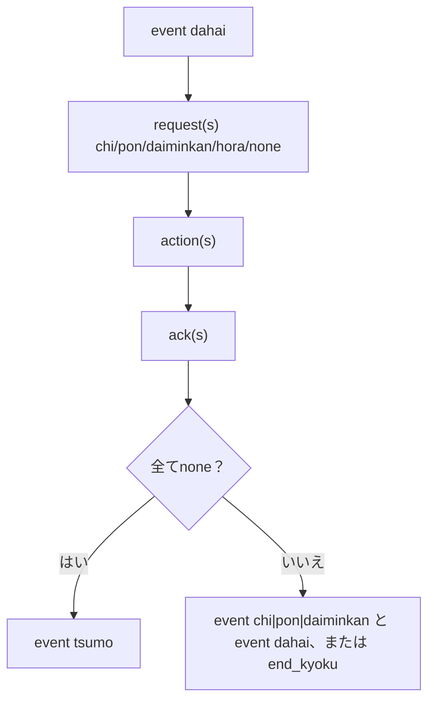
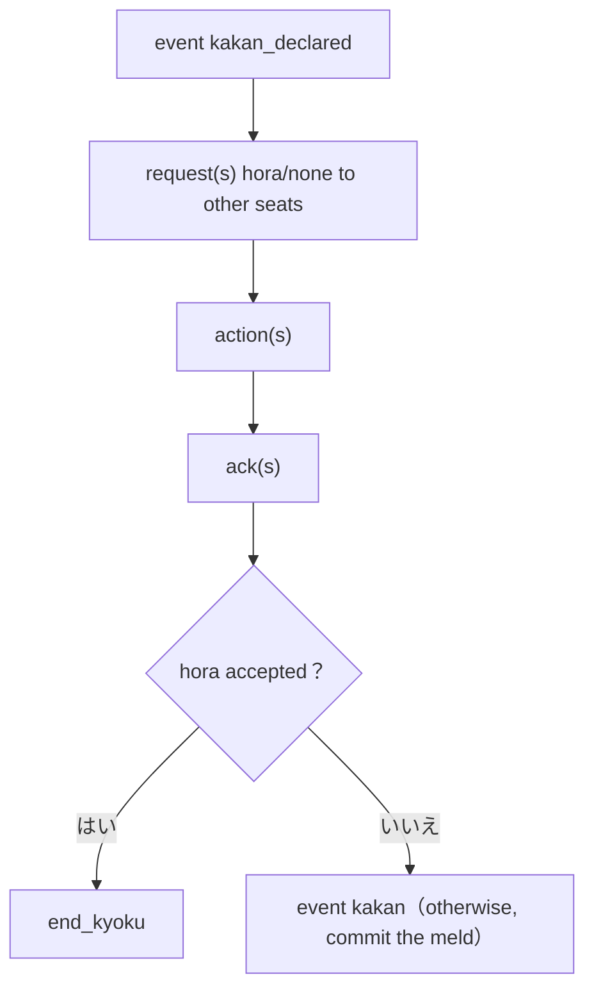
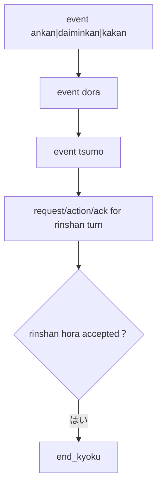
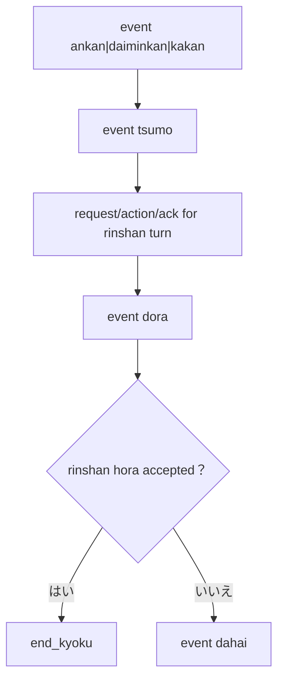
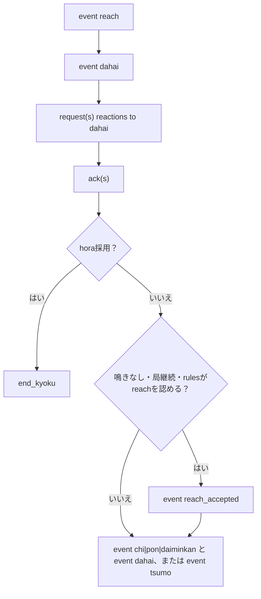
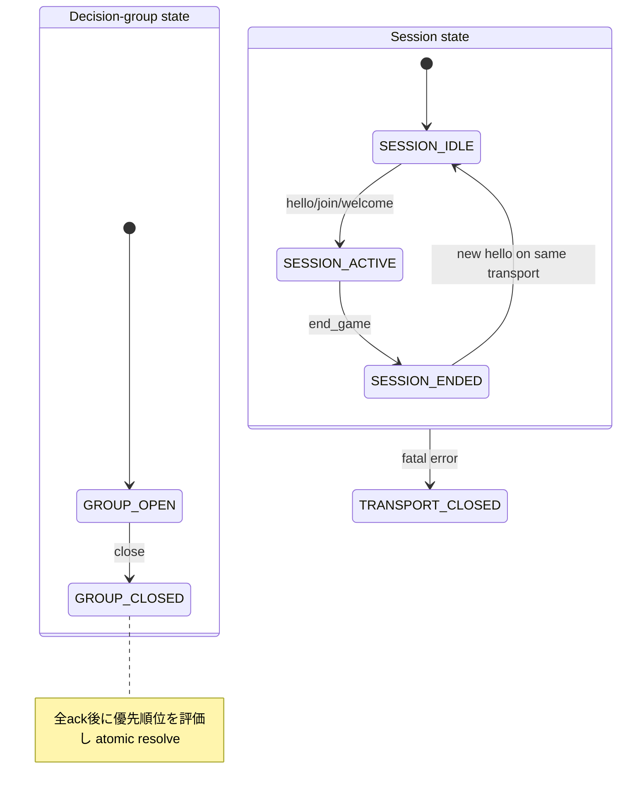
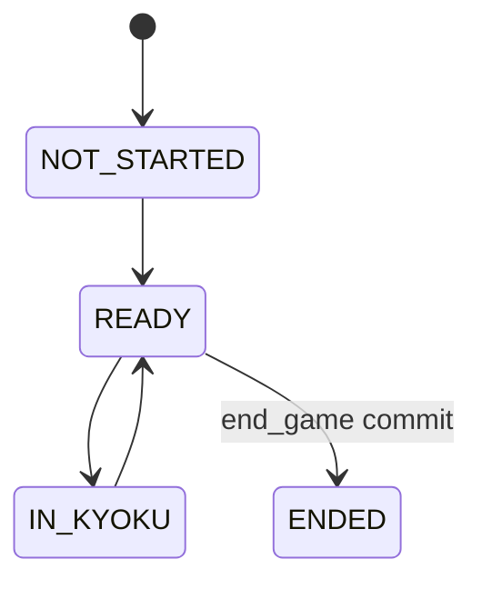
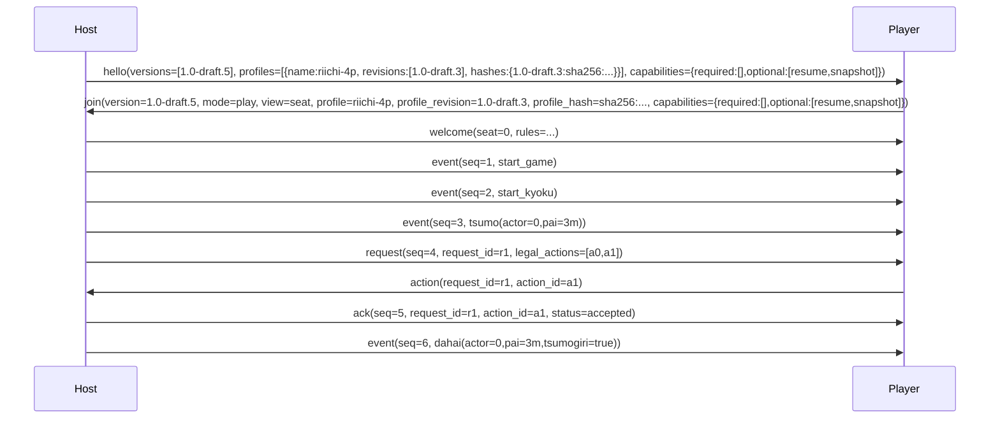

# YRC 0003: YAMAI Protocol Version 1

| 項目 | 値 |
|---|---|
| 文書系列 | YAMAI Request for Comments (YRC) |
| 文書番号 | YRC 0003 |
| 表題 | YAMAI Protocol Version 1 |
| 分類 | Standards Track |
| 状態 | Draft |
| Protocol Version | 1.0-draft.5 |
| 文書版 | 1.0-draft.5 |
| 発行日 | 2026-08-30 |
| 更新対象 | なし |
| 廃止対象 | なし |

## Abstract

本書は、リーチ麻雀の対局ホストと AI プレイヤーの間で、状態イベント、行動要求、行動応答および局結果を交換する YAMAI Protocol Version 1 を規定する。

YAMAI は JSON ベースのイベント語彙を MJAI から継承する一方、通知と要求を異なる message kind として定義し、各要求へ一意な `request_id`、各合法手へ不透明な `action_id`、各ホストメッセージへ単調増加する `seq` を付与する。また、ゲーム開始前の版・機能・ルール交渉、複数和了を含む原子的な局精算、遅延・重複応答の冪等処理、情報公開範囲、再同期および資源上限を規定する。

初期 profile は4人リーチ麻雀を対象とする。3人麻雀は本書の適合範囲外であり、別 profile の登録を必要とする。

## Status of This Memo

本書は YAMAI Project が管理する Standards Track Draft であり、IETF Internet Standard ではない。本書の配布に制限はない。

本書は実装および相互運用試験を目的とする Draft である。wire上のProtocol Versionは文書版と同じ `1.0-draft.5` とする。異なるdraft版は互換とみなしてはならない（MUST NOT）。安定版 `1.0` の割当ては、規範JSON Schema、registry、test vectorおよび2つ以上の独立した相互運用実装が公開された後に限る。

## Table of Contents

1. 状態、規約および要件語
2. 目的
3. プロトコルモデル
4. JSON と transport
5. 共通 envelope
6. 版・機能交渉
7. `riichi-4p` profile
8. 行動要求
9. `ack` と timeout
10. イベント順序
11. visibility と mode
12. エラー
13. 再接続と snapshot
14. 拡張
15. 資源・安全要件
16. MJAI からの移行
17. 適合性
18. Security Considerations
19. Registry Considerations
20. Normative References
21. Informative References
Appendix A. セッション状態機械
Appendix B. 最小交換例

## 1. 状態、規約および要件語

- Protocol name: `yamai`
- Version: `1.0-draft.5`
- Date: 2026-08-30
- Initial profile: `riichi-4p`
- Serialization: JSON
- Transports: JSON Lines, WebSocket text frame

本書は相互運用実験のためのドラフトである。draft版の文法は `MAJOR.MINOR-draft.REVISION` とする。draft同士は完全一致する場合に限り交渉可能である。安定版は `MAJOR.MINOR` とし、同一major内のminor互換性は第14節に従う。

### 1.1 Requirements Language

本書の **MUST**、**MUST NOT**、**REQUIRED**、**SHALL**、**SHALL NOT**、**SHOULD**、**SHOULD NOT**、**RECOMMENDED**、**NOT RECOMMENDED**、**MAY** および **OPTIONAL** は、すべて大文字で表記される場合に限り、[BCP 14] の意味で解釈しなければならない。

### 1.2 データモデル上の表記

`member` は JSON object の name/value pair、`message` は1個の top-level JSON object、`event` はホストが確定した状態変更、`action` はプレイヤーが選択した候補を意味する。

表における「必須」は当該 member が存在しなければならないことを表す。「任意」は省略可能であることを表す。明示的に許可されない `null` は、member の欠落と同値ではない。

数式中の配列添字は0始まりとする。時刻・期間の単位は member 名に `_ms` がある場合は millisecond とする。

## 2. 目的

YAMAI は次の性質を保証する対局プロトコルである。

1. ホストとプレイヤーが同じプロトコル版・ルールを理解している
2. 各行動が、どの要求への回答か一意に判定できる
3. 遅延・重複した行動が別の局面へ適用されない
4. クライアントが合法手を独自推測せず選択できる
5. すべての状態変更を順序付きで再現できる
6. 複数和了を含む局結果が原子的に確定する
7. 不正入力や切断で安全に失敗できる

ホストは、牌山、ルール、合法性、競合解決および点数計算の最終的な権威である。

## 3. プロトコルモデル

YAMAI は message を次の `kind` に分類する。

| `kind` | 方向 | 状態変更 | 応答 |
|---|---|---:|---|
| `hello` | Host → Player | しない | `join` |
| `join` | Player → Host | しない | `welcome` または `error` |
| `welcome` | Host → Player | セッション確立 | 不要 |
| `event` | Host → Player | する | 不要 |
| `request` | Host → Player | しない | `action` を1個 |
| `action` | Player → Host | ホスト受理後にのみする | `ack` |
| `ack` | Host → Player | action 結果を確定 | 不要 |
| `error` | 双方向 | 原則しない | fatal なら切断 |
| `snapshot` | Host → Player | 状態を置換 | 不要 |

プレイヤーは `request` を受信した場合にだけ `action` を送信しなければならない（MUST）。`event` への `none` 応答を送信してはならない（MUST NOT）。

### 3.1 Protocol Core と正準状態

本書の規範的な意味は、message の個別 Schema だけではなく、次の正準状態 `S` と決定的な遷移関数 `Apply` によって定まる。実装は同じ入力履歴に対して同じ `S` と同じ host 出力列を得なければならない（MUST）。自然言語の説明、表示用文字列または到着順だけから状態を推測してはならない（MUST NOT）。

```text
S = {
  session: NEGOTIATING | ACTIVE | ENDED,
  negotiation: { version, profile, profile_revision, profile_hash,
                 capabilities, receive_limits } | null,
  mode: play | spectate | replay | null,
  view: seat | public | full | {seat:N} | null,
  seat: N | null,
  game: NOT_STARTED | READY | IN_KYOKU | ENDED,
  game_id: ID | null,
  players: Player[4] | null,
  rules: Rules | null,
  scores: int[4] | null,
  kyotaku: nonNegativeInteger,
  kyoku: KyokuState | null,
  requests: { active: RequestState[0..4], terminal: TerminalRequest[*], stale_attempts: StaleAttempt[*] },
  groups: DecisionGroup[*],
  clock: { bank_ms: int[4], monotonic_origin: instant },
  ledger: MessageRecord[1..head_seq],
  head_seq: nonNegativeInteger
}
```

`RequestState` と `DecisionGroup` の wire非公開部分も正準状態の一部として次のように固定する。

```text
RequestState = {
  request_id, seat, issued_seq, caused_by_seq,
  legal_actions, default_action_id,
  issued_at, individual_deadline, prior_time_bank_ms,
  operation_id, candidate: action_id | null,
  candidate_kind: response | default | null,
  status: OPEN | CANDIDATE_FIXED | TERMINAL,
  first_arrival_ticket: integer | null,
  terminal_ack_seq: integer | null
}

DecisionGroup = {
  decision_group_id, member_request_ids,
  group_start, common_deadline,
  status: OPEN | RESOLVING | CLOSED,
  linearization_ticket: integer | null,
  transaction_id: ID | null
}

TerminalRequest = {
  request_id, selected_action_id,
  status: accepted | passed | superseded | defaulted,
  terminal_ack_seq, terminal_ack_wire_bytes
}

StaleAttempt = {
  request_id, received_action_id, stale_ack_seq, stale_ack_wire_bytes
}
```

`issued_at`、`individual_deadline`、`group_start`、`common_deadline` はhostの同じmonotonic clock上の値であり、wall-clockまたはpeerが申告する時刻へ変換してはならない（MUST NOT）。`prior_time_bank_ms` はrequest発行時に一度だけ固定し、同一seatの別request、再送またはsnapshot受理で再計算してはならない。`first_arrival_ticket` は期限内の最初のactionだけに割り当て、以後のactionはcandidateを置換しない。

`KyokuState` は少なくとも `bakaze`、`kyoku`、`honba`、`kyotaku`、`oya`、`extension_round`、`hands`、`rivers`、`melds`、`dora_markers`、`wall_remaining`、`turn`、`reach_status`、`first_turn_eligible`、`kan_counts`、`rinshan`、`haitei` および `pending_kan` を持つ状態であり、第13.3節の `snapshot.state.kyoku` と同じ意味を持つ。`pending_requests` はwire上の投影であり、正準状態の `requests.active` は全seat分を保持する。`self_state` は正準状態の各seat別秘密状態であり、viewへ投影するまで共有してはならない（MUST NOT）。

wireへ出さない牌山の順序も正準状態に含める。`KyokuState.deck` は少なくとも `live_tiles`、`rinshan_tiles`、`dead_wall_tiles` および各cursorを持ち、`hands`、`melds`、`rivers`、dora表示牌および残り枚数がそのdeckから重複なく導出できなければならない（MUST）。deckの初期化は `start_kyoku` で一度だけ行い、host以外へdeck全体を公開してはならない。snapshotはdeck全体を送らず、viewに許された `wall_remaining`、手牌枚数、meldおよび公開牌だけを `Π_v` で含める。乱数seedまたはdeckの隠れた再生成で既存のevent列を説明してはならない（MUST NOT）。

正準状態には次の不変条件を常に適用する（MUST）。

1. `session == ACTIVE` なら `negotiation`、`mode`、`view`、`seat`（`play` の場合のみ）、`game_id` および `players`、`rules` が確定している。`spectate`/`replay` の `seat` は `null` である。
2. `game == NOT_STARTED` なら `kyoku == null`、未解決 request は0個であり、`start_game` より前のgame-scoped event/request/ackは存在しない。`game == READY` なら未解決request/groupは0個で、次の局を開始できる状態である。`game == ENDED` または `session == ENDED` なら `kyoku == null`、未解決 requestは0個であり、後続のgame-scoped messageは存在しない。
3. `requests.active` の `request_id` はsession内で一意で、全要素の`game_id`は現在のgameと一致し、同一game内で同一seatを2個以上含まない。`terminal` は同じ `request_id` の最初の終端決定を1個だけ持つ。`rejected` はterminal recordを作らない。
4. `groups` の各memberは対応する active requestを1個持ち、group内のseatは重複しない。`GROUP_OPEN` または `GROUP_RESOLVING` の間、原因となったgroup以外のstate eventを適用しない。
5. `head_seq == 0` または `ledger` のkeyは1から `head_seq` まで連続する。各keyには、同じseqで二つのpayloadを割り当てない。
6. `scores`、`kyotaku` および各点数eventの保存則は第7.4節に従う。宣言中の `reach`、pending中の槓および未解決groupは、確定済みの精算・副露・次局状態へ反映しない。

`Apply(S, operation)` は、入力を検証してから原子的に次のいずれかを返す。

```text
Apply(S, operation) = (S', host_messages[0..n]) | (S, error)
```

errorを返す場合、gameの正準state、requestのactive/terminal record、group、時計、点数およびerror発生前のledger entryを変更してはならない（MUST NOT）。hostがそのerrorをpeerへ通知する場合だけ、`EmitError`を別operationとしてhost errorのwire bytesを新しいledger seqへ登録する。この診断entryによる `head_seq` の増加は、拒否した入力を適用したことを意味しない。一つのoperationが複数messageを生成する場合、全messageのsemantic state updateとledger予約を一つのtransactionとして行う。transportへの書込み途中で失敗しても、すでに予約したseq、requestの終端状態および決定済み結果を巻き戻してはならない（MUST NOT）。その結果は再接続時にledgerから再送する。

### 3.2 Wire ledger と transaction

hostは、`welcome` より後に送信する全てのenveloped host message（`event`、`request`、`ack`、`error`、`snapshot`）を、送信キューへ渡す前に `ledger` へ登録しなければならない（MUST）。`MessageRecord` は少なくとも次を保持する。

| field | 意味 |
|---|---|
| `seq` | このsessionで一度だけ割り当てる正の整数 |
| `wire_bytes` | JSON payloadのUTF-8 byte列。JSONLの行末LF、WebSocketのframe headerは含めない |
| `kind` | 登録時のmessage kind |
| `semantic_state` | 適用前後の内部state digestまたは同等の監査可能な参照 |
| `transaction_id` | 同一の原子operationに属するmessageを識別する不透明ID |

`wire_bytes` は、member順や空白を含めて最初に送信しようとしたpayloadそのものであり、再送時に再serializeしてはならない（MUST NOT）。`seq` は `head_seq + 1` を状態機械ロック内で予約し、reservationが失敗した場合は欠番にしてはならない（MUST NOT）。正常なlive streamでは `seq` は1から1ずつ増加する。`welcome`、版交渉前の`error`およびplayerからhostへのmessageはledgerに入れず、seqを持たない。

同一transaction内のmessageには同じ `transaction_id` を付与する。次の範囲だけが一つのtransactionになれる（MUST）。

| operation | 送信順（seq順） | commit条件 |
|---|---|---|
| 単独action | `ack`、必要なら後続event | ackの終端決定とevent適用 |
| decision group | memberごとの全terminal `ack`、採用eventまたは`end_kyoku` | groupのlinearization point |
| chombo | offenderの`rejected`、残requestのterminal ack、penalty `end_kyoku` | 全request terminal化 |
| resume | `welcome`（seqなし）、ledgerの再送 | 指定範囲を送信可能な状態 |
| snapshot | `snapshot` | snapshot stateと置換範囲をledgerへ登録 |

transaction内のackとeventの間に別transactionのhost messageを挿入してはならない（MUST NOT）。受信したactionの到着順、transportのworker順またはJSON objectのmember順を、transactionの適用順の根拠にしてはならない（MUST NOT）。

### 3.3 Message transition contract

次表は全標準messageの入出力契約である。「成功時の状態」は `Apply` のcommit後にだけ成立し、表にない状態変更は不正である（MUST NOT）。不正messageは状態を変更せず、表のerrorを選択しなければならない（MUST）。

| message | 受理前提条件 | 成功時の状態・出力 | 不成立時のerror |
|---|---|---|---|
| `hello` | transport/sessionがnegotiation可能。既存sessionを再利用しない新しい交渉である | negotiation contextを作成し、hostは`hello`を送る。peerの`join`を待つ | `invalid_frame`/`invalid_json`/`invalid_message`、版がない場合は`unsupported_version` |
| `join` | `hello`受信後、未確定session。version/profile/hash/capability/limit/mode/view/targetが一致 | seatを予約または割当て、session/game contextを作り、`welcome`（seqなし）を一度だけ送る | `unsupported_version`、`unsupported_profile`、`profile_mismatch`、`unsupported_capability`、`unsupported_limit`、`resource_limit`（requested seat不可）、`resume_unavailable` |
| `welcome` | 有効な`join`を受理済み。まだapplication messageを送っていない | sessionを`ACTIVE`にし、`game`を`NOT_STARTED`にする。新規playなら次のhost messageを`start_game(seq=1)`にする | hostがこの前提を満たさない出力は`invalid_message`（受信側はfatal） |
| `event` | session ACTIVE、eventの前後条件（第10.4節）を満たす。seqがledgerの次である | event payloadを正準stateへ適用し、ledgerへ登録する | `sequence_gap`、`sequence_conflict`、状態・Schema違反は`invalid_message` |
| `request` | session ACTIVE、gameが継続中、原因eventが適用済み、active request数/seat/group制約を満たす | requestをactiveへ登録し時計を開始またはgroupへ予約し、ledgerへ登録する | `resource_limit`、`invalid_message`、原因seq不明なら`invalid_message` |
| `action` | playerからhostへ、envelopeなし。対象requestがactiveまたはterminal historyにあり、action_idがcandidateに対応 | attemptを記録。単独ならackと適用event、groupならlinearizationまでack/eventを保留 | 未知requestまたは候補不一致は`invalid_action`。同一requestの異なる再送は`request_conflict`。Schema/ID/session違反は第12節の`invalid_message` |
| `ack` | hostがaction/default/競合を一度だけ決定済み。requestがactiveまたは既存terminalの再送 | activeをterminalへ移し、ledgerへ登録。`accepted`/`defaulted`のstate eventは同transactionの後続で適用 | request不明、status遷移不正、seq不正は`invalid_message` |
| `error` | error codeとseverityが送信方向・状態に適合 | recoverableはgame stateを変えず診断履歴だけを残す。ただし`sequence_gap`にはledgerの完全範囲replayまたは許可されたsnapshotを返す。fatalはsessionをENDED相当の停止状態へ移す。host errorはledgerへ登録 | error自身のSchema/方向違反は相手へ適用せずtransportを終了 |
| `snapshot` | resume/sequence gapの応答として許可された置換。stateが同じprofile/viewの完全射影 | snapshotをledgerへ登録し、受信側はstate、active requestおよび適用済みseqを置換 | 置換関係、visibility、pending requestまたはseq違反は`invalid_message`。復旧不能は`resume_unavailable` |

hostがrecoverable errorを返す場合、そのerror message自体には新しいseqを割り当て、ledgerに登録しなければならない（MUST）。playerが送るerrorにはseqを割り当ててはならない。受信側は不正なhost messageを部分適用せず、どのerrorが選択されたかを決定的に記録できなければならない（MUST）。

## 4. JSON と transport

### 4.1 JSON 共通要件

message は [RFC 8259] の JSON object でなければならない（MUST）。

- 文字コードは UTF-8（MUST）
- BOM は禁止（MUST NOT）
- top-level は object（MUST）
- 重複キーは受信時に拒否（MUST）
- 整数は `-(2^53-1)` 以上 `2^53-1` 以下（MUST）
- `NaN`、`Infinity`、コメント、末尾カンマは禁止（MUST NOT）
- 1メッセージの既定上限は 1 MiB（UTF-8 JSON payloadのみ。JSONLのCR/LFおよびWebSocketのframe headerは含めない）（MUST）
- JSON の最大ネスト深さは64（MUST）
- 未知の標準フィールドは拒否（MUST）。`x_<owner>_<name>` 形式の拡張フィールドだけは、第14節の条件を満たす場合に限り無視してよい（MAY）
- 未知の `kind`、`type`、必須 capability は拒否（MUST）

各endpointは、自身が受信可能な上限を `hello.receive_limits` または `join.receive_limits` で通知しなければならない（MUST）。送信者はpeerの `receive_limits` を超えるmessageを送信してはならない（MUST NOT）。`max_message_bytes` は65,536以上1,048,576以下、`max_json_depth` は16以上64以下、`max_unresolved_requests` は1以上4以下でなければならない（MUST）。`riichi-4p` profileは `max_unresolved_requests >= 4` を要求し、提示値を満たせないendpointは、ゲーム開始前に `unsupported_limit` で拒否しなければならない（MUST）。

### 4.2 JSON Lines transport

フレーム文法を [RFC 5234] の ABNF で次のように定義する。[RFC 8259] の `JSON-text` は末尾の空白にCR/LFを含み得るため、行全体には直接使用せず、同RFCの `object` productionを基礎とする。ただし、このフレーム文法でobject内部およびobjectと行末の間に許される構文上の空白は `WSP`（SPまたはHTAB）だけとし、RFC 8259の `ws` に含まれるCR/LFをobject内部へ許可しない。JSON string内の改行はエスケープされた文字列として扱う。

```abnf
YAMAI-line = object *WSP [CR] LF
CR         = %x0D
LF         = %x0A
```

上記の `object` productionへ適用する空白制限は、この節の `WSP` 制約を優先する。したがって、JSONの構造空白としてCRまたはLFを含む入力は `invalid_frame` とする。

- 1メッセージを1行へ UTF-8 JSON として送信する（MUST）
- 行末は LF (`0x0A`)（MUST）
- 受信側は CRLF も受理してよい（MAY）
- JSON text 内の改行は JSON string の内外を問わず禁止し、string 内で必要な改行はエスケープする（MUST）
- 空行は無視せず `invalid_frame` とする（MUST）
- 送信側は各メッセージを flush する（MUST）
- 受信側は区切り後に先読みした byte を次のフレーム用に保持する（MUST）

TCP と標準入出力は同じフレーミングを使用できる（MAY）。TCP の接続寿命はゲームの寿命と独立であり、`end_game` だけを理由に切断する必要はない。

### 4.3 WebSocket transport

- endpoint はWebSocket subprotocol `yamai.1.draft5` を交渉する（MUST）
- 1 text message は1個の YAMAI message だけを含む（MUST）
- 送信者は [RFC 6455] に従って text message を複数 frame へ分割できる（MAY）
- 受信者は分割された frame を完全な text message へ再構成してから JSON を解析する（MUST）
- binary message は `unsupported_frame` として拒否する（MUST）
- WebSocket の message boundary を YAMAI の message boundary とする（MUST）

### 4.4 transport 非依存性

transport は message の意味を変更してはならない（MUST NOT）。batch transport は1フレームへ複数 YAMAI message を格納してはならない（MUST NOT）。複数 message はそれぞれ独立したフレームとして連続送信する。

## 5. 共通 envelope

`welcome` 完了後、ホストから送る `event`、`request`、`ack`、`error` および `snapshot` は次の共通memberを持たなければならない（MUST）。`hello`、`join` および `welcome` は交渉messageであり、このenvelopeの対象外である。

```json
{
  "yamai": "1.0-draft.5",
  "kind": "event",
  "session_id": "s_01J6...",
  "game_id": "g_01J6...",
  "seq": 42,
  "event": {"type": "dahai", "actor": 2, "pai": "7s", "tsumogiri": true}
}
```

| フィールド | 要件 | 意味 |
|---|---|---|
| `yamai` | 必須 | 選択された完全なProtocol Version |
| `kind` | 必須 | メッセージ種別 |
| `session_id` | 必須 | 接続を越えて再開可能なセッションID |
| `game_id` | 必須 | 一意なゲームID |
| `seq` | 必須 | セッション内で1から単調に1増加する番号 |
| `original_seq` | replay eventでは必須、それ以外は禁止 | replay元記録のhost message seq。replay sessionの振り直し前の番号 |

ID は64文字以下の ASCII `[A-Za-z0-9._:-]` でなければならない（MUST）。ID の内部構造を受信側が解釈してはならない（MUST NOT）。

プレイヤーは検証・適用が完了した連続prefixの最後の `applied_seq` を保持しなければならない（MUST）。未適用のfuture messageを最大seqとして保存してresumeへ申告してはならない（MUST NOT）。`seq` が期待値より大きい場合、当該messageを破棄し、`expected_seq` と `received_seq` を持つ `sequence_gap` errorを送信しなければならない（MUST）。ホストが同じ `seq` を再送する場合、元のmessageとbyte-for-byteで同一でなければならない（MUST）。同一の再送は無視できる（MAY）。同じ `seq` で内容が異なる場合はfatal `sequence_conflict` とする（MUST）。

`sequence_gap` を受信したホストは、`expected_seq` から送信済みの最新 `seq` までの全messageを元の番号と内容で再送しなければならない（MUST）。一部だけを再送してはならない（MUST NOT）。再送できず `snapshot` capability が有効なら、第13.3節のsnapshotを送信できる（MAY）。いずれも不可能な場合、ホストはfatal `resume_unavailable`でsessionを終了しなければならない（MUST）。

`seq` は「受信できたmessage数」ではなく、hostがこのsessionへcommitしたapplication messageの永続的なledger番号である。hostは送信前に次の不変条件を満たすledger entryを作成し、entryとwire bytesの永続化に成功してからtransportへ渡さなければならない（MUST）。transportへのdelivery確認を待ってseqを割り当てたり、切断を理由に未送信entryを削除したりしてはならない（MUST NOT）。

受信側は `applied_seq` と、検証済みの `wire_bytes` を少なくとも最後の連続prefixについて保持する。`seq == applied_seq + 1` のmessageだけを構文・Schema・状態遷移検証後に適用し、適用成功後に `applied_seq` を進める。`seq <= applied_seq` は同じ `wire_bytes` ならduplicateとして無視できるが、byte-for-byteで異なる場合は `sequence_conflict` としなければならない。`seq > applied_seq + 1` はmessageを一切適用せず、`sequence_gap(expected_seq=applied_seq+1, received_seq=seq)`を返す。error送信によってapplied prefixを先へ進めてはならない。

hostは同一 `seq` の再送、resume replayおよびrange replayに、ledger entryのwire bytesをそのまま使用しなければならない。JSON objectをparseして再serializeしたもの、別のviewへ再投影したもの、または同じsemantic payloadを異なるmember順で組み立てたものは同一messageとみなさない（MUST NOT）。

## 6. 版・機能交渉

### 6.1 `hello`

```json
{
  "kind": "hello",
  "protocol": "yamai",
  "versions": ["1.0-draft.5"],
  "profiles": [
    {
      "name": "riichi-4p",
      "revisions": ["1.0-draft.3"],
      "hashes": {"1.0-draft.3": "sha256:811182d20eb1d33304913f3f9a91cfc68d9304a08230affff0ffb4ba21bdf5d5"}
    }
  ],
  "capabilities": {"required": [], "optional": ["resume", "snapshot"]},
  "receive_limits": {"max_message_bytes": 1048576, "max_json_depth": 64, "max_unresolved_requests": 4}
}
```

### 6.2 `join`

```json
{
  "kind": "join",
  "version": "1.0-draft.5",
  "mode": "play",
  "view": "seat",
  "seat": 0,
  "profile": "riichi-4p",
  "profile_revision": "1.0-draft.3",
  "profile_hash": "sha256:811182d20eb1d33304913f3f9a91cfc68d9304a08230affff0ffb4ba21bdf5d5",
  "client": {"name": "ExampleAI", "version": "2.3.0"},
  "capabilities": {"required": [], "optional": ["resume", "snapshot"]},
  "receive_limits": {"max_message_bytes": 1048576, "max_json_depth": 64, "max_unresolved_requests": 4},
  "room": "default"
}
```

クライアントは `hello.versions` に存在する版を1個選ばなければならない（MUST）。draft版は文字列が完全一致しなければならない（MUST）。安定版でmajorが異なる版へ暗黙にdowngradeしてはならない（MUST NOT）。

`hello.profiles` は profile 名ごとの対応revisionと、そのrevisionに対応する `sha256:` 付き64桁小文字hexのhashを提示する。`revisions` と `hashes` のキー集合は一致しなければならない（MUST）。hashは、リポジトリの `test-vectors/yrc-0003/1.0-draft.5/manifest.json` の `profile_hash_inputs` に列挙されたJSON文書を読み込み、`profile_schema`、`rules_schema`、`scoring_vectors_schema`、`yrc0003_registry`、`yrc0005_registry`、`official_vectors` および `scoring_vectors` という7 memberのobjectへ投影した値を対象とする。YRC 0003 registryのprofile `hash` memberは対象objectから除外し、公式vector内のmember名が `profile_hash` である値、`hello.profiles[*].hashes`の各値、および`wire`文字列内の対応する`sha256:`付き64桁hash literalは `sha256:` + 64個のASCII `0` へ正規化する。`wire`ではhash literal以外のbyteを変更してはならない（MUST NOT）。これによりhandshakeとraw wireを含むstateful vectorがprofile hash自身を入力とする循環を禁止する。対象objectは [RFC 8785] JSON Canonicalization Scheme (JCS) で直列化し、UTF-8 byte列へSHA-256を適用する（MUST）。数値、Unicode escape、キー順および空白の扱いをJCS以外の方法で実装してはならない（MUST NOT）。`join.profile_revision` と `join.profile_hash` は同じ広告済み組を選択し、`hello` に存在しなければならない（MUST）。`welcome` は選択結果をそのまま返さなければならない（MUST）。revisionまたはhashが一致しない場合、ホストは `profile_mismatch` で拒否しなければならない（MUST）。

`capabilities` は `required` と `optional` の2配列を持たなければならない（MUST）。重複および両配列への同一値の記載は禁止する（MUST NOT）。`required` はpeerが理解しない場合に交渉を拒否する機能、`optional` は両者が提示した場合だけ有効になる機能である。両者の `required` はpeerの `required` または `optional` に含まれなければならず（MUST）、満たせない場合は `unsupported_capability` で拒否する。未知のexperimental capabilityは `optional` なら無視できるが、`required` なら拒否しなければならない。安定 capability は小文字 snake case、実験用 capability は `x-<owner>-<name>` とする。`resume` capabilityは `play` modeでだけ有効であり、`spectate` または `replay` modeでは交渉済みoptional一覧に双方が含めても有効化してはならない（MUST NOT）。

新規sessionを要求する `join` は `resume` memberを省略する。`play` の新規joinでは `seat` memberを省略してもよく（MAY）、その場合hostは空いているseatのうち最小のseatを割り当てる。`seat` memberを指定した場合、hostはそのseatを割り当てなければならず（MUST）、既に予約済み・参加済みまたはprofile上割り当て不能なら `resource_limit` で拒否しなければならない（MUST）。hostはjoinの到着順以外の隠れた規則でseatを変更してはならず（MUST NOT）、assignment結果を `welcome.seat` に記録する。従って `welcome.seat == join.seat` は `join.seat` が存在する場合だけ要求され、省略時は `welcome.seat` がhostの最小空席割当と一致しなければならない（MUST）。seat割当は `welcome`送信前にsession stateへcommitされ、失敗時に別seatへ暗黙にfallbackしてはならない（MUST NOT）。

再開は `play` modeだけで許可し、`resume` を伴う場合は `target` と新規seat指定を省略し、tokenが対象gameと既存seatを識別する（MUST）。resume joinで `seat` を指定してはならず（MUST NOT）、tokenから復元したseat以外への変更を要求してはならない。`spectate` または `replay` の `join` は `resume` を指定してはならず（MUST NOT）、このmodeでは `resume` capabilityを有効化してはならない。`mode` は `play`、`spectate` または `replay` のいずれかであり、`view` は `play` では文字列 `seat`、`spectate` では文字列 `public`、`replay` では文字列 `public`、`full` または `{ "seat": N }` とする（MUST）。`play` では `target` を指定してはならない（MUST NOT）。`spectate` の `target` は `{ "type": "game", "id": <game_id> }`、`replay` の `target` は `{ "type": "game", "id": <game_id> }` または `{ "type": "recording", "id": <recording_id> }` の一方を必須とする（MUST）。`target.type` を省略してはならない（MUST NOT）。

```json
{
  "kind": "join",
  "version": "1.0-draft.5",
  "mode": "play",
  "view": "seat",
  "profile": "riichi-4p",
  "profile_revision": "1.0-draft.3",
  "profile_hash": "sha256:811182d20eb1d33304913f3f9a91cfc68d9304a08230affff0ffb4ba21bdf5d5",
  "client": {"name": "ExampleAI", "version": "2.3.0"},
  "capabilities": {"required": [], "optional": ["resume", "snapshot"]},
  "receive_limits": {"max_message_bytes": 1048576, "max_json_depth": 64, "max_unresolved_requests": 4},
  "resume": {"token": "rt_01J6...", "last_seq": 120}
}
```

`resume.last_seq` はクライアントが完全に適用した最後のhost messageである。未適用または部分適用したmessageの番号を指定してはならない（MUST NOT）。

### 6.3 `welcome`

```json
{
  "yamai": "1.0-draft.5",
  "kind": "welcome",
  "session_id": "s_01J6...",
  "game_id": "g_01J6...",
  "resumed": false,
  "resume": {"token": "rt_01J6...", "expires_in_ms": 600000},
  "seat": 0,
  "mode": "play",
  "view": "seat",
  "profile": "riichi-4p",
  "profile_revision": "1.0-draft.3",
  "profile_hash": "sha256:811182d20eb1d33304913f3f9a91cfc68d9304a08230affff0ffb4ba21bdf5d5",
  "players": [
    {"seat": 0, "name": "ExampleAI"},
    {"seat": 1, "name": "BotB"},
    {"seat": 2, "name": "BotC"},
    {"seat": 3, "name": "BotD"}
  ],
  "scores": [25000, 25000, 25000, 25000],
  "rules": {
    "game_length": "tonnan",
    "starting_points": 25000,
    "extension": {"mode": "sudden_death", "target_points": 30000, "max_extra_rounds": 4},
    "ranking_policy": "initial_seat_order",
    "red_fives": {"m": 1, "p": 1, "s": 1},
    "kuitan": true,
    "ron_policy": "double_only",
    "reaction_priority": "hora_call_chi",
    "multiple_ron_settlement": {"honba": "each_winner", "kyotaku": "first_winner"},
    "bankruptcy": "end_game",
    "bankruptcy_threshold": 0,
    "dealer_continuation": {"win": true, "tenpai_draw": true},
    "abortive_draw_continuation": true,
    "agariyame": true,
    "noten_payment": {"total_points": 3000, "unit": 100, "remainder": "lowest_seat"},
    "riichi_stick_value": 1000,
    "honba_ron_value": 300,
    "honba_tsumo_value_per_payer": 100,
    "kiriage_mangan": false,
    "kazoe_yakuman": "yakuman",
    "double_yakuman": ["kokushi_13_wait", "suuankou_tanki", "junsei_chuuren", "daisuushii"],
    "pao": {"yakus": ["daisangen", "daisuushii"], "ron": "split", "tsumo": "liable_all"},
    "chombo": {"penalty_points": 8000, "distribution": "equal_other_players", "remainder": "lowest_seat"},
    "ankan_chankan": "kokushi_only",
    "kan_dora_timing": {"ankan": "before_rinshan", "daiminkan": "after_rinshan_discard", "kakan": "after_rinshan_discard"},
    "invalid_action_policy": "reject",
    "time_control": {"grace_ms": 3000, "bank_ms": 15000, "bank_scope": "kyoku"},
    "abortive_draws": ["kyushukyuhai", "suufon_renda", "suucha_riichi", "suukan_sanra", "sanchaho"],
    "local_yaku": []
  }
}
```

`welcome` は交渉結果であり `seq` を持ってはならない（MUST NOT）。`welcome.mode` と `welcome.view` は `join` と一致しなければならず（MUST）、`play` の `welcome.seat` は、明示された `join.seat`、またはhostが省略されたseatへ適用した最小空席割当と一致しなければならない。resume以外の新規play joinで `welcome.seat` を `null` にしてはならない（MUST NOT）。`resumed == false` の場合 `replay_from_seq` を含めてはならず（MUST NOT）、`resumed == true` の場合 `replay_from_seq` と `resume` を必須とする（MUST）。`spectate` または `replay` では `welcome.game_id` が tagged `join.target` のgameを識別しなければならない（MUST）。新規sessionでは `resumed` を `false` とし、最初のenveloped host messageの `seq` を1とする。再開成功時は `resumed` を `true`、`replay_from_seq` を `join.resume.last_seq + 1` とし、同じ `session_id` と `game_id` およびtokenに紐付いたseatを返さなければならない（MUST）。ホストは `replay_from_seq` から全messageを再送するか、第13.3節のsnapshotを送信する。

`play` modeで `resume` capabilityが有効な場合、ホストは `welcome.resume.token` を毎回新しい値へrotateしなければならない（MUST）。`spectate` または `replay` modeでは `welcome` に `resume` memberを含めてはならない（MUST NOT）。`expires_in_ms` は `welcome` 送信完了からの有効期間である。再開に失敗した場合、ホストは交渉用fatal `resume_unavailable` を返し、新規sessionへ暗黙にfallbackしてはならない（MUST NOT）。`resume` capabilityが無効なjoinに `resume` memberがある場合も、ホストは `resume_unavailable` で拒否しなければならない（MUST）。

`rules` のすべての member は profile の Schema で意味を定義しなければならない（MUST）。profile が必須とする member を省略してはならない（MUST NOT）。クライアントは理解できない必須ルール値を `unsupported_rules` で拒否しなければならない（MUST）。

## 7. `riichi-4p` profile

役、役満condition、ドラbonus、符および基本点の意味論は [YRC 0005] に従わなければならない（MUST）。本書と [YRC 0005] を組み合わせて1個の `riichi-4p` 規範profileを構成する。

### 7.1 座席

座席は整数 `0` から `3` である。座席はゲーム中固定し、seat-indexed array は座席順とする。親は event ごとの `oya` で表す。

### 7.2 必須ルール

`riichi-4p` の `rules` は次の member をすべて持たなければならない（MUST）。既定値による省略を禁止する（MUST NOT）。

`riichi-4p` profileのendpointは `max_message_bytes >= 1,048,576`、`max_json_depth >= 64` および `max_unresolved_requests >= 4` を受信可能でなければならない（MUST）。`join.receive_limits` がこの下限を満たさない場合、ホストは `unsupported_limit` で交渉を拒否しなければならない（MUST）。完全な `legal_actions` またはsnapshotをpeer上限に合わせて切り詰めてはならない（MUST NOT）。

| キー | 型・値 | 意味 |
|---|---|---|
| `game_length` | `tonpu`, `tonnan` | 規定のゲーム長 |
| `starting_points` | 非負整数 | 開始点 |
| `extension` | `{mode,target_points,max_extra_rounds}` | 規定局後の延長。`mode` は `none` または `sudden_death`、`max_extra_rounds` は0～100 |
| `ranking_policy` | `initial_seat_order` | 同点時は小さい絶対seatを上位とする |
| `red_fives` | `m,p,s` ごとの0～4 | 各色の赤五枚数 |
| `kuitan` | boolean | 喰いタン |
| `ron_policy` | `multiple`, `head_bump`, `double_only` | 全ロン、頭ハネ、または二家和まで許可し三家和を途中流局とする |
| `reaction_priority` | `hora_call_chi` | 和了、daiminkan/pon、chi、noneの固定優先順 |
| `multiple_ron_settlement` | `{honba,kyotaku}` | 複数ロン時の本場・供託。下記規則に従う |
| `bankruptcy` | `continue`, `end_game` | トビ終了 |
| `bankruptcy_threshold` | 整数 | `scores < threshold` をトビとする境界 |
| `dealer_continuation` | `{win,tenpai_draw}` | 親和了・流局聴牌時の連荘 |
| `abortive_draw_continuation` | boolean | 途中流局時の連荘 |
| `agariyame` | boolean | オーラス親のアガリ止め |
| `noten_payment` | `{total_points,unit,remainder}` | 通常流局時に授受する点の総額と100点単位の配分 |
| `riichi_stick_value` | 非負整数 | リーチ供託額 |
| `honba_ron_value` | 非負整数 | ロン時の1本場加算 |
| `honba_tsumo_value_per_payer` | 非負整数 | ツモ時に各支払者が加算する1本場額 |
| `kiriage_mangan` | boolean | 切り上げ満貫 |
| `kazoe_yakuman` | `yakuman`, `sanbaiman` | 数え役満の上限 |
| `double_yakuman` | condition IDの配列 | ダブル役満として扱う形。空配列なら全役満を単倍とする |
| `pao` | `{yakus,ron,tsumo}` | 対象役と責任払い。`ron` は `split`/`liable_all`、`tsumo` は `liable_all`/`normal` |
| `ankan_chankan` | `never`, `kokushi_only` | 暗槓への槍槓 |
| `kan_dora_timing` | `{ankan,daiminkan,kakan}` | 各槓の公開時点。値は `before_rinshan` または `after_rinshan_discard` |
| `invalid_action_policy` | `reject`, `default`, `chombo` | 不正 action への対局上の処置 |
| `chombo` | `{penalty_points,distribution,remainder}` | `chombo`時の総点数、他家への配分、端数席 |
| `time_control` | `{grace_ms,bank_ms,bank_scope}` | 猶予時間、持ち時間、`bank_scope` は `kyoku` または `game` |
| `abortive_draws` | reason ID の配列 | 採用する途中流局 |
| `local_yaku` | yaku ID の配列 | 合意済みローカル役。通常は空 |

`local_yaku` に未知の値があるクライアントは接続を拒否しなければならない（MUST）。合法手だけを選択するプレイヤーであっても、和了判断と期待値計算が変化するため、未知の値を無視してはならない（MUST NOT）。

`time_control.grace_ms` と `time_control.bank_ms` は0以上600,000以下の整数でなければならない（MUST）。`grace_ms` は全requestに共通する非課金の猶予であり、time bankを消費しない。requestの `time_bank_ms` は発行時の当該seatの残りbankを表し、`0 <= time_bank_ms <= rules.time_control.bank_ms` でなければならない（MUST）。同一seatの前requestが消費した量を戻したり、同時requestへ同じ残量を二重に割り当てたりしてはならない（MUST NOT）。単独requestのdeadlineは、requestの送信完了時刻に `grace_ms + timeout_ms + time_bank_ms` を加えた時刻である。decision groupの各requestについては、第8.1節で定義する `group_start` を各個別時計の開始時点とし、同じ式を `group_start` に加えた時刻を個別deadlineとする。`bank_scope == "kyoku"` では `start_kyoku` ごと、`bank_scope == "game"` では `start_game` ごとに bank をresetする。

`starting_points`、`extension.target_points`、`bankruptcy_threshold`、`riichi_stick_value`、`honba_ron_value`、`honba_tsumo_value_per_payer` および `chombo.penalty_points` は100の倍数でなければならない（MUST）。`noten_payment.total_points` は600の倍数、`noten_payment.unit` は100、`noten_payment.remainder` は `lowest_seat` でなければならない（MUST）。

`extension.mode == "none"` の場合、`max_extra_rounds` は0でなければならない（MUST）。`sudden_death` の場合、次の述語を使用して延長を決定する。

```text
base_final(S) =
  S.kyoku.extension_round == 0 AND
  ((rules.game_length == "tonpu"  AND S.kyoku.bakaze == "E" AND S.kyoku.kyoku == 4) OR
   (rules.game_length == "tonnan" AND S.kyoku.bakaze == "S" AND S.kyoku.kyoku == 4))

extension_active(S) = S.kyoku.extension_round > 0
extension_available(S) =
  rules.extension.mode == "sudden_death" AND
  S.kyoku.extension_round < rules.extension.max_extra_rounds
```

`extension_round` は「現在のgameで開始した延長局の通し番号」であり、通常局は0、最初の延長局は1である。同じ親の連荘を含め、延長局を1局終了するたびに番号を1増加させる。従って `start_kyoku.extension_round` は1から `max_extra_rounds` までの範囲に限られ、`max_extra_rounds` が4なら延長局は最大4局であり、4局目の終了後に5局目を開始してはならない（MUST NOT）。`renchan` であっても番号を再利用または据え置きしてはならない。

`base_final(S)` の `end_kyoku` で最高scoreが `target_points` 以上なら `next.type = "end_game"` とする。target未満なら、`extension_available(S)` が真の場合に限り `next.extension_round = 1` として延長局を開始し、偽なら `next.type = "end_game"` とする。延長局内では、各 `end_kyoku` 後に最高scoreがtarget以上なら直ちに `next.type = "end_game"` とし、target未満なら `extension_available(S)` が真の場合だけ `next.extension_round = S.kyoku.extension_round + 1` を設定して続行し、偽なら `end_game` とする。通常局の `extension_round == 0` を延長局の `next` へコピーしてはならない（MUST NOT）。

`agariyame` の判定は `base_final(S)` でだけ行う。親が連荘し、`agariyame` が有効で、親の順位が1位かつ親scoreがtarget以上の場合は、延長判定より先に `next.type = "end_game"` とする。延長局で同じ条件を再適用して局数を増減させてはならない。`next.type == "renchan"` なら `next.oya` は現在のoya、`rotate` なら `(oya + 1) mod 4` とし、いずれの場合も上記の延長番号更新を同時に適用する。未使用の延長局があるという理由だけで、target到達後に追加局を開始してはならない（MUST NOT）。同点順位は常に `ranking_policy` で決定し、`end_game.rankings` はその結果と一致しなければならない（MUST）。

`ron_policy == "head_bump"` では、候補のうち `(actor - target + 4) mod 4` が最小の和了者だけを採用する。`multiple` では全和了者を採用する。`double_only` では二家和まで採用し、三家和は `sanchaho` として流局にする。`double_only` では `abortive_draws` に `sanchaho` を含め、それ以外では含めてはならない（MUST）。

複数ロンの `first_winner` は `(actor - target + 4) mod 4` が最小の和了者とする。`multiple_ron_settlement.honba` は `each_winner` または `first_winner` である。前者は各winへ本場を加算し、後者はfirst winnerだけへ加算する。`kyotaku` は `first_winner` または `equal_split` である。`kyotaku` は供託本数で表し、点数は `kyotaku × riichi_stick_value` とする。`equal_split` では供託点を100点単位で等分し、除算の余りをfirst winnerへ加算する。未配分の供託本数はなく、`next.kyotaku` は配分後の本数でなければならない（MUST）。各winの `deltas` はこの配分と一致しなければならない（MUST）。

`pao.yakus` は責任払いの対象役を列挙する。責任seatが決定された時点で、ホストは `pao` eventを記録しなければならない（MUST）。`pao.ron == "liable_all"` では責任seatが全額を支払う。`split` では責任seatの支払額を `ceil(hand_points / 2, 100)`、放銃seatの支払額を `hand_points - 責任seat支払額` とする。両seatが同じなら全額をそのseatが支払う。`pao.tsumo == "liable_all"` では責任seatが全額を支払い、`normal` では通常のツモ支払いとする。本場は和了点と同じ比率で同じ支払者へ配分し、供託は支払者と独立して和了者へ付与する。複数winでは各winの支払を独立に展開し、同一支払者の合算後もtop-level `deltas` と一致させる。ここで `ceil(x,100)` はx以上の最小の100の倍数である。

`noten_payment.total_points` は通常流局で授受する総点数である。聴牌者数を `t` とし、`total_points` は600の倍数でなければならない（MUST）。`0 < t < 4` の場合、各seatの純差額は、`t==1` なら聴牌者 `+total_points`・各不聴者 `-total_points/3`、`t==2` なら各聴牌者 `+total_points/2`・各不聴者 `-total_points/2`、`t==3` なら各聴牌者 `+total_points/3`・不聴者 `-total_points` とする。`t==0` または `t==4` の場合は全seatの差額を0とする。配分はseat単位の純差額で表し、個別seat間の支払明細を要求してはならない（MUST）。

`chombo.penalty_points` はchomboで移動する総点数であり、`distribution == "equal_other_players"` の場合はoffenderから他の3 seatへ100点単位で等分し、端数は `remainder == "lowest_seat"` で最小seatへ加算する。ホストは支払元・支払先・点数を `result.penalty.payments` に記録し、top-level `deltas` はその合計と一致させなければならない（MUST）。

局終了後、ホストは次の順序で `next` を決定しなければならない（MUST）。

1. `deltas` を適用して確定 `scores` を得る。
2. `bankruptcy == "end_game"` かついずれかのscoreが `bankruptcy_threshold` 未満なら、他の条件に優先して `next.type = "end_game"` とする。
3. 親が和了し `dealer_continuation.win` がtrue、通常流局で親が聴牌し `tenpai_draw` がtrue、または途中流局で `abortive_draw_continuation` がtrueなら `dealer_continues = true` とする。
4. `base_final(S)` が偽なら、`dealer_continues` なら `renchan`、それ以外なら `rotate` とする。この場合 `extension_round` は0から変更してはならない（MUST）。
5. `base_final(S)` が真なら、`agariyame`、`dealer_continues`、親rank 1および親scoreが `extension.target_points` 以上の全条件を満たす場合に `end_game` とする。そうでなくても最高scoreがtarget以上なら `end_game` とする。
6. `base_final(S)` でtarget未満なら、`extension_available(S)` が真の場合だけ `renchan` または `rotate` を選び `next.extension_round = 1` とする。偽の場合は `end_game` とする。`extension_active(S)` では、target以上なら常に `end_game`、target未満なら `extension_available(S)` が真の場合だけ `dealer_continues` に応じた `renchan`/`rotate` と `next.extension_round = S.kyoku.extension_round + 1` を設定し、偽なら `end_game` とする。

`game_length == "tonpu"` の規定最終局は東4局、`tonnan` は南4局である。途中流局では本場を1増加する。通常流局は親の聴牌にかかわらず本場を1増加する。和了時は連荘なら本場を1増加し、親流れなら0へ戻す。

`abortive_draws` の初期reasonは次の条件で成立する。conditionを満たしても一覧に含まれないreasonを宣言してはならない（MUST NOT）。

`fanpai` はlive wallが0枚となり、最後の自摸および打牌に和了がなく、途中流局も成立しない通常流局である。`fanpai` は `abortive_draws` に含めない。

- `kyushukyuhai`: 自分の最初の自摸後、他家を含め鳴きがなく、自分の手牌に異なる么九牌が9種以上ある場合に、そのplayerが `ryukyoku` actionを選択する。
- `suufon_renda`: 鳴きのない第一巡で4人の最初の打牌が同一の風牌であり、4枚目にロンがない。
- `suucha_riichi`: 4人全員の `reach_accepted` が成立し、4人目のリーチ打牌にロンがない。
- `suukan_sanra`: 卓上の成立済み槓が4回に達し、4回全てが同一playerによるものではなく、4回目の槓への槍槓およびその嶺上打牌への和了がない。
- `sanchaho`: `ron_policy == "double_only"` で同一打牌または加槓に3人が和了可能である。

この一覧で表現できない必須ルールは、交渉済み capability と namespaced rule key を使用しなければならない（MUST）。状態または点数へ影響するルールを、説明文だけで追加してはならない（MUST NOT）。

### 7.3 牌

公開牌は MJAI と同じ文字列表記を使用する。

```text
1m..9m  1p..9p  1s..9s
E S W N P F C
5mr 5pr 5sr
```

非公開牌を文字列 `?` で表してはならない（MUST NOT）。単一の非公開牌は JSON `null`、非公開手牌は `{"count": 13}` で表さなければならない（MUST）。

```json
{
  "hands": [
    {"tiles": ["1m", "2m", "3m", "5pr", "E", "E", "E", "4s", "5s", "6s", "7p", "8p", "9p"]},
    {"count": 13},
    {"count": 13},
    {"count": 13}
  ]
}
```

action 内の牌は公開牌文字列でなければならない（MUST）。赤五と通常五は異なる牌として比較し、面子の牌種を比較する場合に限り同じ五として扱う。

### 7.4 event

`event` は状態を1回だけ変更する。プレイヤーは `seq` 順に event を適用しなければならない（MUST）。

新規gameでは、`welcome` 完了後の最初のenveloped host `event`を `start_game` としなければならない（MUST）。そのmessageの `seq` は1であり、`start_game` より前に同じgameの `request`、`event` または `ack` を送信してはならない（MUST NOT）。

本節の event 表および例は、共通 envelope の `event` member の値を示す。wire message は第5節の envelope で包まなければならない（MUST）。

| event `type` | 必須フィールド | 説明 |
|---|---|---|
| `start_game` | `players`, `rules`, `scores` | ゲーム開始。`welcome` と同値なゲーム情報を記録用に含む |
| `start_kyoku` | `bakaze`, `kyoku`, `honba`, `kyotaku`, `oya`, `extension_round`, `dora_marker`, `scores`, `hands` | 局開始 |
| `tsumo` | `actor`, `pai` | ツモ。非行動者の view では `pai:null` |
| `dahai` | `actor`, `pai`, `tsumogiri` | 打牌 |
| `chi` | `actor`, `target`, `pai`, `consumed[2]` | チー成立 |
| `pon` | `actor`, `target`, `pai`, `consumed[2]` | ポン成立 |
| `daiminkan` | `actor`, `target`, `pai`, `consumed[3]` | 大明槓成立 |
| `ankan_declared` | `actor`, `consumed[4]` | 暗槓宣言。槍槓判断前で、面子は未確定。`consumed` はplay viewではactorだけが牌種を受け取り、他viewでは第11節の投影規則に従う |
| `ankan` | `actor`, `consumed[4]` | 暗槓成立。`consumed` の公開範囲はprofileのview投影で固定する |
| `kakan_declared` | `actor`, `pai`, `consumed[3]` | 加槓宣言。槍槓判断前で、既存ポンは未変更 |
| `kakan` | `actor`, `pai`, `consumed[3]` | 槍槓がなかった加槓の成立 |
| `dora` | `dora_marker` | ドラ表示牌追加 |
| `reach` | `actor` | リーチ宣言 |
| `reach_accepted` | `actor`, `deltas`, `scores`, `kyotaku` | リーチ成立・供託反映 |
| `pao` | `actor`, `yaku_id`, `liable_seat` | 役ごとの責任払いseat決定履歴 |
| `end_kyoku` | `result`, `deltas`, `scores`, `next` | 局結果を原子的に確定 |
| `end_game` | `scores`, `rankings`, `kyotaku` | ゲーム終了。未配分供託本数も確定 |

`scores` と `deltas` は4要素でなければならない（MUST）。点数変更 event では、各座席について `new_scores[i] == old_scores[i] + deltas[i]` が成立しなければならない（MUST）。

点数変更の全体保存則は、供託を含めて `sum(new_scores) + new_kyotaku * riichi_stick_value == sum(old_scores) + old_kyotaku * riichi_stick_value` としなければならない（MUST）。`old_kyotaku` と `new_kyotaku` は当該eventまたは直前に確定した局状態から取得する。`reach_accepted` ではactorの `deltas` による控除と `kyotaku` の1本増加を同時に検証し、`end_kyoku` では配分した供託をwinの `deltas` に一度だけ含める。paoを含む各winは、profileの支払式または明示されたpaymentへ展開できなければならず、点数の発行・消滅・二重計上を許可してはならない（MUST NOT）。

`start_kyoku.kyotaku`、`reach_accepted.kyotaku`、`end_kyoku.next.kyotaku` および `end_game.kyotaku` は供託本数であり、1本の点数は `rules.riichi_stick_value` である。`reach_accepted` はactorから `riichi_stick_value` を1本分控除し、kyotakuを1増やす。和了時に配分した供託点はwinの `deltas` に含め、配分後の残本数を `next.kyotaku` へ繰り越す。和了者がいない場合も供託を失わせず、次局または `end_game.kyotaku` へ繰り越さなければならない（MUST）。

`ankan_declared` と `kakan_declared` は pending 状態を開始する。`ankan` または `kakan` は面子を確定し、`end_kyoku` は pending 状態を破棄する。宣言 event だけを根拠として副露を確定してはならない（MUST NOT）。

`pao` eventは責任払いの決定履歴であり、`actor` は対象役を成立させるseat、`yaku_id` は `rules.pao.yakus` の値、`liable_seat` は責任seatである。`liable_seat` は `actor` と異なるseatでなければならず（MUST）、和了時の `result.wins[].pao` はそれまでの全 `pao` eventの `yaku_id` → `liable_seat` 対応と一致しなければならない（MUST）。責任seatを推測させるだけの自由記述を送信してはならない（MUST NOT）。

`end_game.rankings` はseat-indexedな4要素の整数arrayであり、値 `1,2,3,4` を重複なく1回ずつ含まなければならない（MUST）。高い `scores` を持つseatを上位とし、同点は `rules.ranking_policy` で解決する。`end_game.scores` は最終の実点であり、未配分の供託は `end_game.kyotaku` に本数で報告し、scoresまたはrankingsへ暗黙に加算してはならない（MUST NOT）。`end_game` 後に同じ `game_id` のeventまたはrequestを送信してはならない（MUST NOT）。

`start_game.players`、`start_game.rules` および `start_game.scores` は、同じsessionの `welcome` に含まれる値とJSONのobject member順を除いて同値でなければならない（MUST）。不一致を受信したクライアントはfatal `invalid_message` としてsessionを終了しなければならない（MUST）。

### 7.5 `end_kyoku`

ホストは、和了が1件か複数かにかかわらず、局内の全和了を1個の `end_kyoku` にまとめなければならない（MUST）。

```json
{
  "type": "end_kyoku",
  "result": {
    "type": "hora",
    "wins": [
      {
        "actor": 0,
        "target": 2,
        "pai": "7s",
        "fu": 40,
        "han": 4,
        "yakus": [{"id": "reach", "value": 1, "unit": "han"}],
        "bonuses": [{"id": "dora", "han": 2}, {"id": "uradora", "han": 1}],
        "ura_dora_markers": ["4p"],
        "pao": [],
        "hand_points": 12000,
        "deltas": [12000, 0, -12000, 0]
      },
      {
        "actor": 1,
        "target": 2,
        "pai": "7s",
        "fu": 30,
        "han": 2,
        "yakus": [{"id": "tanyao", "value": 1, "unit": "han"}],
        "bonuses": [{"id": "akadora", "han": 1}],
        "ura_dora_markers": [],
        "pao": [],
        "hand_points": 2000,
        "deltas": [0, 2000, -2000, 0]
      }
    ]
  },
  "deltas": [12000, 2000, -14000, 0],
  "scores": [37000, 27000, 11000, 25000],
  "next": {"type": "renchan", "honba": 1, "oya": 0, "kyotaku": 0, "extension_round": 0}
}
```

流局の表現例を次に示す。

```json
{
  "type": "end_kyoku",
  "result": {
    "type": "ryukyoku",
    "reason": "fanpai",
    "tenpai": [true, false, false, true]
  },
  "deltas": [1500, -1500, -1500, 1500],
  "scores": [26500, 23500, 23500, 26500],
  "next": {"type": "renchan", "honba": 1, "oya": 0, "kyotaku": 0, "extension_round": 0}
}
```

`next.type` は `renchan`、`rotate` または `end_game` のいずれかでなければならない（MUST）。局継続判断を `wins` の順序から推測してはならない（MUST NOT）。

`next.type == "end_game"` は次局を開始しないという局終了後の判断だけを表し、`end_game` eventを置き換えない。`next.type == "end_game"` の `end_kyoku` を送信したhostは、その直後に同じsessionとgameの最終 `end_game` eventを1個送信しなければならない（MUST）。

`end_kyoku` は次の member を持たなければならない（MUST）。

| member | 型 | 制約 |
|---|---|---|
| `type` | string | `end_kyoku` |
| `result` | object | 下記 result variant の1個 |
| `deltas` | integer[4] | 局全体の seat-indexed 点差 |
| `scores` | integer[4] | `previous_scores[i] + deltas[i]` |
| `next` | object | `type`、`honba`、`oya`、`kyotaku`、`extension_round` を持つ。`end_game` ではこれらを省略 |

`result.type == "hora"` の場合、`result.wins` は1個以上3個以下の win object を持たなければならない（MUST）。各 win object は次の member を持つ。

| member | 型 | 制約 |
|---|---|---|
| `actor` | seat | 和了者 |
| `target` | seat | ツモでは `actor` と同じ、ロンでは放銃者 |
| `pai` | tile | 和了牌 |
| `fu` | 非負整数 | 適用ルールで計算した符 |
| `han` | 非負整数 | 役満を除く合計飜。役満だけなら0 |
| `yakus` | array | 登録済み yaku ID、`value`、`unit` (`han` または `yakuman`) |
| `bonuses` | array | 登録済みbonus IDと正の整数 `han`。該当なしなら空array |
| `hand_points` | 非負整数 | 本場・供託を除く和了点の総支払額 |
| `deltas` | integer[4] | 当該 win に割り当てた本場・供託を含む点差 |
| `ura_dora_markers` | tile[] | リーチ和了時の裏ドラ表示牌。リーチでない場合は空array |
| `pao` | object[] | `yaku_id` と責任払い `liable_seat` の対応。該当なしは空array |

`result.wins` は `actor` の昇順で整列しなければならない（MUST）。top-level `deltas` は全 win の `deltas` を要素ごとに加算した値と一致しなければならない（MUST）。供託と本場は `rules.multiple_ron_settlement` に従って割り当て、二重計上してはならない（MUST NOT）。

各 `wins[].pao` elementは `{ "yaku_id": <登録済みyaku ID>, "liable_seat": <seat> }` でなければならず（MUST）、同一 `yaku_id` を重複させてはならない。`wins[].ura_dora_markers` は当該winの和了時点で公開する裏ドラ表示牌を正確に列挙し、`reach_accepted` が成立していないwinでは空arrayでなければならない（MUST）。

役満でないwinでは、`han` は `yakus` の `unit == "han"` の `value` と全 `bonuses[].han` の合計に一致しなければならない（MUST）。役満winでは `han` を0、`bonuses` を空arrayとし、`unit == "yakuman"` の `value` 合計を役満倍数とする。ドラ、裏ドラおよび赤ドラは役ではなくbonusとして記録する。

`result.type == "ryukyoku"` の場合、`result.reason` は Result Reasons registry の値、`result.tenpai` は4要素の boolean arrayでなければならない（MUST）。途中流局で聴牌判定を行わない場合、`tenpai` は `null` とする。通常流局で `0 < t < 4` の場合、`deltas` は `rules.noten_payment.total_points` のseat単位の純差額規則に従い、各seatの受取または支払の純差額と一致しなければならない（MUST）。個別seat間の支払明細を要求してはならない。

`result.type == "penalty"` の場合、`result.offender`、登録済み `result.reason`、`result.penalty.payments` および top-level `deltas` を持たなければならない（MUST）。各paymentは `{from,to,points}` で、`from` は offender、`to` は他seat、合計とtop-level `deltas`は一致しなければならない。このvariantは `invalid_action_policy == "chombo"` またはprofileが登録した penalty ruleでのみ使用できる（MUST）。

## 8. 行動要求

### 8.1 `request`

```json
{
  "yamai": "1.0-draft.5",
  "kind": "request",
  "session_id": "s_01J6...",
  "game_id": "g_01J6...",
  "seq": 43,
  "request_id": "r_01J6...",
  "seat": 0,
  "caused_by_seq": 42,
  "timeout_ms": 3000,
  "time_bank_ms": 15000,
  "legal_actions": [
    {"action_id": "a0", "action": {"type": "dahai", "actor": 0, "pai": "3m", "tsumogiri": false}},
    {"action_id": "a1", "action": {"type": "dahai", "actor": 0, "pai": "7s", "tsumogiri": true}},
    {"action_id": "a2", "action": {"type": "hora", "actor": 0}}
  ],
  "default_action_id": "a1"
}
```

`request` は次の要件を満たさなければならない。

- `request_id` は `game_id` 内で一意である（MUST）。
- `seat` は受信 session の `welcome.seat` と一致する（MUST）。
- `caused_by_seq` は判断の原因となった、同じ session の適用済み event を参照する（MUST）。
- `legal_actions` は、その view で選択できる完全な集合であり、1個以上512個以下の要素を持つ（MUST）。
- 各 `legal_actions[].action.actor` は `seat` と一致する（MUST）。`none` だけは `actor` を省略できる（MAY）。
- `action_id` は request 内で一意な64文字以下のIDである（MUST）。
- `default_action_id` は `legal_actions` に存在する（MUST）。
- `timeout_ms` と `time_bank_ms` は0以上600,000以下の整数である（MUST）。
- 競合解決が必要な request は `decision_group_id`、`decision_group_members`、`decision_group_deadline_ms` および `decision_group_close` を持つ（MUST）。単独 decision の request はこれらを省略できる（MAY）。

同じ打牌または加槓に複数プレイヤーが反応する request は、同じ `decision_group_id` を持たなければならない（MUST）。`decision_group_members` は当該groupに属する全requestの `{request_id,seat}` の配列であり、group内の全requestで同一でなければならない（MUST）。`decision_group_deadline_ms` は millisecond 単位の期間であり、group内の全memberのrequest messageを送信キューへ渡し終えた直後の最初の時刻を `group_start` としたとき、`group_start` から共通期限までの長さを表す。group内の各requestの個別時計は `group_start` より前に開始してはならず、個別deadlineは `group_start + rules.time_control.grace_ms + timeout_ms_i + time_bank_ms_i` とする。共通期限 `group_start + decision_group_deadline_ms` は全memberの個別deadline以上でなければならない（MUST）。`decision_group_deadline_ms` の上限は1,200,000msであるため、groupを発行するhostは全memberの個別deadlineがこの上限内へ収まる値を選ばなければならず（MUST）、収まらない組み合わせをgroupとして送信してはならない（MUST NOT）。例えば `rules.time_control.grace_ms == 3000`、各memberの `timeout_ms_i == 1000`、`time_bank_ms_i == 1000` のgroupでは、`decision_group_deadline_ms` は少なくとも5000でなければならない（MUST）。`decision_group_close` は本版では `all_resolved_or_deadline` 固定とする。ホストは当該 request を並列に発行できる（MAY）が、groupの全memberがterminalになるか共通期限へ達するまでstate eventを送信してはならない（MUST）。

ここで `terminal` は、requestが `accepted`、`passed`、`superseded`、`defaulted` または `stale` のいずれかの終端ACKで解決済みであることをいう。`rejected` ACKはterminalではない。

同一seatに同時に存在できる未解決requestは1個だけであり（MUST）、1個の `decision_group_members` に同じseatを2回以上含めてはならない（MUST NOT）。これによりtime bankはseatごとの共有残量から一度だけ消費される。

#### 8.1.1 Request issuance、線形化および時計

requestの並行性はtransportの並行workerではなく、hostの単一state machineが決める。hostは次の順序でrequestを発行しなければならない（MUST）。

1. 原因eventの適用後、全request ID、candidate、defaultおよびgroup descriptorを生成し、active requestへ予約する。
2. 同一groupのrequestを `seat` の昇順（同一seatは不可）で並べ、その順序で `seq` を連続予約する。他のtransactionのmessageをgroup memberの間へ挿入してはならない（MUST NOT）。
3. 各requestのpayloadを一度だけwire bytesへ確定し、ledgerへ登録してから送信キューへ渡す。最後のmember payloadを送信キューへ渡し終えた後のhost単調時計の最初の時点を `group_start` とする。
4. 全memberへ同じ `decision_group_members`、`decision_group_deadline_ms` および `decision_group_close` を設定する。descriptorの配列順は意味を持たないが、正準化・監査時はseat昇順とする。

`decision_group_id` がないrequestは、同じ規則を適用する幅1のimplicit decisionである。幅1のdecisionはwire上でgroup memberを省略するが、内部では `operation_id = request_id` を持ち、`group_start = issued_at` とする。`max_unresolved_requests` は全active request（group内のrequestを含む）の上限であり、groupの幅を超えるrequestまたは同一seatの二重requestを、上限に達していないことを理由に許可してはならない（MUST NOT）。

各request `i` の個別deadlineを次で定義する。

```text
D_i = group_start + rules.time_control.grace_ms + timeout_ms_i + time_bank_ms_i
D_G = group_start + decision_group_deadline_ms
```

groupの `D_G` は全 `D_i` 以上でなければならない（MUST）。時計の開始前に受信したactionは、group発行transactionが完了するまでbufferしてよく（MAY）、そのactionのstate変更・bank消費・ack発行を開始前に行ってはならない。`group_start` でbuffered actionをstate-machine lockへ投入し、そこでのeffective arrival ticketを割り当てる。`D_i` より後にhost ingressへ到達したactionおよび `D_G` より後に到達したactionは、そのrequestの候補にならない。`D_i` に到達したrequestは既定候補へ移行し、groupが他memberを待っていても後からactionで置換してはならない（MUST NOT）。

hostはaction ingressとtimer expiryを同じstate-machine lockでlinearizeし、各操作へ単調時計の `arrival_ticket` を割り当てる。`elapsed_ms <= grace_ms + timeout_ms + time_bank_ms` のaction ingressは期限内候補になり得るが、deadlineと同じtimestampでexpiry ticketが先に、または同値のexpiry優先規則で処理された場合、そのactionは候補にならない。従って `elapsed_ms` の丸めやtransport workerの実行順で結果を変えてはならない（MUST NOT）。

groupの `linearization point` は、全memberがterminal candidate（応答またはdefault）になった時点、または `D_G` のexpiry処理時点に、state-machine lock内で一度だけ記録する。linearization pointまでは候補を外部へ `accepted`/`passed`/`superseded` として確定してはならず、同groupを再評価してはならない（MUST NOT）。複数のopen operationが存在する実装では、`operation_key = (min(caused_by_seq), decision_group_id または request_id)` の辞書順で最小のoperationだけを次にlinearizeする。先行operationが未解決の間、後続operationのstate eventをcommitしてはならない（MUST）。

requestの最初の期限内action ingressまたは個別deadlineによるdefault固定時に、`elapsed_ms` を一度だけ確定し、`consumed_ms = min(max(0, elapsed_ms - grace_ms - timeout_ms), prior_time_bank_ms)` をそのseatのbankから控除する。候補固定後にgroup closeを待つ時間は同じrequestのbankを追加消費しない。ACKの `time_bank_ms` はこの控除後の値であり、group内の他requestとの待ち時間を二重に差し引いてはならない（MUST NOT）。

linearization後のackはmemberの `seat` 昇順、同seat不可、の順で生成する。各ackのseqを連続予約し、全memberのackをcommitしてから採用eventまたは `end_kyoku` を同じtransactionで送信する。採用eventの内容はlinearization pointで凍結したcandidate集合からだけ計算し、後着action・後着timeout・再接続を結果へ混在させてはならない（MUST NOT）。

### 8.2 `action`

```json
{
  "yamai": "1.0-draft.5",
  "kind": "action",
  "session_id": "s_01J6...",
  "game_id": "g_01J6...",
  "request_id": "r_01J6...",
  "action_id": "a2"
}
```

プレイヤーは `legal_actions` の `action_id` を1個だけ返さなければならない（MUST）。action object を再構築して送信してはならない（MUST NOT）。この規則は、`consumed` の順序、赤牌、既定値およびルール差による不一致を排除する。

pass が合法な場合、ホストは `none` action を候補に含めなければならない（MUST）。自摸番で打牌が必須の場合、`none` を含めてはならない（MUST NOT）。

### 8.3 複合行動

リーチとその打牌、ならびにチー・ポンと直後の打牌は、単一の合法候補として表さなければならない（MUST）。

```json
{
  "action_id": "a7",
  "action": {
    "type": "reach",
    "actor": 0,
    "dahai": {"type": "dahai", "actor": 0, "pai": "7s", "tsumogiri": false}
  }
}
```

```json
{
  "action_id": "a8",
  "action": {
    "type": "pon",
    "actor": 0,
    "target": 3,
    "pai": "E",
    "consumed": ["E", "E"],
    "dahai": {"type": "dahai", "actor": 0, "pai": "9p", "tsumogiri": false}
  }
}
```

複合action内の `dahai` は独立した完全なdahai objectであり、`type` は常に `dahai`、`actor` は外側actionの `actor` と同じでなければならない（MUST）。ホストは受理後、`reach` と `dahai`、または `pon` と `dahai` を別々の `event` として連続配信しなければならない（MUST）。途中に別の `request` を挿入してはならない（MUST NOT）。

### 8.4 競合解決

ホストは、同じ `decision_group_id` の応答を、全memberがterminal candidateになるか `decision_group_deadline_ms` に達した時点で一度だけ原子的に解決しなければならない（MUST）。未応答memberには `default_action_id` を適用し、close transaction内で `defaulted` ackを生成する。期限前に受信した合法actionは、他memberの応答を待ってから優先順位を評価する。

厳密には、group内の各requestは個別deadline `D_i` に達した時点で、未応答ならそのrequestの候補を `default_action_id` に固定する。これはwire上の `defaulted` ackを直ちに送信することを意味しない。全memberの候補が固定された場合、または `D_G` に達した場合をgroup closeとし、その後の一回のlinearizationでstatusと採用eventを確定する。期限前にhost ingressへ到達した合法actionは候補として固定し、不正actionの `rejected` ackは候補を固定せず、`reject` policyでは元の個別deadlineまでrequestをactiveに保つ。`D_G` までに候補が固定されていないrequestは、その時点でdefault候補へ固定しなければならない（MUST）。

group close transactionでは、応答済みで採用されたcandidateのstatusを `accepted`、応答済みで採用されなかった合法candidateを `superseded`、応答済みの `none` が採用された場合を `passed`、未応答からdefaultされたcandidateを（採否にかかわらず）`defaulted` とする。従ってdefault candidateが優先順位に負けても、`defaulted` を `superseded` へ置換してはならない。採用candidateがない場合は、全memberの `none` を `passed` とし、採用eventを生成しない。各statusは一つの終端ackだけで表し、同じrequestへ後から別の終端ackを発行してはならない（MUST NOT）。

優先順位は次の順序に固定する（MUST）。

1. `hora`: `rules.ron_policy` に従い、`multiple` は全て、`head_bump` は `(actor-target+4) mod 4` が最小の1人、`double_only` は最小の2人を採用する。3人以上なら全horaを採用せず `sanchaho` のryukyokuとする。
2. `daiminkan` または `pon`: 複数候補は `(actor-target+4) mod 4` が最小の1人を採用する。
3. `chi`: 複数候補は同じ距離式の最小の1人を採用する。
4. 採用候補がない場合は全ての `none` を受理し、次のtsumoへ進む。

`hora` が1個以上採用された場合、副露候補は全て `superseded` とし、1個の `end_kyoku` を送る。副露候補を採用した場合、同groupの他候補を `superseded` とし、全ackを送信してから採用eventを1個だけ送る。全memberのackと採用eventは同一groupのtransactionに属し、group解決中に別のstate eventまたは次groupのrequestを送信してはならない（MUST NOT）。

合法であったが他家の優先行動に負けた action の status は `rejected` ではなく `superseded` とする（MUST）。当該 action をチョンボ等の違法行動として扱ってはならない（MUST NOT）。

ここでいう解決のMUSTは、host processが稼働し、host schedulerが該当するresolve actionを実行し、単調時計が進行することを前提とした状態機械上の義務である。同じgroupが `GROUP_CLOSED` のまま、disconnectとresumeなど別の処理を繰り返してresolveを無期限に先送りすることは、このMUSTに違反する。host crash、scheduler starvation、clock haltまたは恒久的なtransport不通の下で、eventualなresolveまたはpeerへのdeliveryまでを本プロトコルが保証すると解釈してはならない（MUST NOT）。transportの一時的な切断だけではrequestの時計またはresolveを停止・取消ししてはならず（MUST NOT）、hostは稼働中に解決結果を保持して再接続後のreplayまたはsnapshotへ含めなければならない（MUST）。

### 8.5 不正 action

`request_id` が未解決であるが `action_id` が `legal_actions` に存在しない場合、ホストは `rules.invalid_action_policy` に従って次を実行しなければならない（MUST）。

| policy | 処理 |
|---|---|
| `reject` | `rejected` ack と recoverable `invalid_action` を送信し、元の期限まで request を未解決のまま維持する |
| `default` | `default_action_id` を直ちに採用し、`defaulted` ack を送信する |
| `chombo` | `rejected` ack の後、全ての未解決requestをterminal statusへ遷移させ、`result.type == "penalty"` の `end_kyoku` を送信する |

JSON 構文違反、message Schema 違反または `session_id` 不一致は、この policy の対象外である。これらは第12節の error として処理する。

構文とenvelopeが正しいが、現在の未解決requestにも終端履歴にも存在しない `request_id` を持つ `action` は、recoverable `invalid_action` errorとして扱わなければならない（MUST）。この場合、request、stateおよび終端履歴を新たに作成または変更してはならない（MUST NOT）。

`chombo` が発生した場合、offenderの不正actionには `rejected` ackを送信し、同じgroupおよび他のgroupに残る全未解決requestには `stale` または `superseded` ackを送信してから、`result.type == "penalty"` の `end_kyoku` を送信しなければならない（MUST）。新しいactionを受理してpenaltyへ混在させてはならない（MUST NOT）。`end_kyoku` の `result.penalty.payments` と `deltas` は `rules.chombo` の配分へ一致させ、`next` は通常の局進行規則で決定する。これにより `end_kyoku` 送信時に未解決requestを残してはならない。

## 9. `ack` と timeout

```json
{
  "yamai": "1.0-draft.5",
  "kind": "ack",
  "session_id": "s_01J6...",
  "game_id": "g_01J6...",
  "seq": 44,
  "request_id": "r_01J6...",
  "action_id": "a2",
  "status": "accepted",
  "elapsed_ms": 812,
  "time_bank_ms": 15000
}
```

`status` は次のいずれかでなければならない（MUST）。

| status | 意味 | 状態への適用 |
|---|---|---|
| `accepted` | 選択が採用された | 後続 event で適用 |
| `passed` | `none` が受理された | 変更なし |
| `superseded` | 合法だが優先行動に負けた | 変更なし |
| `defaulted` | 期限切れで既定行動を採用 | 後続 event で適用 |
| `stale` | 古い・解決済み request への応答 | 変更なし |
| `rejected` | request/action の組が不正 | 常に非終端。`invalid_action_policy == reject` では recoverable `invalid_action` errorを伴って元requestを期限まで維持し、`default`/`chombo` では第8.5節の処理に従い直後に `defaulted` または `stale`/`superseded` の終端ackを送る |

requestのlifecycle recordには、最初に確定した終端決定を一つだけ保存する。`accepted`、`passed`、`superseded`、`defaulted` は、そのrequestの候補を確定する終端statusであり、ackと同じtransaction内の後続event（必要な場合）へ一度だけ反映する。`stale` は解決済みrequestへ後着した一つのaction attemptに対する応答であり、wire上は終端statusであっても、元requestのterminal recordを置換・追加せず、元の選択、元のstatusおよび元のack seqを保持する。従って、元requestの正準terminal ackは一つだけであり、`stale` ackを理由にstate event、点数、groupの再解決を行ってはならない（MUST NOT）。

同じrequestへ同じ `action_id` を送った完全重複は、最初のaction attemptの結果が既にledgerにある場合、新しいapplication messageを生成せず無視してよい（MAY）。異なる `action_id` は、requestがactiveなら最初の期限内候補を維持して `request_conflict` errorを返し、requestがterminalなら元のterminal decisionを維持して `stale` ackを一つ返す。`request_conflict` errorと`stale` ackは新しいhost seqを持つ別entryだが、元requestのterminal recordへ追加の決定を行わない（MUST）。groupのlinearization前に異なるactionが到着した場合も、最初にlockへ登録された期限内candidateを保持し、後着を採用候補へ混在させてはならない。

すべての `ack` は `request_id`、`status`、`action_id`、`elapsed_ms` および `time_bank_ms` を持たなければならない（MUST）。`action_id` は当該statusに対応する選択（`rejected` では受信したaction）を表す。`elapsed_ms` はrequest送信開始からの確定経過時間、`time_bank_ms` はack適用後の残量であり、いずれも0以上1,800,000以下、後者は0以上600,000以下でなければならない（MUST）。`rejected` 以外のackは終端状態であり、`rejected` ackだけを送ってrequestを終端化してはならない（MUST NOT）。終端状態へ遷移した後の再送は、旧ackを通常送信へ挿入せず、第13節のreplayまたはsnapshotの履歴としてだけ扱う。

期限の計測は、ホストの単調増加する時計で、完全なrequest messageを当該transportの送信キューへ渡し終えた時点に開始する（MUST）。JSON LinesではLFを含む1行をflushした時点、WebSocketではtext message全体（fragmentを含む）を送信APIへ渡し終えた時点を同じ開始点として扱う。`elapsed_ms` はこの時計からの経過時間を切り捨てた整数である。decision groupでは全memberのrequest messageを送信キューへ渡し終えた後の最初の時点を共通起点とし、各requestの個別時計が共通起点より前に始まってはならない（MUST）。deadlineの期間は `grace_ms + timeout_ms + time_bank_ms` であり、action ingressはその期間内にstate-machine lockへ到達した場合に限り期限内候補となる。同じdeadline timestampでaction ingressとtimeout expiryが競合した場合は、第8.1.1節のexpiry優先規則によりtimeoutを採用する。`elapsed_ms <= grace_ms + timeout_ms` の場合、time bankを消費しない。超過した場合の消費量は `min(max(0, elapsed_ms - grace_ms - timeout_ms), prior_time_bank_ms)`、残量は `prior_time_bank_ms - consumed_ms` とする。ホストは ack の `elapsed_ms` と `time_bank_ms` に確定値を格納しなければならない（MUST）。`bank_scope` の開始時に残量を `rules.time_control.bank_ms` へresetしなければならない（MUST）。

期限超過時、ホストは `default_action_id` を採用し、`defaulted` ack を送信しなければならない（MUST）。

ホストが action を既に受理している場合、同じ `request_id` と `action_id` の再送には、元のackを通常送信へ再挿入せず、既に送信済みなら新しいapplication messageを生成してはならない（MUST NOT）。resumeまたはsequence-gapのreplayでは、最初のackを元の `seq` および内容で再送する。同じ `request_id` に異なる `action_id` が再送された場合、最初の選択を維持し、受信したactionの `request_id`、`action_id`、元のstatusを含むrecoverable `request_conflict` error（active requestの場合）または `stale` ack（terminal requestの場合）を返さなければならない（MUST）。timeoutによりrequestが既に `defaulted` で解決されている場合、後着actionを適用せず、新しい `seq` の `stale` ackを返さなければならない（MUST）。`accepted`、`passed`、`superseded` または `defaulted` へ遷移したrequestのID、最初に選択されたaction、terminal statusおよびackのwire内容は、少なくとも当該gameの `end_game` まで保持しなければならない（MUST）。後着attemptへの `stale` 応答も、再送時に同じpayloadを再利用できるよう保持する。

## 10. イベント順序

### 10.1 打牌と鳴き



### 10.2 加槓・暗槓と槍槓



`kakan_declared` を受信したプレイヤーに `hora` が合法なら、ホストは request を発行しなければならない（MUST）。`ankan_chankan` が `kokushi_only` なら、国士無双で和了可能なプレイヤーに限り `ankan_declared` 後の request を発行する。

成立した槓の種別を `K` とし、`T = rules.kan_dora_timing[K]` とする。槍槓 `hora` が受理された場合は `ankan`／`kakan` の成立eventを送信せず、下記の分岐に従う `dora`（必要な場合）に続けて `end_kyoku` を送信する。`T == "before_rinshan"` の場合、ホストは次の順に送信しなければならない（MUST）。



`T == "after_rinshan_discard"` の場合、ホストは次の順に送信しなければならない（MUST）。



後者では、`dora` は選択された嶺上打牌の `dahai` eventより前に公開されるが、打牌actionの選択後である。嶺上和了の場合も `dora` を公開してから `end_kyoku` を送信し、`dahai`およびその反応requestは送信しない（MUST）。通常の嶺上打牌の場合は `dahai` の後に第10.1節の反応groupを開始する。槓種別に異なる `T` を使用できる。

### 10.3 リーチ

複合 `reach` action を受理したホストは次の event を連続配信しなければならない（MUST）。



`reach_accepted` はreaction groupを原子的に解決した後、`hora`、`chi`、`pon` または `daiminkan` が採用されず、かつrulesがreachを認める場合に限り、鳴きeventより先に送信する（MUST）。ロンまたは鳴きが採用された場合は `reach_accepted` を送信せず、`reach` eventは未成立の宣言として局終了時に破棄する。宣言時の供託を暗黙に点数へ反映してはならない。供託を適用する位置はprofileで固定する。`reach_accepted.deltas`、`scores` および `kyotaku` は、その適用と供託本数の増加を検証可能にしなければならない（MUST）。

### 10.4 状態前後条件

ホストは次の前後条件を満たさないeventを送信してはならず、プレイヤーは違反を `invalid_message` として扱わなければならない（MUST）。`state` の用語は第13.3節のsnapshotと同じである。

| event | 直前条件 | 適用後の更新 |
|---|---|---|
| `start_game` | sessionがactiveでgame未開始 | players、rules、scoresを初期化し、kyotakuを0とする |
| `start_kyoku` | game開始済み、前局が終了 | hands、rivers、melds、dora、wall、oya、honba、kyotakuを指定値へ置換し、`first_turn_eligible`を全seat true、`kan_counts`を全seat 0、pendingを空にする |
| `tsumo` | `awaiting_draw`、actorが現在手番、live wallまたはrinshan牌が存在 | actorの手牌へpaiを追加し、live drawなら`wall_remaining`を1減らし、phaseを`awaiting_action`へ進める。live wall最後の牌なら`haitei`をtrueとする |
| `dahai` | `awaiting_action`、actorが手番、paiがactorの手牌に存在 | paiをriverへ移し、`first_turn_eligible[actor]`をfalse、reactionが必要なら`awaiting_responses`へ進める |
| `chi`/`pon`/`daiminkan` | 直前dahaiへのreaction groupが解決済み、採用候補 |対象牌を副露へ移し、対象seatのfirst-turn資格をfalseとし、chi/ponは直後のdahai request、daiminkanは嶺上drawへ進める |
| `ankan_declared`/`kakan_declared` | `awaiting_action`、actorが手番、対象牌が合法 | `pending_kan`を設定し、槍槓判定が必要ならresponse groupへ進める。面子、`kan_counts`、doraはまだ更新しない |
| `ankan`/`kakan`/`dora` | pending kanまたはkan-dora timingが許す状態 | pendingを確定し、該当actorの`kan_counts`を1増加、dora timingに従いdoraを追加する |
| `reach_accepted` | 当該reachのreaction groupでhora/鳴きがなく、供託を控除可能 | actorのreach stateをaccepted、kyotakuを1増加、scores/deltasを同時に更新する |
| `end_kyoku` | hora、ryukyokuまたはpenaltyが確定し、未解決requestがない | pendingを全て破棄し、result、scores、nextを原子的に確定する |
| `end_game` | 最終`end_kyoku`後 | scores、rankings、kyotakuを固定し、同gameの後続event/requestを禁止する |

上表を次のより細かい規範で補う（MUST）。各行の「適用後」は、そのevent payloadを正準状態へ適用した直後の状態であり、eventの送信順と異なる内部先行適用を公開してはならない。

| event | 必須前提条件 | 正準状態の更新 | 禁止される同時更新 |
|---|---|---|---|
| `start_game` | `session=ACTIVE`、`game=NOT_STARTED`、ledger headが0 | `game=READY`、players/rules/scoresを確定、`kyotaku=0`、`head`をeventのseqへ | `kyoku`、request、ack、点数以外の暗黙値 |
| `start_kyoku` | `game=READY`、前局の`end_kyoku`がcommit済み、active request/groupが0 | `game=IN_KYOKU`、指定された局情報を新規局へ置換し、live wallとrinshan予約を初期化、`phase=awaiting_draw`、全reach=`none`、`pending_kan=null` | 前局のriver/meld/reach/pending、`extension_round`の再計算 |
| `tsumo` | `phase=awaiting_draw`、actor=`turn.actor`、source tileが存在 | sourceがliveならlive wallを1減算、rinshanならrinshan予約だけを1消費、actor手牌へpaiを追加、`phase=awaiting_action`、`rinshan`/`haitei`をsourceに合わせる | 他seatの手牌公開、river追加、requestの先行commit |
| `dahai` | `phase=awaiting_action`、actorが手番、paiが一枚だけ手牌にある、pendingなし | paiをactor riverへ一度だけ移し、`first_turn_eligible[actor]=false`、`phase=awaiting_responses`（reactionあり）または次actorの`awaiting_draw` | 同一paiの二重除去、鳴きの先行適用、reach供託の先行控除 |
| `chi`/`pon`/`daiminkan` | 原因dahaiのgroupがlinearize済み、candidateが採用 | targetのriverの対象牌を副露へ移し、consumedをactor手牌から移動、actorのfirst-turn資格をfalse。chi/ponはactorの直後打牌待ち、daiminkanはpendingなしで嶺上draw待ち | group未解決中のmeld、非採用candidate、同一riverの二重消費 |
| `ankan_declared` | actorの通常手番、4枚の同牌が合法、槍槓判定が必要なprofile | `pending_kan={type:ankan_declared,...}`、対象牌を予約状態にする。meld/kan_counts/doraは不変 | `melds`追加、`kan_counts`増加、dora公開、供託 |
| `kakan_declared` | actorの通常手番、既存ponと追加牌が合法 | `pending_kan={type:kakan_declared,...}`。既存ponとmeld/kan_counts/doraは不変 | 既存ponの書換え、meld確定、dora公開 |
| `ankan`/`kakan` | matching pendingがあり、必要な槍槓groupでhoraが採用されていない | pendingを対応meldへcommit、`kan_counts[actor] += 1`、嶺上draw待ち。`dora`はtimingで別event | 槍槓済みkan、pending不一致、同一kanの二重commit |
| `dora` | 直前kanとprofile timingがこの公開を許可し、markerが未公開 | markerをdora列へ一度だけappend | kanの未確定commit、二枚以上の同時追加 |
| `reach` | `reach`複合actionのdahaiが同一transactionで先行commit済み、actorが未宣言 | `reach_status[actor]=declared`。reaction groupをopenできる | kyotaku/scores控除、`accepted`への直接遷移 |
| `reach_accepted` | 対応reaction groupがcloseし、hora/chi/pon/daiminkanが不採用、rules上の供託条件を満たす | `reach_status[actor]=accepted`、指定deltas/scores/kyotakuを保存則付きで適用 | call/horaの後付け、二度目の供託、reach未宣言seat |
| `pao` | yaku成立の責任seatがprofile条件を満たし、同じyakuの履歴がない | `pao[yaku_id]=liable_seat`を一度だけappend | winsへの推測だけ、actor自身をliable seatにすること |
| `end_kyoku` | `game=IN_KYOKU`、全active request/groupがterminal、resultが一意に確定、pending kan/reachの処理が完了 | result、deltas、scores、next、kyotakuを一つのcommitで確定。未成立のreachは`declared`から`none`へ戻し、pendingを破棄、`kyoku=null`、`game=READY` | 宣言中reachへの供託、pending kanのmeld化、未解決actionの残置 |
| `end_game` | `session=ACTIVE`、`game=READY`、直前`end_kyoku.next.type=end_game`、active request/group=0 | scores/rankings/kyotakuを固定、`game=ENDED`、このeventをledgerへcommitした後に`session=ENDED`、終端履歴をfreeze | 後続event/request/ack、rankingsの再計算 |

`reach` が先行しても、対応groupでロンまたは鳴きが一つでも採用された場合は `reach_accepted` を発行してはならず（MUST NOT）、その `reach_status=declared` を `end_kyoku` のcommitで `none` へ取り消す。取消しはwire上の点数eventを生成せず、供託控除、`kyotaku`増加、`scores`変更を伴ってはならない（MUST）。これにより、リーチ宣言後に鳴きで不成立となった局面を `declared` のまま次局へ持ち越してはならない。

`caused_by_seq` は同一sessionの既にledgerへcommitされたevent seqを指し、将来seq、request seq、snapshotで置換された範囲外のseqまたは別gameのseqを指してはならない（MUST NOT）。event payloadが正しい型でもこの因果関係に違反する場合は状態へ適用せず `invalid_message` とする。

`first_turn_eligible`、`kan_counts`、`haitei`、`rinshan`、`pending_kan` および `reach_status` はevent適用後の値を保持し、snapshotで省略してはならない（MUST）。`dahai` 後のreaction groupは、そのdahaiを原因とするrequestが全て終端化するまで次のstate eventを送信してはならない。`start_kyoku.scores` と `kyotaku` は直前の `end_kyoku.next` または `start_game` の確定値と一致しなければならない（MUST）。

## 11. visibility と mode

`welcome.mode` は次のいずれかでなければならない（MUST）。

| mode | 用途 | 秘匿 |
|---|---|---|
| `play` | 実対局 | 各座席 view に必要な情報だけ |
| `spectate` | 観戦 | `welcome.view` で公開viewを指定 |
| `replay` | 牌譜再生 | `welcome.view` で完全情報または座席viewを指定 |

`play` では、ホストは各接続の `seat` に応じて別の view を生成しなければならない（MUST）。他家のツモ牌は `null`、他家の配牌は `{"count":n}` とする。

`play` の `welcome.seat` は整数seatでなければならない（MUST）。`spectate` と `replay` では `seat` を `null` とし、`view` を `public`、`full` または `{ "seat": N }` のいずれかとする。`full` は `replay` でだけ使用できる（MUST）。`{"seat":N}` は当該seatのplay viewと同じ秘匿を適用する。

### 11.1 完全な visibility 射影

visibilityはhostの正準状態または未投影host messageへ適用する全域関数 `Π_v` として定義する。`v` は次のいずれかである。

```text
play(i)       : mode=play の seat i
public        : mode=spectate の公開view、または replay の public view
replay_seat(i): mode=replay の {"seat":i} view
replay_full   : mode=replay の full view
```

`Π_v` はobjectの構造とmemberの順序を保ち、下表の値だけを置換または省略する（MUST）。下表にない標準memberを、viewの都合で追加・削除・別の意味へ再利用してはならない（MUST NOT）。`replay_seat(i)` は秘匿値について `play(i)` と同じ射影を使うが、liveの `self_state` と `pending_requests` は持たない。`replay_full` だけが記録時点の全seatの秘匿値を受け取る。

| object/path | `play(i)` / `replay_seat(i)` | `public` | `replay_full` |
|---|---|---|---|
| `welcome.seat`、`snapshot.state.seat` | `play(i)`は`i`、`replay_seat(i)`は`null` | `null` | `null` |
| `welcome.resume` | playで交渉済みなら保持 | 送信禁止 | 送信禁止 |
| `start_kyoku.hands[s]`、`snapshot.state.kyoku.hands[s]` | `s==i` は完全なtile列、それ以外は正確な `{"count":n}` | 全seatを正確な `{"count":n}` | 全seatの完全なtile列 |
| `tsumo.pai`、`turn.last_event.pai` | `actor==i` はtile、それ以外は`null` | 常に`null` | 記録値を保持 |
| `ankan_declared.consumed`、`ankan.consumed`、対応する`pending_kan` | `actor==i` はtile列、それ以外は要素ごとに`null` | 要素ごとに`null` | 記録値を保持 |
| `kakan_declared`/`kakan` の `pai` と `consumed` | eventで公開されるtileを保持 | 保持 | 保持 |
| `rivers`、`chi`/`pon`/`daiminkan` meld、`dora_markers`、`pao`、reachおよび精算値 | 保持 | 保持 | 保持 |
| `kyoku.self_state` | `play(i)`だけ保持 | 送信禁止 | 送信禁止 |
| `snapshot.state.pending_requests` | `play(i)`だけ、`seat==i`のactive requestを保持 | 送信禁止 | 送信禁止 |
| `request`/`ack` | `play(i)`への該当messageだけ送信 | 送信禁止 | 送信禁止 |

`hands[s]` の `count` は投影時点で正準stateが持つ非公開手牌枚数と等しくなければならず（MUST）、固定値13を入れてはならない。`tsumo.pai` の `null` は「牌が存在しない」ことを表さず、対象viewへ公開されない既知の1牌を表す。`ankan` の `consumed` はschemaが許す要素ごとの `null` 置換を行い、配列長、event type、actorおよび他のmemberを変えてはならない（MUST）。`kakan` の `pai`/`consumed` は成立したponと追加牌をevent時点で公開するmemberとして定義されるため、これを非公開扱いにしてviewごとに異なるactionを生成してはならない。

`Π_v` は `event` payloadだけでなく、`snapshot.state.kyoku.turn.last_event`、`melds` および `pending_kan` へ再帰的に適用する。`end_kyoku` の `result`、winの精算値、`deltas`、`scores`、`next` および `end_game` のrankings/kyotakuは全viewで同値でなければならない（MUST）。精算から手牌を推測できるprofile拡張を追加する場合、その拡張は専用capabilityと本表への射影規則を要求し、未定義のままpublicへ送信してはならない（MUST NOT）。

`public` viewは上記表にない情報、requestのlegal action、active timer、`self_state`、非公開hand tileまたはsecret tokenを送信してはならない（MUST NOT）。`play(i)`は `i` 以外の `self_state`、pending request、手牌tileおよびツモ牌を受信してはならない。`replay_full` は認可済みの `replay` sessionでだけ使用でき、play/spectate sessionへ送信してはならない（MUST NOT）。

snapshotの `state` は、snapshot生成元の正準stateへ `Π_v` を適用した結果でなければならない。snapshot受信側は、必要memberを復元するために別viewの情報、過去の非公開messageまたは推測を混ぜてはならず、投影後のstateから得られる `last_event`、`hands.count`、pending requestおよび `self_state` が相互に一致することを検証しなければならない（MUST）。

ホストは `spectate` または `replay` sessionへ `request` または `ack` を送信してはならない（MUST NOT）。当該sessionは `action` を送信してはならない（MUST NOT）。replayのeventは記録済みeventの順序で送信するが、replay sessionの `seq` はeventだけで1から振り直さなければならない（MUST）。振り直し前の記録messageの番号は各replay eventの必須 `original_seq` として保持する。replayではlive timeoutを適用しない。

### 11.2 Replay の source sequence

replayのsourceは、`target.type == "game"` なら対象gameのhost ledger、`target.type == "recording"` なら対象recordingの保存済みhost message列である。hostはsourceを一度選択した後に変更してはならず（MUST NOT）、`event` kindだけをsourceのseq昇順で抽出する。抽出した第1 eventのreplay `seq` は1、以後は1ずつ増加する。各replay eventにはsource ledgerのseqを `original_seq` として設定し、`original_seq` は正の整数で抽出順に厳密増加しなければならない（MUST）。sourceに欠番、同一 `original_seq` の別payloadまたはeventの並べ替えがある場合は、replayを開始せず `resume_unavailable` 相当のfatal errorで終了する。

replayの `seq` はsourceの `original_seq` と同じ値にしてはならず、resume replayのseqを再利用してはならない（MUST NOT）。replay eventの `session_id` はreplay session、`game_id` はsourceが表すgameであり、sourceのwire bytesをそのまま再送するのではなく、`original_seq` を付与した後に当該viewの `Π_v` を適用して一度だけserializeする。以後の再送またはsequence gap応答が必要な実装は、そのreplay session ledgerのwire bytesを使わなければならない。

replayは保存済みの有限event列を再生する処理であり、liveのrequest、action、ack、timeout、pending requestおよびsnapshot置換を生成してはならない（MUST NOT）。`replay_full` の利用認可はYAMAIの外部authorization profileに従う。`replay_seat(i)` ではsourceの時点ごとのseat iの秘匿射影を使い、current live playerの権限やresume tokenを流用してはならない。

mode を途中で変更してはならない（MUST NOT）。完全情報 replay を play クライアントへ送信してはならない（MUST NOT）。

## 12. エラー

版交渉前に送信するerrorは `kind`、`code`、`severity` および `message` を持ち、`yamai`、`session_id`、`game_id` および `seq` を持ってはならない（MUST NOT）。`welcome` 完了後にホストが送信するerrorは、第5節の共通envelopeに従わなければならない（MUST）。

プレイヤーが送信する error は `seq` を持ってはならず（MUST NOT）、版交渉後は `yamai`、`session_id` および `game_id` を持たなければならない（MUST）。host message に関連する error は `caused_by_seq`、request に関連する error は `request_id` を含むべきである（SHOULD）。

```json
{
  "yamai": "1.0-draft.5",
  "kind": "error",
  "session_id": "s_01J6...",
  "game_id": "g_01J6...",
  "seq": 45,
  "code": "invalid_action",
  "severity": "recoverable",
  "message": "action_id is not legal for this request",
  "request_id": "r_01J6..."
}
```

安定 error code:

| code | severity | 説明 |
|---|---|---|
| `unsupported_version` | fatal | 共通版がない |
| `unsupported_profile` | fatal | profile 非対応 |
| `profile_mismatch` | fatal | profile revisionまたはhash不一致 |
| `unsupported_capability` | fatal | required capability 非対応 |
| `unsupported_rules` | fatal | 必須ルール非対応 |
| `unsupported_limit` | fatal | 提示された資源上限を実装できない |
| `unsupported_frame` | fatal | transport frame の種別が非対応 |
| `invalid_frame` | fatal | フレーミング違反 |
| `invalid_json` | fatal | JSON 構文違反 |
| `invalid_message` | 下記規則 | Schema 違反 |
| `sequence_gap` | recoverable | event 欠落。snapshot/replay が必要 |
| `sequence_conflict` | fatal | 同じ seq の内容が異なる |
| `invalid_action` | recoverable | request/action の不一致 |
| `request_conflict` | recoverable | 同一 request へ異なる再送 |
| `resume_unavailable` | fatal | 要求された session を復旧できない |
| `resource_limit` | fatal | 上限超過 |
| `internal_error` | fatal | ホスト内部エラー |

`severity == "recoverable"` の error は、関連する不正 message を状態へ適用せず、session を継続できることを表す。`severity == "fatal"` の error を送信した endpoint は、当該 error の送信完了後に新しい application message を送信してはならず（MUST NOT）、transport を終了しなければならない（MUST）。

`invalid_message` は、プレイヤーからホストへの `action` が第8.2節の必須member `yamai`、`kind`、`session_id`、`game_id` および既知のrequest_idを正しい型で持ち、`action_id` またはその他のaction固有memberだけがSchema違反である場合に限りrecoverableとする。既知の解決済みrequestへのwell-formedなactionはSchema違反ではなく、第9節の `stale` または元ackとして処理しなければならない（MUST）。それ以外のHost → Player message、交渉message、ID不一致または状態変更messageのSchema違反はfatalとする（MUST）。

一つの受信messageに複数の不備がある場合、hostは次の検証優先順で最初の一つだけをerror codeへ写像しなければならない（MUST）。後段の検証を行って副作用を発生させてはならない（MUST NOT）。

| 優先順 | 検証層 | 失敗時のcode/severity |
|---:|---|---|
| 1 | transport frame、サイズ、UTF-8、BOM、JSONL boundary | `invalid_frame`/`resource_limit`、fatal |
| 2 | JSON grammar、duplicate key、数値・depth | `invalid_json`/`resource_limit`、fatal |
| 3 | direction、kind、version、session_id、game_id、envelopeの構造 | `invalid_message`、fatal（actionの限定例外は下記） |
| 4 | message Schema、registry値、mode/viewおよびprofile/rule | `invalid_message`、fatal |
| 5 | host seq、ledger duplicate/gap/conflict、`original_seq` | `sequence_gap`/`sequence_conflict`/`invalid_message` |
| 6 | session/game phase、caused_by_seq、request/group前提 | `invalid_message`、fatal |
| 7 | request_id/action_idの対応、期限、冪等性および優先順位 | `invalid_action`/`request_conflict`、recoverable |

構文が正しく、既知active requestの `request_id` を持つplayer `action` で、7層だけが不備なら `invalid_action` または `invalid_message` をrecoverableとして返す。それ以外の受信messageはfatal `invalid_message`であり、特にsession/game ID、direction、既知のrequest_idまたは必須memberを推測で補ってはならない。hostは同一受信messageに対してrecoverable errorを二つ以上返してはならず、errorを返しただけで元requestを終端化してはならない（MUST NOT）。

`message` は診断専用とし、プログラム分岐には `code` を使用しなければならない（MUST）。秘密情報、手牌、token または stack trace を `message` に含めてはならない（MUST NOT）。

## 13. 再接続と snapshot

### 13.1 Resume token

`resume` capabilityを交渉したsessionでは、第6.2節の `join.resume` と第6.3節の `welcome.resume` を使用する。tokenは128 bit以上の暗号学的乱数から生成し、URL-safe ASCIIで表現しなければならない（MUST）。tokenは1回の再開成功時に失効し、新しいtokenへrotateしなければならない（MUST）。

### 13.2 Replayによる再開

再開成功後、ホストは同じsessionについて `welcome.replay_from_seq` から、その時点のledger headまでの全entryを、seqの昇順かつwire bytesそのままで再送しなければならない（MUST）。`welcome.replay_from_seq` は常に `join.resume.last_seq + 1` であり、snapshotを選択する場合も復旧要求の下限を示す。クライアントは `join.resume.last_seq` 以下を再適用してはならず（MUST NOT）、resume replayを第11節のreplay modeと混同してseqを振り直してはならない。replay完了後、host ledgerの次のseqからlive送信へ移行する。

`join.resume.last_seq` が0ならledgerの1から、headと等しいならreplay messageなしで、いずれも同じsessionを継続する。last_seqがheadより大きい、ledgerに欠番がある、tokenが別game/seatへ紐付く、または保存したwire bytesを復元できない場合、hostは `resume_unavailable` を返して新規gameへfallbackしてはならない（MUST NOT）。ledgerの一部だけを返して「再開成功」としてはならない。

transport切断はrequestの時計を停止しない。再開時までに期限切れとなったrequestをホストは `defaulted` として解決し、そのackと結果eventをreplay範囲へ含めなければならない（MUST）。replay範囲に未解決requestが残る場合、ホストはそのrequestを元のseq・内容でbyte-for-byte再送するか、`snapshot` capabilityを使用して第13.3節の再計算済み `pending_requests` を送信しなければならない（MUST）。再送されたrequestは同じ `request_id` の再提示として扱い、元のdeadlineを延長せず、新しいrequestを生成してはならない。snapshotで復元されたpending requestは元の `request_id`、`action_id`、legal action、defaultおよびgroup情報を保持し、切断前に送信済みだったactionは同じrequestの冪等規則で処理する（MUST）。

期限切れのdefault処理はresume handshakeの前後にかかわらずhost単調時計で一度だけ行う。切断中にgroupのlinearizationが完了した場合、全ackと採用eventを同じtransactionでledgerへ確定し、resume replayまたはsnapshot stateへ反映する。切断中にrequestが未解決のままなら、再送でdeadlineをリセットせず、snapshotの `pending_requests` に元の残り時間とgroup descriptorを記録する。

resume replayに含まれるhost messageは、live送信時と同じ `session_id`、`game_id`、`seq` およびsemantic payloadを持つ。resume replayで `original_seq` を付加・変更してはならず（MUST NOT）、`original_seq` は第11.2節のreplay modeにだけ使用する。

### 13.3 Snapshotによる再開

`snapshot` capabilityが有効な場合、ホストはreplayの代わりに次のmessageを送信できる（MAY）。

```json
{
  "yamai": "1.0-draft.5",
  "kind": "snapshot",
  "session_id": "s_01J6...",
  "game_id": "g_01J6...",
  "seq": 121,
  "replaces_through_seq": 120,
  "state": {
    "mode": "play",
    "seat": 0,
    "view": "seat",
    "players": [
      {"seat": 0, "name": "ExampleAI"},
      {"seat": 1, "name": "BotB"},
      {"seat": 2, "name": "BotC"},
      {"seat": 3, "name": "BotD"}
    ],
    "scores": [25000, 25000, 25000, 25000],
      "kyoku": {
      "bakaze": "E",
      "kyoku": 1,
      "honba": 0,
        "kyotaku": 0,
        "oya": 0,
        "extension_round": 0,
      "hands": [{"tiles": ["1m", "2m", "3m", "4m", "5mr", "6m", "7p", "8p", "9p", "2s", "3s", "4s", "E", "9s"]}, {"count": 13}, {"count": 13}, {"count": 13}],
      "rivers": [[], [], [], []],
      "melds": [[], [], [], []],
      "dora_markers": ["2p"],
      "wall_remaining": 69,
      "turn": {"actor": 0, "phase": "awaiting_action", "last_event_seq": 120, "last_event": {"type": "tsumo", "actor": 0, "pai": "9s"}},
      "reach_status": [
        {"state": "none", "double": false, "ippatsu": false},
        {"state": "none", "double": false, "ippatsu": false},
        {"state": "none", "double": false, "ippatsu": false},
        {"state": "none", "double": false, "ippatsu": false}
      ],
      "first_turn_eligible": [true, true, true, true],
      "kan_counts": [0, 0, 0, 0],
      "rinshan": false,
      "haitei": false,
        "pending_kan": null,
        "pao": [],
        "self_state": {"temporary_furiten": false, "riichi_furiten": false, "kuikae_forbidden": [], "time_bank_ms": 15000}
      },
    "pending_requests": [
      {
        "request_id": "r_01J6...",
        "seat": 0,
        "caused_by_seq": 120,
        "timeout_ms": 3000,
        "time_bank_ms": 15000,
        "legal_actions": [{"action_id": "a1", "action": {"type": "dahai", "actor": 0, "pai": "9s", "tsumogiri": true}}],
        "default_action_id": "a1"
      }
    ]
  }
}
```

`hands` はsnapshot時点の正確な手牌または非公開枚数を持たなければならない（MUST）。rulesは再開時の `welcome.rules` を権威とし、snapshotで変更してはならない（MUST NOT）。

`snapshot.replaces_through_seq` はsnapshot送信直前に当該sessionで使用済みの最大seqであり、`snapshot.seq` は `replaces_through_seq + 1` の新しい番号でなければならない（MUST）。snapshotのseqを過去entryのseqへ上書きしてはならない。`snapshot.replaces_through_seq` はresumeの `last_seq` 以上、sequence gapへの応答なら `received_seq` 以上でなければならない。hostは `replaces_through_seq` までのledger entryが連続し、snapshot stateがそのprefixの適用結果であることを検証してから送信しなければならない（MUST）。

クライアントは、resumeまたは `sequence_gap` への応答として受信したsnapshotに限り、`seq == applied_seq + 1` の通常検査を省略して受理できる（MAY）。それ以外のsnapshot、session/game/view/profileが不一致のsnapshot、`snapshot.seq != replaces_through_seq + 1` のsnapshot、または既存の適用済みprefixを後退させるsnapshotは `invalid_message` として拒否しなければならない（MUST）。受理は一つのatomic replaceで行い、既存game state、projection state、active requestおよびgroupを全て破棄した後、`state`を正準状態の投影として置換する。置換前のstateを一部残したり、過去eventを再度適用したりしてはならない（MUST NOT）。

`state.pending_requests` に含まれるrequestは同じID、seat、caused_by_seq、candidate集合、default、group descriptorおよび元deadlineを持つ新しいactive representationとして復元する。snapshot受理を起点にdeadlineを延長してはならず（MUST NOT）、受理時点で既に期限切れならhostは直ちに通常seqの `defaulted` ack/結果transactionを処理する。snapshot受理後のclient `applied_seq` は `snapshot.seq` とし、その次のhost messageは `snapshot.seq + 1` でなければならない（MUST）。旧ledger entryは監査・将来のresume用に保持するが、client stateへ再適用してはならない。

snapshot stateの全memberを検証できない場合、クライアントは部分stateを表示・action選択へ使わず、`invalid_message`（recoverableなresync contextでは再度snapshotを要求）として扱う。hostが正しいsnapshotを生成・配送できない場合は `resume_unavailable` でsessionを終了し、推測値または空のpending requestへ置換してはならない。

`kyoku` は局外なら `null`、局内なら上記memberを持つobjectとする。`rivers` の各要素は `{pai,tsumogiri,reach}`、`melds` の各要素は `chi`、`pon`、`daiminkan`、`ankan` または `kakan` eventと同じmemberを持つ。`pending_kan` は `null` または未解決の `ankan_declared`／`kakan_declared` eventである。

`turn.phase` は `awaiting_draw`、`awaiting_action`、`awaiting_responses`、`resolving` のいずれかである。`awaiting_action` または `awaiting_responses` では対応する `pending_requests` を少なくとも1個持ち、`awaiting_draw` または `resolving` ではpending requestを持ってはならない（MUST）。`last_event` は `last_event_seq` のevent payloadと同一でなければならない（MUST）。`reach_status[].state` は `none`、`declared`、`accepted` のいずれかであり、`double` と `ippatsu` は当該seatの現在の資格を表す。`first_turn_eligible`、`kan_counts`、`rinshan` および `haitei` は、途中流局・役・槓制限の判定に使用する現在値である。

`self_state` は、`kyoku` が局内state objectであるplay sessionでは必須とし、当該sessionのseatだけが知る一時状態を持つ。`kyoku == null` の局外stateでは `self_state` を持たない。`temporary_furiten` は次の自摸までの同巡振聴、`riichi_furiten` はリーチ後の見逃しによる継続振聴、`kuikae_forbidden` は直後の打牌で禁止されるtile、`time_bank_ms` は現在の残り持ち時間である。これらを他seatのplay viewへ送信してはならない（MUST NOT）。spectateとreplayでは `self_state` を省略する。

`pending_requests` の各要素は `request_id`、`seat`、`caused_by_seq`、`timeout_ms`、`time_bank_ms`、`legal_actions` および `default_action_id` を持つ。envelope memberは含めない。`decision_group_id` を持つ要素は、`decision_group_members`、`decision_group_deadline_ms` および `decision_group_close` も必須とし、live requestと同じ値を保持しなければならない（MUST）。`decision_group_id` を持たない要素は、これらgroup memberを省略してよく、含めてはならない（MUST NOT）。snapshot内の `timeout_ms` は元requestに設定された固定の非課金時間、`time_bank_ms` はそのrequestの発行時に固定された持ち時間上限を表す。snapshot受信側はこれらの値をdeadlineの起点へ使ってはならず、hostは内部に保存した `individual_deadline`/`common_deadline` と現在のmonotonic clockだけで残り時間を判定する（MUST）。snapshot受信を起点に時計またはtime bankを再開始してはならない。hostはsnapshot送信中も元のdeadlineを監視し、期限切れなら `defaulted` のack/eventを通常のseqで送信する。play modeのsnapshotは第11節のvisibilityを越えてはならない（MUST NOT）。

## 14. 拡張

標準 member を別の意味で再利用してはならない（MUST NOT）。

- 任意の実験フィールド: `x_<owner>_<name>`
- 実験 capability: `x-<owner>-<name>`
- 実験 event/action type: `x-<owner>-<name>`

状態遷移に影響する拡張は capability 交渉を必須とする（MUST）。理解せず無視した場合に状態が変化する拡張を、単なる未知 member として送信してはならない（MUST NOT）。

標準objectは定義済みmemberと `x_<owner>_<name>` のnamespaced memberだけを持つ閉じたobjectである（MUST）。受信者は未知の標準memberを `invalid_message` として拒否し、未知のnamespaced memberは状態へ影響しない場合に限り無視してよい（MAY）。namespaced memberの値が状態または点数へ影響する場合、そのownerはcapabilityで意味と適用順を交渉しなければならない（MUST）。

安定版の同一major内minor版は、既存実装が安全に無視できる任意 member または任意 capabilityだけを追加できる（MAY）。必須 member、状態遷移または既存値の意味を変更する場合、major版を上げなければならない（MUST）。draft版は第1節の規則に従い、minor部分またはdraft revisionが異なる場合も完全一致しなければ互換とみなさない（MUST NOT）。

## 15. 資源・安全要件

実装は次の制限を持たなければならない（MUST）。

| 項目 | 既定上限 |
|---|---:|
| 1メッセージ | 1 MiB |
| 受信frame／LF待ちバッファ | 1 MiB |
| JSON depth | 64 |
| ID length | 64 byte |
| 同一接続の未解決 request | 4 |
| `legal_actions` | request あたり512 |
| event 数 | 1ゲームあたり100,000 |
| 送信backlog | 8 MiB または1024 messageの小さい方 |
| 応答待ち | request に明示。無期限禁止 |

上限超過データを部分適用してはならない（MUST NOT）。受信側はJSONLでLFを待つ未完frameを1 MiBを超えて保持してはならず、WebSocketではmessage payload上限をhandshake時に設定しなければならない。送信側は送信backlogを超えてmessageをenqueueせず、backpressureを適用して順序とseqを維持しなければならない（MUST）。backlogが満杯の間は新しいrequestを発行せず、60,000msを超えてpeerがdrainしない場合は、送信可能なら `resource_limit` を通知してからtransportを閉じなければならない（MUST）。ログ出力は protocol transport と分離し、標準入出力 transport では診断を stderr へ出さなければならない（MUST）。

## 16. MJAI からの移行

| MJAI | YAMAI |
|---|---|
| `hello.protocol_version` | `hello.versions` と `join.version` |
| 全イベントへの `none` | `request` がある場合だけ action |
| `possible_actions` | 完全な `legal_actions` + `action_id` |
| arrival order の応答 | `request_id` |
| 暗黙 timeout | `timeout_ms`, `time_bank_ms`, default action |
| 逐次 `hora` | atomic `end_kyoku.result.wins[]` |
| `?` | `null` または `{"count":n}` |
| 独自 `aka_flag` 等 | profile の必須 `rules` |
| TCP切断で終了 | `end_game` event。接続寿命とは独立 |

MJAI から YAMAI への gateway は、入力方言とそのrevisionを明示的に設定しなければならない（MUST）。gatewayは少なくとも、object/array frameの境界、`possible_actions` から `legal_actions` への候補対応、複合reach・鳴きaction、`tehais`/秘匿牌の view、逐次`hora`から`wins[]`への順序、`fan`/`hora_points`/裏ドラ表示牌欄からYAMAIの `han`/`hand_points`/`ura_dora_markers`への対応を宣言しなければならない（MUST）。YAMAIの必須memberを入力方言から得られず、規範的に再計算もできない場合は、既定値で補わず変換を拒否しなければならない（MUST）。情報がないルールを推測した場合、変換結果へ `x_gateway_assumptions` を記録すべきである（SHOULD）。

逐次 `hora` を `end_kyoku` へ変換する gateway は、最後の累積 `scores` を確定点として使用し、各 `deltas` の和と一致するか検証しなければならない（MUST）。不一致を黙って補正してはならない（MUST NOT）。

gatewayの変換表、損失箇所および拒否条件は、同一release tagの規範Schema、registryおよび公式test vectorへ追跡可能でなければならない（MUST）。

## 17. 適合性

`YAMAI 1.0-draft.5 riichi-4p play` 適合を表明する実装は、少なくとも次の試験を通過しなければならない（MUST）。

1. 版不一致と未対応ルールの拒否
2. JSONL の分割・複数行一括受信
3. `seq` の重複・欠落・衝突
4. action の正常、遅延、重複、異なる再送
5. chi、pon、daiminkan、ankan、kakan、槍槓
6. リーチ複合 action と供託
7. 赤牌を含む consumed
8. ダブルロン、頭ハネ、三家和
9. 通常流局、九種九牌、途中流局
10. timeout と default action
11. play/replay の情報秘匿
12. message・depth・action 数上限
13. 暗槓・大明槓・加槓ごとの槓ドラ公開時点
14. `han`、`yakus`、`bonuses`、役満倍数の整合
15. `sequence_gap` 後の範囲再送とsnapshot置換
16. resume tokenのrotate、期限切れ、replay、snapshot
17. 同一transport上の複数sessionと `end_game.rankings`
18. snapshotの未使用 `seq`、一時振聴、一発、第一巡、手番、time bank
19. 未解決requestを含むresumeでのtimeout継続とsnapshot強制
20. 複数ロンの本場・供託配分と責任払いの端数
21. bankruptcy、連荘、アガリ止め、延長の評価順
22. play、spectate、replayのseat・request禁止・visibility
23. [YRC 0005] の全役・符・点数test vector
24. profile revision/hash、required/optional capability、mode/view/target交渉
25. decision groupの全member、共通deadline、close、優先順位および原子解決
26. pao決定履歴、責任seat、chombo payments、未解決requestのterminal化
27. notenのtenpai人数別payments、kyotaku本数の積算・配分・繰越・終局
28. 嶺上和了時の槓ドラ分岐、`ura_dora_markers` およびreplay `original_seq`
29. grace、deadline境界、同一seatの重複request、送信backpressure
30. Protocol Coreの全message Apply前後条件、失敗時の副作用なしおよび検証層ごとのerror優先順
31. wire ledgerの連続seq、同一seqのbyte-for-byte再送、transaction境界および未送信entryの保持
32. decision groupの同時action、個別timeout、同値timestampのtimeout優先、linearization後の一回限り解決
33. 新規joinの明示seat・最小空席割当、resume seat固定、game/recording replay target
34. reach宣言の鳴き/ロン取消し、延長局の通し番号と`max_extra_rounds`上限
35. `Π_v` の全view射影、snapshot/`last_event`再帰、非公開tile/count、self stateおよびpending requestの非漏洩

試験30〜35は、同一release tagの`stateful-trace.schema.json`と公式stateful vectorを使い、個別messageではなくsession全体の順序として検査しなければならない（MUST）。試験23は、期待値間の自己整合検査だけでなく、独立scoring oracleが入力hand、ruleおよびeventから役・符・点数・支払い・deltaを再計算して一致することを要求する（MUST）。Protocol Coreの形式モデルを適合証拠へ用いる場合、有限境界、環境仮定、検査したinvariantおよび未完走の探索を結果へ記録しなければならない（MUST）。

Schema、公式test vectorおよびregistryは、本書と同じrepository・同じrelease tagで版管理しなければならない（MUST）。規範Schemaまたはtest vectorに互換性のない変更を行う場合、draft revisionまたはmajor versionを更新しなければならない（MUST）。

## 18. Security Considerations

### 18.1 入力検証

受信者は JSON 構文、message Schema、profile Schema および状態遷移を、状態へ適用する前に検証しなければならない（MUST）。型不正、範囲外 seat、不正 tile、未知の必須 capability または矛盾する `scores` を既定値へ変換して続行してはならない（MUST NOT）。

### 18.2 Resource Exhaustion

第15節の上限は、message length、JSON depth、候補数、未解決 request および game event 数による resource exhaustion を制限する。実装は上限へ達した入力を部分適用してはならない（MUST NOT）。timeout は無期限であってはならない（MUST NOT）。

### 18.3 Confidentiality

YAMAI 自体は暗号化または peer authentication を提供しない。信頼境界を越える接続は、TLS または同等の authenticated confidential transport を使用しなければならない（MUST）。

`play` mode のホストは、第11節の view 制約を守らなければならない（MUST）。ログ、error message、snapshot および tracing data も同じ制約を受ける。完全情報 replay、resume token、認証 token または他家の非公開牌を診断出力へ含めてはならない（MUST NOT）。

resume tokenはbearer credentialとして扱わなければならない（MUST）。ホストはtokenを平文で永続保存せず、one-way hashまたは同等の漏洩耐性を持つ形式で検証すべきである（SHOULD）。tokenを使用する再接続はauthenticated confidential transport上でのみ許可する（MUST）。

### 18.4 Integrity and Replay

TLS を使用しない transport は、message の改ざんと session hijacking に脆弱である。`session_id`、`game_id` および `request_id` は認証 token ではない。これらを possession proof として使用してはならない（MUST NOT）。

action replay は第9節の冪等規則で処理しなければならない（MUST）。同じ `request_id` へ異なる action を適用してはならない（MUST NOT）。

### 18.5 Fairness and Timing

`timeout_ms` と `time_bank_ms` は対局結果へ影響する。ホストは全 seat へ同じ rule で時間を計測し、transport latency を含むか否かを一貫させなければならない（MUST）。クライアントが送る elapsed time を権威として使用してはならない（MUST NOT）。

## 19. Registry Considerations

YAMAI Project は次の registry を本書と同じ repository で管理する。

| Registry | 初期値 |
|---|---|
| Protocol Versions | `1.0-draft.5` |
| Profiles | `riichi-4p@1.0-draft.3` (`sha256:` hashはrelease registryで確定) |
| Capabilities | required/optional交渉。初期optional: `resume`, `snapshot` |
| Message Kinds | `hello`, `join`, `welcome`, `event`, `request`, `action`, `ack`, `error`, `snapshot` |
| Event Types | 第7.4節の値（`pao`を含む） |
| Action Types | `none`, `dahai`, `chi`, `pon`, `daiminkan`, `ankan`, `kakan`, `reach`, `hora`, `ryukyoku` |
| ACK Status | 第9節の値 |
| Error Codes | 第12節の値（`profile_mismatch`, `unsupported_capability`を含む） |
| Rule Keys | 第7.2節の値（`reaction_priority`, `chombo`を含み、`return_points`を含まない） |
| Result Types | `hora`, `ryukyoku`, `penalty` |
| Result Reasons | `fanpai`, `kyushukyuhai`, `suufon_renda`, `suucha_riichi`, `suukan_sanra`, `sanchaho`, `illegal_action` |
| Yaku IDs | 下記の初期 Yaku IDs |
| Bonus IDs | `dora`, `uradora`, `akadora` |
| Double Yakuman Conditions | `kokushi_13_wait`, `suuankou_tanki`, `junsei_chuuren`, `daisuushii` |

安定値の登録方針は [RFC 8126] の **Specification Required** とする。YAMAI Projectは1名以上のDesignated Expertを公開registryのmaintainer欄に指名しなければならない（MUST）。申請者本人は自身の申請を承認してはならない（MUST NOT）。Designated Expertが未指名の間、新しい安定値を登録してはならない（MUST NOT）。

登録申請は公開pull requestとして、公開仕様、JSON Schema、最低1個の正例、最低1個の負例、状態遷移への影響、security considerationsおよび後方互換性を提示しなければならない（MUST）。最低14日間のpublic review後、申請者以外のDesignated Expertが、識別子衝突、仕様の永続性、独立実装可能性、後方互換性およびsecurity impactを審査する。承認・拒否・差戻しの理由はpull requestへ記録しなければならない（MUST）。異議申立てはYAMAI Project maintainerの過半数で裁定する。

`x-<owner>-<name>` capability および type、ならびに `x_<owner>_<name>` member は Private Use とし、登録を要求しない。実験値を安定値として依存させてはならない（MUST NOT）。

`riichi-4p` の初期Yaku IDsは次の値とし、成立条件と飜数は [YRC 0005] に従う。

```text
riichi, double_riichi, ippatsu, menzen_tsumo, tanyao, pinfu,
iipeikou, yakuhai_haku, yakuhai_hatsu, yakuhai_chun, seat_wind,
round_wind, rinshan_kaihou, chankan, haitei, houtei,
sanshoku_doujun, ikkitsuukan, chanta, chiitoitsu, toitoi,
sanankou, honroutou, sanshoku_doukou, sankantsu, shousangen,
honitsu, junchan, ryanpeikou, chinitsu, kokushi_musou,
suuankou, daisangen, shousuushii, daisuushii, tsuuiisou,
chinroutou, ryuuiisou, chuuren_poutou, suukantsu, tenhou, chiihou
```

和了形が `rules.double_yakuman` に登録されたconditionを満たす場合もyaku IDを変更せず、該当 `yakus[].value` を2、`yakus[].unit` を `yakuman` とする。それ以外の役満はvalue 1とする。役名の表示文字列をprotocol decisionに使用してはならない（MUST NOT）。

次の provisional identifier を使用する。IANA 登録が完了するまで、一般の Internet media type または WebSocket subprotocol として登録済みであると表明してはならない（MUST NOT）。

- JSON Lines media type: `application/yamai-jsonl`
- JSON message media type: `application/yamai+json`
- WebSocket subprotocol: `yamai.1.draft5`

`+json` は登録済みstructured syntax suffixである。一方、JSON Lines全体は単一JSON textではないため、未登録suffix `+jsonl` を使用してはならない（MUST NOT）。media typeの正式登録は [RFC 6838] のtemplateとreview手続に従う。

## 20. Normative References

- [YRC 0005] YAMAI Project, “YAMAI `riichi-4p` 役・符・点数規則 (1.0-draft.3)”.

- [BCP 14] Bradner, S., “Key words for use in RFCs to Indicate Requirement Levels”, BCP 14, RFC 2119, March 1997; Leiba, B., “Ambiguity of Uppercase vs Lowercase in RFC 2119 Key Words”, BCP 14, RFC 8174, May 2017.  
  https://www.rfc-editor.org/info/bcp14
- [RFC 8259] Bray, T., Ed., “The JavaScript Object Notation (JSON) Data Interchange Format”, STD 90, RFC 8259, December 2017.  
  https://www.rfc-editor.org/rfc/rfc8259
- [RFC 5234] Crocker, D., Ed. and P. Overell, “Augmented BNF for Syntax Specifications: ABNF”, STD 68, RFC 5234, January 2008.  
  https://www.rfc-editor.org/rfc/rfc5234
- [RFC 6455] Fette, I. and A. Melnikov, “The WebSocket Protocol”, RFC 6455, December 2011.  
  https://www.rfc-editor.org/rfc/rfc6455
- [RFC 8126] Cotton, M., Leiba, B., and T. Narten, “Guidelines for Writing an IANA Considerations Section in RFCs”, BCP 26, RFC 8126, June 2017.  
  https://www.rfc-editor.org/rfc/rfc8126
- [RFC 6838] Freed, N., Klensin, J., and T. Hansen, “Media Type Specifications and Registration Procedures”, BCP 13, RFC 6838, January 2013.  
  https://www.rfc-editor.org/rfc/rfc6838
- [RFC 8785] Rundgren, A. and M. Jordan, “JSON Canonicalization Scheme (JCS)”, RFC 8785, June 2020.  
  https://www.rfc-editor.org/rfc/rfc8785

## 21. Informative References

- [YRC 0001] YAMAI Project, “デファクト MJAI プロトコル記述仕様”.
- [YRC 0002] YAMAI Project, “MJAI プロトコルの設計上の欠陥”.
- [YRC 0004] YAMAI Project, “代表的 MJAI 実装プロファイル”.
- [GIMITE-MJAI] Gimite, “Mjai 麻雀AI対戦サーバ”, 2017-06-07.  
  https://gimite.net/pukiwiki/index.php?Mjai+%E9%BA%BB%E9%9B%80AI%E5%AF%BE%E6%88%A6%E3%82%B5%E3%83%BC%E3%83%90=
- [CRYOLITE-MJAI] Cryolite, “Standardization Project for mjai Format Specification”.  
  https://github.com/Cryolite/mjai
- [RIICHI-PROTOCOL-V2] smly, “Protocol v2: request_id, action_ack, and time bank are now live”, 2026-06-10.  
  https://github.com/smly/RiichiEnv/discussions/216

## Appendix A. セッション状態機械



transport stateとsession stateは独立である。`SESSION_IDLE` では `hello`、`join`、`welcome` および交渉用 `error` だけを送信できる。`SESSION_ACTIVE` では第3節のgame-scoped messageを送信できる。図の `GROUP_OPEN` と `GROUP_CLOSED` は複数応答を待つdecision groupにだけ適用し、単独decisionの未解決requestはgroup stateを作らずrequest単独のlifecycleで管理する。decision groupでは全memberのterminal化または共通deadlineで `GROUP_CLOSED` へ遷移し、GROUP_CLOSEDから全ackを送った後に、優先順位を一度だけ評価して採用eventを原子的に送信する。`end_game` はsessionを `SESSION_ENDED` にするが、transportを閉じる必要はない。ホストは同じtransportで新しい `hello` を送信して次sessionを開始するか、transportを正常終了できる（MAY）。

canonical game phaseは次の局進行を使用する。



`SESSION_ENDED` では当該gameのledgerを凍結し、同一session_id/game_idへapplication messageを追加してはならない。新しいhelloは新しいsession_idを生成するため、過去sessionのseqを再利用しない（MUST）。

未解決 `request` は session の部分状態である。`end_kyoku` または `end_game` を送信する前に、関連するすべての request を `accepted`、`passed`、`superseded`、`defaulted` または `stale` のいずれかで解決しなければならない（MUST）。`chombo` ではoffender以外を含む全ての未解決requestをterminal化してからpenaltyを確定する。

## Appendix B. 最小交換例

次の例は envelope の必須関係だけを示す。`rules` と配牌は説明のため省略しており、実際の message としては不適合である。


